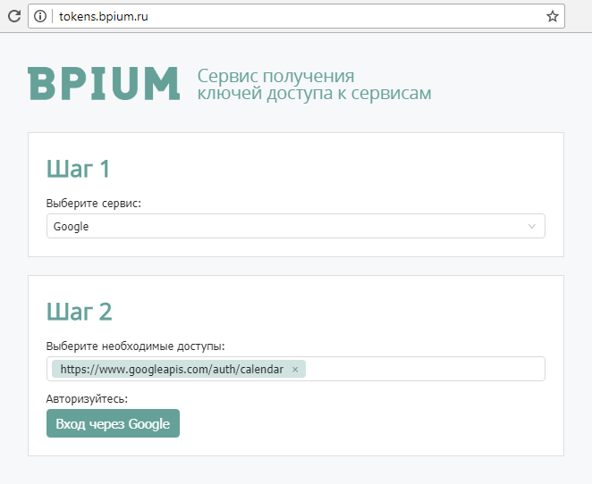
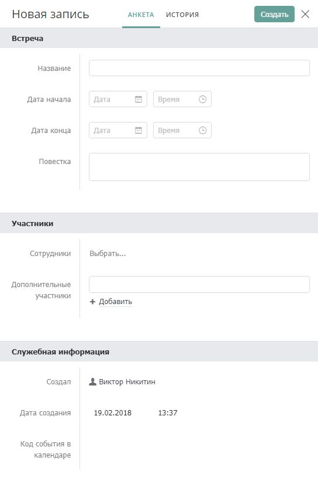
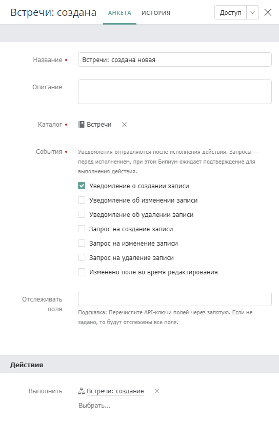
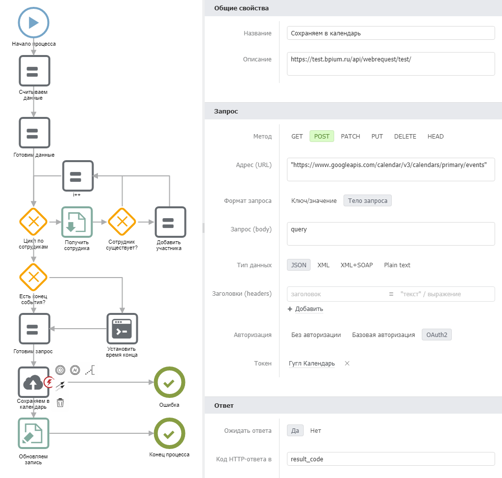

# Google Calendar

Сервис для планирования личных и групповых встреч. Интегрирован с почтой и календарями мобильных устройств. Сайт: [calendar.google.com](https://calendar.google.com)

## Особенности

**Стоимость**  \
Бесплатно

## Возможности интеграции

Бипиум позволяет управлять данными в календарях и встречах:

* Создавать новые календари
* Создавать и изменять события в календарях
* Получать список событий и их данных
* Управлять уведомлениями и напоминаниями

## Способ интеграции

### Авторизация

#### На стороне Google Календаря

Дополнительный настройки не требуются.

#### На стороне Бипиума

Google Calendar использует авторизацию по протоколу oAuth 2.0. Для обращения к данным календаря из Бипиума нужно получить ключи доступа. Подробнее о ключах доступа к внешним сервисам описано в статье «[Доступ к сервисам](../../../../manual/structure/systemcatalogs/oauthservices.md)».

1.  Получите ключи доступа на сайте [tokens.bpium.ru](http://tokens.bpium.ru). Выберите сервис Google и укажите доступ к календарю:

    
2. Авторизуйтесь под учетной записью Goggle. От имени этого пользователя вы будете создавать события и календари.
3.  Сохраните полученные ключи доступа в каталоге Управление / Доступ к сервисам. Имя записи может быть произвольным, например, Google Calendar:\

    

Ключи доступа Бипиум будет продлевать автоматически.

### Вызов методов

#### На стороне Бипиума

Для интеграции потребуется модуль бизнес-процессов Бипиума. Бипиум через сценарии может запрашивать информацию у Календаря и создавать встречи.

1. Настройте событие, по которому будет запускаться процесс. Например, событие об изменении данных. Подробнее в статье «[События](../../../../manual/structure/systemcatalogs/events.md)».
2. В каталоге «[Сценарии](../../../../manual/processes/scripts/)» создайте сценарий. С помощью компонента [веб-запрос](../../../../manual/processes/scripts/components/webrequest.md) настройте обращение к Календарю.

Методы API Google Календаря: [developers.google.com/google-apps/calendar/v3/reference/](https://developers.google.com/google-apps/calendar/v3/reference/)

## Пример интеграции

### Добавление встреч в Google Календарь

Данный пример описывает как создавать события в Google Календаре при создании записей в каталоге Встречи.

#### 1. Создайте каталог Встречи

Ключевые поля: Дата начала и конца встречи, название, описание (повестка), участники (сотрудники) и дополнительные участники (адреса эл.почты).

Код созданного события в календаре будет сохраняться в поле «Код события в календаре». По этому коду можно будет изменять событие в календаре при редактировании в каталоге Встреч.

#### 2. Создайте событие

При создании записи в каталоге Встреч будет запускаться сценарий, который будет добавлять создавать событие в Google календаре. Задайте параметры события в каталоге Управление/События:

В поле выполнить выберите первый пункт Создать новый сценарий. Создайте и настройте сценарий.

#### 3. Настройте сценарий

Пример сценария, создающего событие в календаре при создании записи в каталоге Встречи:

**Особенности сценария**

* Сценарий преобразует указанные контакты (эл.почту) в участников встречи
* Сценарий достает почты указанных сотрудников и назначает их участниками встречи
* Сценарий формирует дату конца встречи, если она не указана
* Сценарий сохраняет код созданного события в записи встречи

**Адаптация сценария под себя**

При адаптации сценария под себя вам потребуется изменить стыковку с каталогом Встречи. В созданном вами каталоге коды полей могут отличатся от указанных в сценарии. Сценарий построен так, что все важные для логики поля сохраняются в переменные в компоненте «Считываем данные». Измените ссылки на поля, учитывая коды полей в вашем каталоге. Коды полей можно увидеть в режиме редактирования каталога.

Сценарий: [скачать](http://download.bpium.ru/docs/scripts/googlecalendar.version.1.bpmn).

