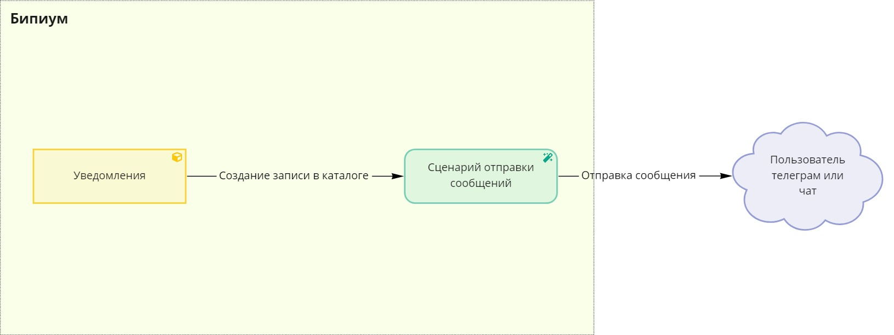

# Интеграция с Telegram-ботом

## 1. Введение

Каталог для отправки сообщений в Telegram — способ отправки сформированных сообщений пользователям или в групповые чаты от имени Telegram-бота.

## **2. Принцип работы**

Отправка сообщения производится с использованием специального каталога «Уведомления», в записях которого фиксируются id пользователя / чата и текст сообщения. Текст сообщения может быть сформирован как обычный текст, так и в формате HTML-верстки с использованием дополнительных возможностей форматирования. Описание возможностей форматирования сообщения Telegram-бота можно найти в [официальной документации](https://telegram-bot-sdk.readme.io/reference/sendmessage) к API Telegram. Каталог позволяет удобно отправлять сообщения путем создания новых записей и следить за историей всех отправленных сообщений из Бипиума.

При создании записи в каталоге «Уведомления» срабатывает сценарий по отправке сообщения по данным из полей созданной записи.

## **3. Реализация**

Для начала необходимо создать Telegram-бота, от лица которого пользователи будут получать сообщения. Процесс создания бота описан на официальной [странице документации](https://core.telegram.org/bots#3-how-do-i-create-a-bot) сервиса Telegram.

После успешного создания бота направляется сообщение, содержащее логин созданного бота и токен для доступа к его API.

 (3) (1).png>)

Для того, чтобы бот мог отправлять сообщения, получателю сообщения необходимо на него подписаться. Если же предполагается, что бот будет отправлять сообщения в групповой чат, то необходимо добавить его в соответствующий чат.

### 3.1. Настройка структуры каталога «Уведомления»

Создайте каталог «Уведомления», данный каталог будет содержать информацию о всех осуществленных рассылках. Создание записи в каталоге инициирует отправку сообщения. Настройка полей представлена на скриншоте ниже, создавать поля необходимо в том же порядке:

 (1) (1).png>)

* **Кому** (Текст)\
  Описание: В это поле передается id пользователя или чата.
* **Сообщение** (Многострочный текст)\
  Описание: Текст сообщения.

### **3.2. Настройка автоматизации**

#### **3.2.1. Создание записи сценария**

Создайте новую запись в системном каталоге «Сценарии». Заполните обязательные поля карточки произвольным образом и прикрепите в поле «Сценарий» [следующий файл](https://drive.google.com/file/d/1Fwtl3MziM2Ub1u5uyGCo7TAhdfONzxA\_/view?usp=sharing), нажав на кнопку «Загрузить…»:

.png>)

#### **3.2.2. Создание записи события**

Перейдите в системный в каталог «События» (обычно он находится в отделе Управление) и создайте новую запись. Заполните запись следующим образом:

.png>)

В поле «Выполнить» в качестве сценария выберите созданный на предыдущем шаге сценарий.

#### **3.2.3. Настройка файла сценария**

Сценарий для отправки сообщения выглядит следующим образом:

 (1).png>)

В загруженном сценарии отредактируйте следующие компоненты, согласно комментариям внутри них:

* **Компонент «токен»**\
  В переменной «token» в качестве значения укажите токен вашего Telegram-бота в кавычках.

## **4. Тестирование**

### 4.1. Каталог «Уведомления»

Создайте запись в каталоге «Уведомления». Заполните поля записи и нажмите кнопку «Сохранить». Пример заполнения представлен ниже:

 (1) (1).png>)

### **4.2. Результат**

После сохранения записи в каталоге сообщение будет отправлено указанному пользователю. Пример отправленного ботом сообщения представлен на скриншоте ниже:

.png>)

