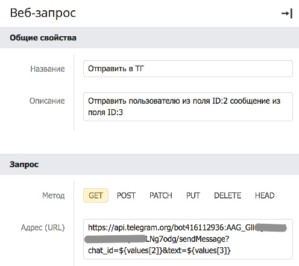

# Telegram

Бесплатный кроссплатформенный мессенджер, позволяющий обмениваться текстовыми сообщениями и медиафайлами различных форматов.

Сайт: [telegram.org](https://telegram.org/).

## **Возможности**

* Отправлять сообщения в личные переписки и чаты
* Получать сообщения от участников чата
* Управлять участниками групповых чатов
* Администрировать групповые чаты

Телеграм запрещает сервисам общаться от имени людей. Для совершения действий через API требуется создать бота. Боты могут общаться с людьми, только если человек первый начал беседу с ботом.

Полный список доступных методов: [https://core.telegram.org/bots/api#available-methods](https://core.telegram.org/bots/api#available-methods).

## **Пример интеграции**

### **Отправка сообщений**

Создание чат-помощника (бота), который будет отправлять название новой записи в телеграм.

1. **Создаем бота.** Ищем в строке поиска мессенджера контакт BotFather ([https://t.me/BotFather](https://t.me/BotFather)) и добавляем его в свой список контактов, нажав в окне диалога кнопку Start. Создаём нового бота, отправив в чат с BotFather команду `/newbot`.
2. **Выбираем имя.** Указываем название бота и его имя.
3. **Получаем идентификатор бота.** BotFather в ответном сообщении вышлет ссылку на созданного бота и токен (bot\_id:token).
4. **Создаем сценарий.** В каталоге «Управление / Сценарии» добавляем новую запись. Указываем название сценария «Телеграм» и нажимаем «создать» в поле «Сценарий».
5. **Добавляем «Веб-запрос».** В всплывающем окне сценария находятся два компонента «Старт» и «Стоп». Добавляем между ними блок «Веб-запрос», так чтобы связывающие линии проходили через него.
6.  **Настраиваем «Веб-запрос».** Чтобы настроить компонент, кликните на него. Указываем следующие параметры: `Метод: GET`\
    `Адрес (URL): https://api.telegram.org/botID:TOKEN/sendMessage?chat_id=ИДЕНТИФИКАТОР_ЧАТА&text=ТЕКСТ_СООБЩЕНИЯ`\
    `ID` — идентификатор бота из шага 3\
    `TOKEN` — токен бота из шага 3

    
7. **Выбираем чат.** Идентификатор чата можно получить через метод [getUpdates](https://core.telegram.org/bots/api#getupdates). Пример: result\[0].message.chat.id.
8. **Создаем событие.** В каталоге «Управление / События» добавляем новую запись (событие), по которому будет запускаться наш сценарий. Указываем название «Отправка сообщения в телеграм». Выбираем каталог в котором мы хотим отслеживать создание записей. Выбираем событие «Уведомление о создании записи». В поле «Выполнить» указываем наш сценарий.
