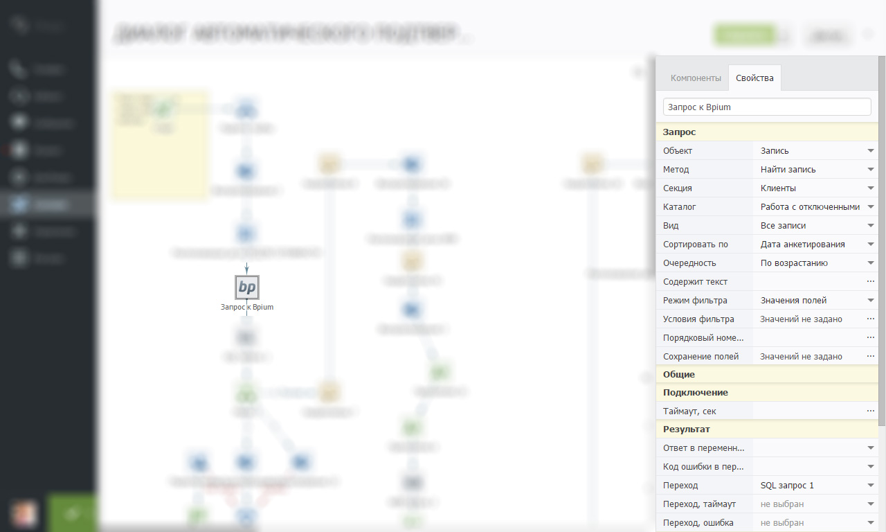
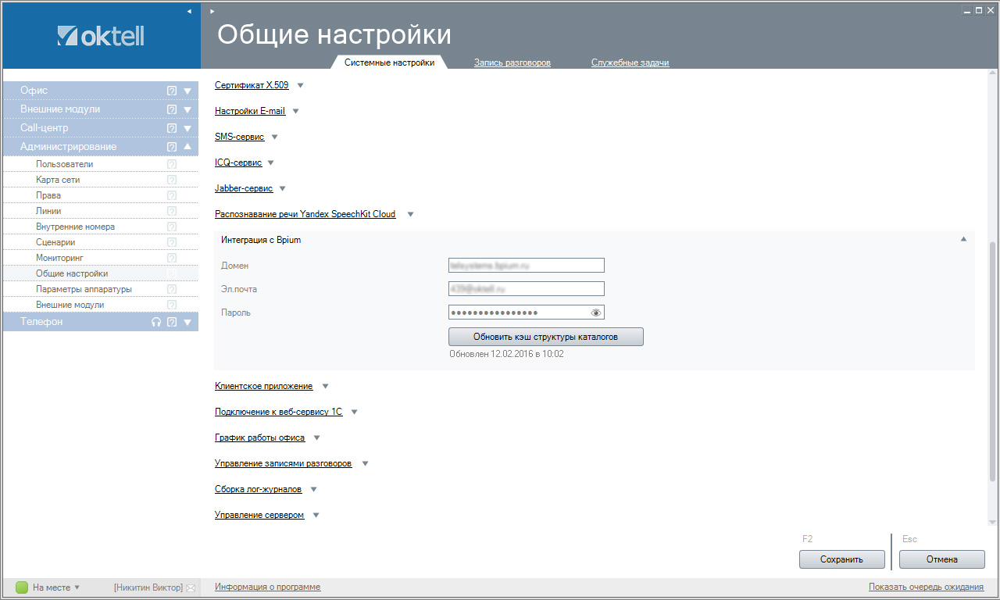

# Компонент Bpium в Oktell

Компонент доступен в Oktell начиная с версии 2.13 от 23.12.2015.

## Компонент сценария

В коммуникационную платформу Oktell встроен мощный механизм пользовательских скриптов — сценариев. Они выполняют различные действия при внешних событиях или по расписанию. Сценарии состоят из связанных компонентов, каждый из которых имеет свойства. Благодаря простой настройке сценариев в графическом редакторе, провести интеграцию сможет любой штатный специалист компании.

В сценариях Oktell несколько десятков компонентов: логических операций, компонентов для работы с телефонией, почтой, месенджерами, базами данных и файловой системой. Один из компонентов — «Запрос к Bpium».

### Возможности компонента

Компонент позволяет работать с записями в Бипиуме:

* находить записи с определёнными свойствами
* получать конкретные записи по номеру
* создавать новые записи
* изменять записи
* удалять записи

## Включение интеграции

Прежде чем начать использовать компонент в сценариях, настройте соединение Oktell с Бипиумом. Зайдите в общие настройки Oktell и укажите адрес вашего домена в Bpium, электронную почту и пароль пользователя, под которым Oktell будет обращаться к Бипиуму. Перед этим добавьте пользователя в качестве сотрудника в Бипиуме, или введите ваши авторизационные данные.

Формат указания домена: _вашдомен.bpium.ru_, либо полный адрес с указанием протокола и порта: [https://вашдомен.ru](https://xn--80adhe8ahe2f.ru).

После авторизации Oktell запросит у Бипиума структуру данных: секции, каталоги и виды. Если вы измените структуру данных в Бипиуме, то Oktell её обновит спустя несколько часов. Чтобы провести принудительную синхронизацию нажмите кнопку:

Свойства компонента Bpium&#x20;

### Объект: запись

Работа с записями каталогов.

#### Метод: Найти запись

Находит и возвращает одну доступную запись, удовлетворяющую условиям поиска. Если требуется вернуть несколько — организуйте цикл в сценариях.

**Раздел «Запрос»**

* **Секция:** список _доступных_ отделов в Бипиуме.
* **Каталог:** список _доступных_ каталогов выбранного отдела.
* **Вид:** список _доступных_ видов выбранного каталога.
* **Сортировать по:** поле каталога, по которому будет произведена сортировка.
* **Очередность:** порядок сортировки.
* **Содержит текст:** быстрый поиск по текстовым полям каталога.
* **Режим фильтра:** список установленных фильтров:
  * Без фильтра — не использовать фильтр
  * Значение полей — включает режим задания фильтров в форме в свойстве «Условия фильтра»
  * GET-параметры — расширенное задание фильтров согласно API
* **Условия фильтра:** форма для установки значений фильтра по полям каталога.
* **Порядковый номер:** номер записи в выборке, которую нужно вернуть. Используется для получения записей в цикле. по умолчанию возвращает первую (нулевую) запись.
* **Сохранение полей:** форма для назначения в какие переменные сценария сохранить значения полей записи.

**Раздел «Подключение»**

* **Таймаут:** время ожидания ответа. Если Бипиум не ответит за указанное время, компонент продолжит работу сценария по ветке таймаут. Измеряется в секундах.

**Раздел «Результат»**

* **Ответ в переменную:** запись в JSON-формате согласно API (метод Record/GET). Для получения значений полей записи используйте компонент сценариев «Парсер».
* **Код ошибки в переменную:** возврат кода ошибки, в случае её возникновения
* **Переход:** указание компонента, к которому перейдёт сценарий в случае успешного выполнения запроса.
* **Переход, таймаут:** указание компонента, к которому перейдёт сценарий в случае не выполнения запроса по таймауту.
* **Переход, ошибка:** указание компонента, к которому перейдёт сценарий в случае не выполнения запроса по ошибке.

#### Метод: Получить структуру записи

Возвращает метаданные каталога: описание структуры полей и возможных значений.

**Раздел «Запрос»**

* **Секция:** список _доступных_ отделов в Бипиуме.
* **Каталог:** список _доступных_ каталогов выбранного отдела.

**Раздел «Результат»**

* **Ответ в переменную:** список полей каталога в JSON-формате согласно API (метод Catalog/GET). Для получения структуры отдельных полей и их свойств используйте компонент сценариев «Парсер».

_Остальные параметры идентичны запросу метода «Найти запись»._

#### Метод: Получить запись

Возвращает запись по её идентификатору.

**Раздел «Запрос»**

* **Секция:** список _доступных_ отделов в Бипиуме.
* **Каталог:** список _доступных_ каталогов выбранного отдела.
* **ID записи:** идентификатор (ID) записи в Бипиуме.
* **Сохранение полей:** форма для назначения в какие переменные сценария сохранить значения полей записи.

**Раздел «Результат»**

* **Ответ в переменную:** запись в JSON-формате согласно API (метод Record/GET). Для получения значений полей записи используйте компонент сценариев «Парсер».

_Остальные параметры идентичны запросу метода «Найти запись»._

#### Метод: Изменить запись

Изменяет запись по её идентификатору.

**Раздел «Запрос»**

* **Секция:** список _доступных_ отделов в Бипиуме.
* **Каталог:** список _доступных_ каталогов выбранного отдела.
* **ID записи:** идентификатор (ID) записи в Бипиуме.
* **Режим задания свойств:** способ передачи значения полей:
  * Значения полей — назначение значений через форму в свойстве «Поля»
  * JSON-объект — передача значений через JSON согласно API
* **Поля:** форма для назначения значений полей из переменных. Если у поля не стоит галочка, то значение поля не будет изменено при сохранении.
* **Данные записи (JSON):** расширенный способ передачи значений полей через JSON-структуру согласно API.

**Раздел «Результат»**

* **Ответ в переменную:** ответ на запрос в JSON-формате согласно API (метод Record/PATCH).

_Остальные параметры идентичны запросу метода «Найти запись»._

#### Метод: Добавить запись

Создает новую запись в каталоге.

**Раздел «Результат»**

* **ID записи в переменную:** возвращает идентификатор (ID) созданной записи в случае успеха.
* **Ответ в переменную:** ответ на запрос в JSON-формате согласно API (метод Record/POST).

_Остальные параметры идентичны запросу метода «Изменить запись»._

#### Метод: Удалить запись

Удаляет запись по её идентификатору.

**Раздел «Запрос»**

* **Секция:** список _доступных_ отделов в Бипиуме.
* **Каталог:** список _доступных_ каталогов выбранного отдела.
* **ID записи:** идентификатор (ID) записи в Бипиуме.

**Раздел «Результат»**

* **Ответ в переменную:** ответ на запрос в JSON-формате согласно API (метод Record/DELETE).

_Остальные параметры идентичны запросу метода «Найти запись»._
