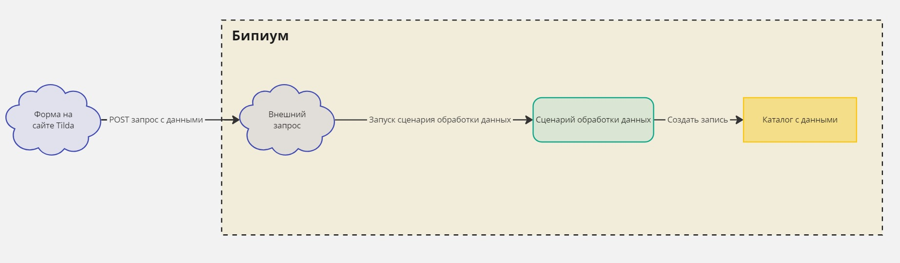

# Прием данных с формы Tilda

## 1. Введение

Бипиум позволяет принимать и обрабатывать данные из форм сайта на Tilda. \
Например, у нас есть сайт созданный на Tilda с формой обратной связи.

<figure><figcaption></figcaption></figure>

Мы хотим, чтобы при нажатии кнопки **Отправить**, введенные в форму данные сохранились в Бипиум.&#x20;

## 2. Принцип работы

<figure><figcaption></figcaption></figure>

* Ваш сайт отправляет введенные пользователем в форме данные в Бипиум
* Бипиум принимает запрос и запускает сценарий обработки полученных данных
* На основе полученных данных в Бипиум создается новая запись в соответствующем каталоге

## 3. Реализация

### 3.1. Подготовка полей формы в Tilda

Для того, чтобы передавать данные в Бипиум мы должны задать имена переменных для всех полей, которые есть на нашей форме. Для нашего примера зададим следующие имена:

_Имя_ - _**name**_\
&#xNAN;_&#x42D;л. почта **- email**_\
&#xNAN;_&#x422;елефон_ - _**phone**_\
&#xNAN;_&#x427;ем мы можем помочь?_ - _**comment**_

<figure><figcaption>
пример для поля <strong>Имя</strong>
</figcaption></figure>

### 3.2. Подготовка каталога для данных в Бипиум

Для того, чтобы принимать данные из сайта, в Бипиум необходимо подготовить каталог, куда мы будем сохранять отправленные данные. Типы полей в Бипиум и Tilda отличаются, поэтому мы подготовили список соответствия популярных полей Tilda к полям в Бипиум:

* **Email** = _**Контакт**_ с выбранным значением _**Электронная почта**_
* **Телефон&#x20;**_**=**_ _**Контакт**_ с выбранным значением _**Телефон**_
* **Имя** = _**Текст**_
* **Поле для ввода в одну строку** = _**Текст**_
* **Поле для ввода в несколько строк** = _**Текст**_ с выбранным значением _**Многострочный текст**_
* **Выпадающий список** = _**Выбор значения**_ или _**Статус**_. Варианты ответа в Тильда - это элементы выбранного поля в Бипиум
* **Вопрос с вариантами ответа** = если **Вид ответа** - _**Один вариант ответа (радиокнопки)**_, то _**Выбор значения**_ или _**Статус**_, если **Вид ответа** - _**Несколько вариантов ответа (галочки)**_, то _**Набор галочек**_ или _**Статус**_ (с настройкой _**Можно выбрать несколько**_)


Варианты ответа для полей **Выпадающий список** и **Вопрос с вариантами ответа** в Tilda должны быть идентичными элементам соответствующих полей в Бипиум, включая регистр


* **Оценочная шкала** = _**Число**_
* **Галочка** = _**Переключатель**_
* **Дата** = _**Дата**_


Tilda не передает информацию о выбранном формате для поля типа **Дата**, из-за чего мы не сможем отличить формат **ДД-ММ-ГГГГ** от формата **ММ-ДД-ГГГГ** и поэтому рекомендуем выбирать либо **ДД-ММ-ГГГГ**, либо **ГГГГ-ММ-ДД**


* **Время** = _**Текст**_ с выбранным значением _**Текст по маске**_ и настройкой 11:11
* **Количество** = _**Число**_
* **Ссылка** = _**Контакт**_ с выбранным значением _**Сайт/ссылка**_
* **Скрытое поле** = _**Текст**_
* **Калькулятор** = _**Число**_

Создадим в Бипиум новый каталог и добавим такие же поля, которые у нас есть на нашем сайте, в соответствии со списком соответствия выше:

<figure><figcaption></figcaption></figure>

В свойствах каждого поля в Служебных заметках укажите имя переменной соответствующего поля, который мы задали в шаге 3.1. \
Это позволит соотнести поля из Tilda с полями в Бипиум.&#x20;

Когда все поля добавлены, сохраните каталог, нажав соответствующую  кнопку в правом верхнем углу. Посмотрите ID созданного каталога: он будет указан в адресной строке после _/catalog/_\
Например, если адрес выглядит так: [https://tilda-demo.bpium.ru/#/section/2/catalog/16/view/0/records](https://tilda-demo.bpium.ru/#/section/2/catalog/16/view/0/records) значит ID-каталога 16. Запомните этот ID - он понадобится нам в следующем шаге.&#x20;

### 3.3. Подготовка инструмента приема данных

В Бипиум есть возможность создания специальных ссылок для приема данных из сторонних сервисов. Этот инструмент называется [_**Внешние запросы**_](../../../../manual/structure/systemcatalogs/weblisteners.md). Создать внешний запрос для приема данных можно в каталоге _**Внешние запросы**_. По умолчанию этот каталог находится в отделе _**Управление.**_ Переходим в этот каталог и нажимаем кнопку _**Добавить:**_

<figure><figcaption></figcaption></figure>

Заполните поля как на скриншоте выше. \
Также у _**Внешнего запроса**_ должен быть [сценарий](../../../../manual/processes/scripts/), который обрабатывает полученные данные. Сценарий указывается в поле _**Выполнить.**_ Добавим новый сценарий. Для этого нажмите кнопку _**Добавить в «Сценарии»:**_

<figure><figcaption></figcaption></figure>

Появится окно создания записи сценария. Скачайте готовый файл сценария по ссылке ниже.



Нажмите кнопку _**Загрузить**_ и выберите скачанный файл:

<figure><figcaption></figcaption></figure>

Нажмите на загруженный файл. У вас откроется схема сценария. В данной схеме нужно нажать на компонент _**УКАЖИТЕ ID КАТАЛОГА**_, указать в нем ID-каталога, который создали в предыдущем шаге и сохранить сам файл сценария:

<figure><figcaption></figcaption></figure>

Теперь сохраним запись сценария:

<figure><figcaption></figcaption></figure>

Также сохраним запись внешнего запроса:

<figure><figcaption></figcaption></figure>

Ссылка для приема данных подготовлена, она формируется следующим образом:\
&#xNAN;**\[Домен]/api/webrequest/\[URL-идентификатор]**, где:\
&#xNAN;**\[Домен]** - это Ваш домен системы Бипиум. Например: https://tilda-demo.bpium.ru/\
&#xNAN;**\[URL-идентификатор]** - это значение, которое мы ввели в записи внешнего запроса в поле _**URL-идентификатор**_\
Для домена из примера &#x43F;_&#x43E;лная ссылка будет следующая:_\
_https://tilda-demo.bpium.ru/api/webrequest/getRequest_

### 3.4. Подключение вебхука на Tilda

Перейдем в настройки нашего сайта на Tilda. Нужно перейти в блок _**Формы**_ и найти раздел _**Webhook:**_

<figure><figcaption></figcaption></figure> <figure><figcaption></figcaption></figure>

Укажем адрес, созданный в предыдущем шаге и добавим этот Webhook:

<figure><figcaption></figcaption></figure>

После создания Webhook'а в Tilda, будет отправлен тестовый запрос на указанный адрес. Проверить, что все действия выше проделаны правильно можно в каталоге [_**Процессы**_](../../../../manual/structure/systemcatalogs/processes.md)_**.**_ В данном каталоге должна быть одна запись со статусом _**Завершен**_:

<figure><figcaption></figcaption></figure>

В то же время, в нашем созданном каталоге под данные из сайта также должна появиться одна пустая запись без данных:

<figure><figcaption></figcaption></figure>

### 3.5. Подключение вебхука к форме

Осталось только подключить созданный в Tilda Webhook к нужной нам форме. Для этого переходим к настройке блока с формой на нужной странице и включаем галочку: _**WEBHOOK: \[НАШ АДРЕС]**_&#x20;

<figure><figcaption></figcaption></figure>

Сохраняем изменения и публикуем страницу.&#x20;

## 4. Тестирование

Перейдем на наш сайт, заполняем форму ввода данных и нажимаем кнопку _**Отправить**_

<figure><figcaption></figcaption></figure>

Заходим в Бипиум, открываем созданный нами каталог и проверяем, что создана новая запись с нашими введенными на сайте данными:

<figure><figcaption></figcaption></figure>
