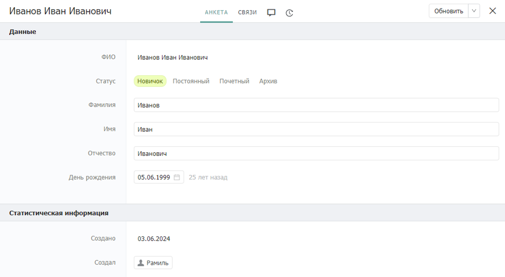
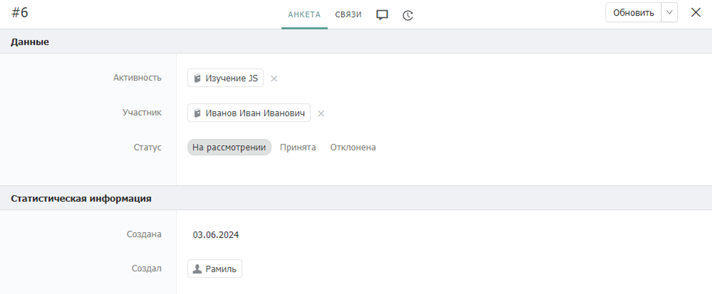
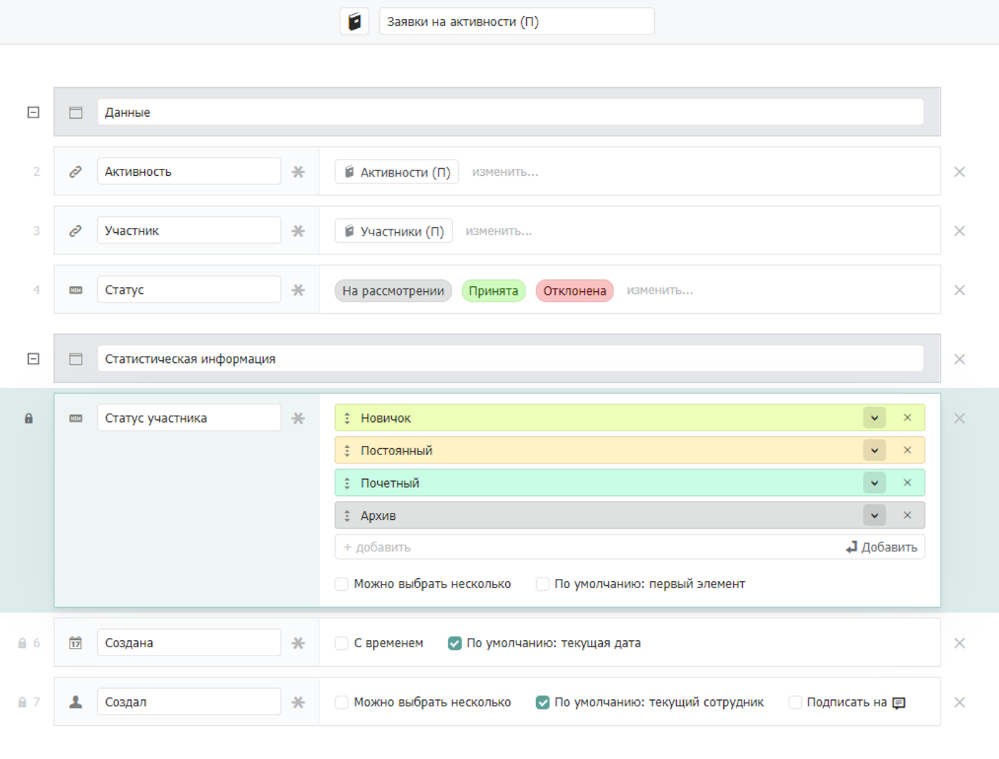
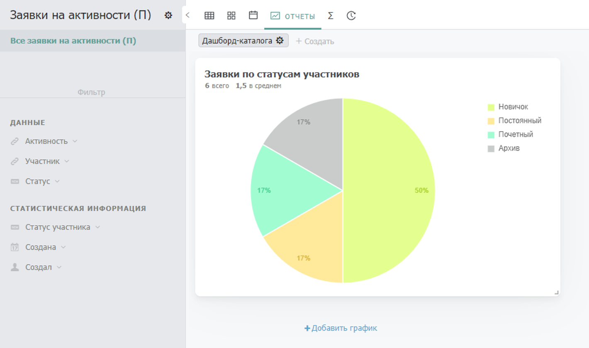

# Дублирование

## Описание


Дублируйте поля между записями, связанными друг с другом, которые в дальнейшем могут быть изменены


_Паттерн дублирования_ обязывает переносить часть полей между каталогами со смежными процессами. Дублирование полей между каталогами позволяет более гибко настраивать отчетность и фильтрацию в системе: добавляет новые поля в качестве фильтров, по которым можно настраивать разложение графиков.


_Паттерн дублирования_ неразрывно связан с [_паттерном актуализации_](aktualizaciya.md)_:_ зачастую продублированные значения должны быть актуализированы в соответствии со значениями-родителями.


## Проблематика

Рассмотрим необходимость использования _паттерна дублирования_ на примере учета заявок на активности, поступающих со стороны их участников.

В Бипиуме реализован функционал учета заявок на активности. В рамках этого функционала настроены каталоги с базой участников, активностями и заявками на участие в активностях. Каждый участник имеет определенный статус и может принимать участие сразу в нескольких активностях.

Так выглядит запись участника активности:

<figure><figcaption></figcaption></figure>

А так выглядит заявка на участие в активности:

<figure><figcaption></figcaption></figure>

Перед сотрудниками системы стоит задача в просмотре количества участников определенной активности в разрезе их текущих статусов в системе. Для решения этой задачи в записи заявки на активность должно быть дополнительное поле со статусом участника, указанного в этой заявке.


Подобную задачу можно частично решить расширив поле “Статус” из каталога с участниками. Таким образом задача с фильтрацией в каталоге будет решена, но раскладывать графики по расширенным полям — невозможно.


В реализации, описанной выше, графически оценить количество участников активности в разрезе их статусов — невозможно. Для того, чтобы это сделать нужно продублировать поле “Статус” из записи участника в заявку.

Следствием несоблюдения _паттерна дублирования_ могут быть следующие проблемы:

* Ограниченная возможность фильтрации записей
* Ограниченная возможность построения графиков

### Ограниченная возможность фильтрации записей

Из-за отсутствия в каталоге вспомогательных полей для фильтрации решение некоторых задач связанных с анализом данных в системе становится затруднительным. Такие задачи всё ещё решаемы, но для этого сотрудникам необходимо анализировать данные сразу из нескольких каталогов в системе.

Такой подход увеличивает затрачиваемое сотрудниками время и может привести к переводу части их деятельности в другое ПО (например в Excel).

### Ограниченная возможность построения графиков

Так как в каталоге отсутствует часть полезных полей из других каталогов, в нем не будет возможности построить необходимые для анализа графические отчеты. Таким образом сотрудники не смогут наглядно анализировать текущее состояние процесса в системе.

## Применение паттерна

Описанные выше проблемы могут быть решены использованием _паттерна дублирования:_ для этого в целевом каталоге нужно продублировать нужные поля из связанных каталогов. В такой реализации сотрудники смогут использовать новые поля для фильтрации записей и построения графических отчетов.

В реализацию выше добавим поле “Статус участника” и наполним его теми же значениями, что есть в поле “Статус” в каталоге “Участники”:

<figure><figcaption></figcaption></figure>


Следуйте [_паттерну упорядоченности_](uporyadochennost.md). Располагайте дублируемые поля после тех, что сотрудники должны заполнить вручную.


Далее необходимо написать сценарий автоматизации, который будет автоматически заполнять поле “Статус участника” аналогичным значением из выбранной записи участника.


В ряде случаев продублированные поля должны быть актуализированы согласно родительскому полю. В этом случае потребуется написание дополнительного сценария, который будет актуализировать статус участника во всех заявках при изменении статуса в записи “Участника”.


После добавления нового поля и написания сценария автоматизации необходимо проставить действующие значения всех статусов из “Участников” во все “Заявки на активности”, согласно [_паттерну актуальности_](aktualizaciya.md).

Теперь в каталоге “Заявки на активности” возможно настроить дополнительную фильтрацию по статусам участников, а также создать графические отчеты с разложением по ним:

<figure><figcaption></figcaption></figure>
