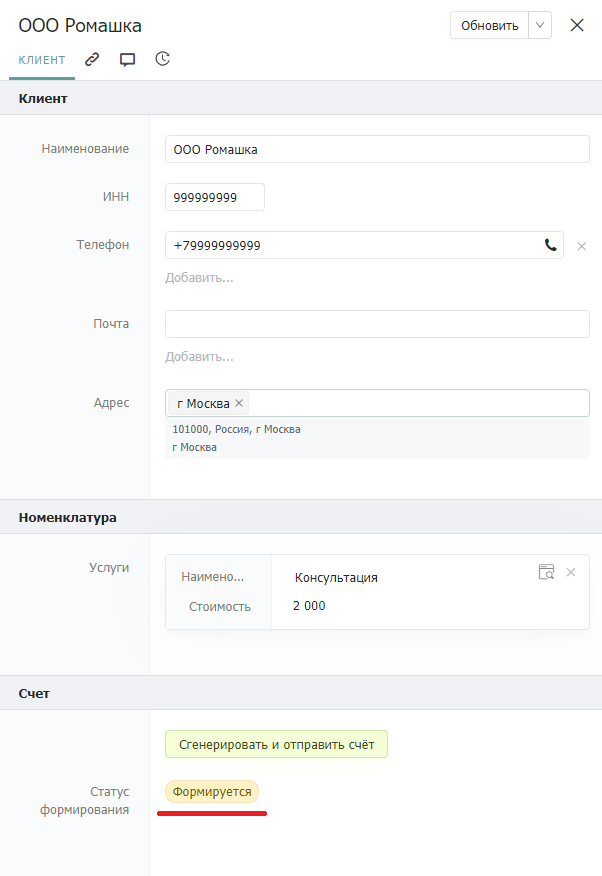

# Информирование

## Описание


Уведомляйте пользователей о прогрессе важных процессов


_Паттерн информирования_ обязывает уведомлять пользователей о важных событиях внутри системы. Он представляет собой ключевой элемент эффективного взаимодействия внутри системы и управления бизнес-процессами. Это обеспечивает пользователю актуальную и своевременную информацию, необходимую для принятия дальнейших действий, и помогает предотвратить возможные задержки и недоразумения.

## Проблематика

Рассмотрим проблемы тех кейсов когда _паттерн информирования_ игнорируется:

* Не предпринимаются меры при наступлении дедлайна какого-либо бизнес-объекта
* Не предпринимаются меры при наступлении ключевой точки внутри какого-либо бизнес-объекта

### Не предпринимаются меры при наступлении дедлайна какого-либо бизнес-объекта

В качестве примера можем рассмотреть реализацию таск-трекера.

Таск-трекер состоит из поступающих запросов и задач для их решения. В каждом запросе есть некоторый набор полей дедлайн, до которого он должен быть закрыт.

Так выглядит карточка запроса:

<figure><figcaption></figcaption></figure>

Когда наступает дедлайн, система автоматически изменяет значение поля "Просрочен" на "Да". Однако среди множества задач есть риск не заметить, что у какой-то из них истёк срок. Это может иметь серьёзные последствия, особенно если задача была критически важной и её выполнение в установленный срок было крайне необходимо.

### Не предпринимаются меры при наступлении ключевой точки внутри какого-либо бизнес-объекта

Несвоевременной реагирование на ключевые события внутри бизнес-объекта может привести к сереьезным негативным последствиям.

* Потеря прибыли, недостижение бизнес-целей.
* Убытки, задержки в платежах, штрафы.
* Недовольство клиентов, снижение лояльности.
* Негативные отзывы, потеря доверия.

Для более наглядного представления проблемы рассмотрим пример генерации важных документов на основе уже имеющихся данных.

Предположим в системе имеется каталог "Счета" со счетами для оплаты:&#x20;

<figure><figcaption></figcaption></figure>

В представленной записи мы видим необходимые данные для формирования счета, а также кнопку для его генерации и отправки.

Сотруднику требуется заполнить эти данные, сгенерировать счет и отправить его. Однако, сотрудник не получает обратной связи о том, был ли счет сгенерирован корректно и отправлен нужному адресату.

Существенным недостатком является отсутствие обратной связи для сотрудника, делающее его невольным участником "черного ящика" в данном бизнес-процессе.

## Применение паттерна

В предыдущем примере мы рассмотрели процесс генерации и отправки счета. Давайте теперь взглянем на этот процесс, используя _паттерн информирования_.

Используя автоматизации, мы можем реагировать на какие то конкретные события внутри процесса генерации и отправки счета.

В данном процессе мы можем выделить несколько случаев, когда необходимо информировать сотрудника:

* Во время заполнения данных карточки.
* Во время генерации счета.
* Во время отправки счета.

Добавляем в каталог дополнительные информирующие поля, а также некоторую автоматизацию, которая будет реагировать на то или иное действие.

Теперь при нажатии на кнопку, сотрудник будет проинформирован о статусе процесса формирования и отправки счета:&#x20;

<figure><figcaption></figcaption></figure>

При успешной генерации счета, статус поменяет значение на "Готово":

<figure><figcaption></figcaption></figure>

То же самое мы можем наблюдать и с отправкой счета. Но, как мы видим на скриншотах выше, не было заполнено поле с почтой получателя. В этом случае статус отправки счета переходит в "Ошибка" и появляется всплывающее сообщение:

<figure><figcaption></figcaption></figure>

Такая реализация позволяет эффективно решать проблему информирования о важных событиях в системе. Благодаря применению _паттерна информирования_, сотрудники всегда будут в курсе хода ключевых процессов, своевременно реагируя на изменения и предотвращая негативные последствия.
