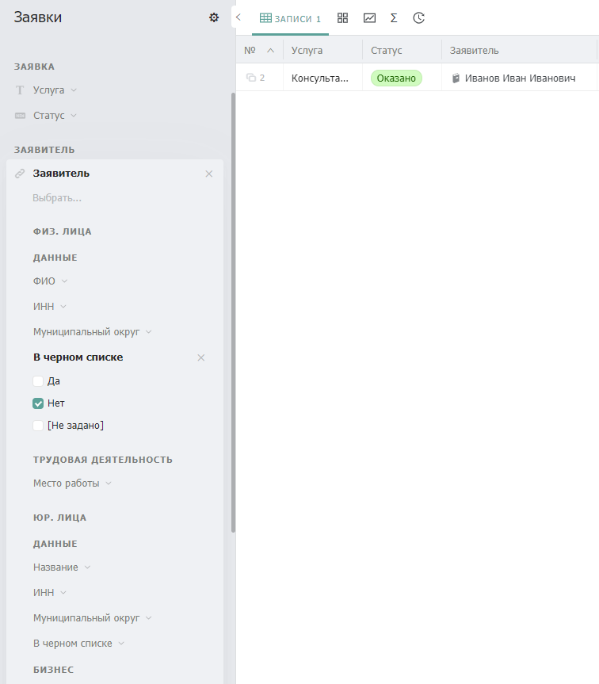

---
layout:
  title:
    visible: true
  description:
    visible: false
  tableOfContents:
    visible: true
  outline:
    visible: true
  pagination:
    visible: true
---

# Слияние

## Описание


Объединяйте схожие бизнес-объекты в один каталог в системе.



_Бизнес-объекты_ — это представления реальных объектов деятельности. Они могут отображать как физические объекты: помещения, активы, контракты, так и абстрактные понятия: сорта яблок, обращения клиентов.


_Паттерн слияния_ обязывает объединять бизнес-объекты со **схожими атрибутами**, **смыслом** и **процессами** в системе в один бизнес-объект (каталог). Использование паттерна позволяет сократить общее количество используемых каталогов, позволяя выстроить более интуитивную навигацию. Кроме того использование паттерна позволяет расширить применение механизмов фильтрации и построения графических отчетов в системе.


_Паттерн слияния_ не противоречит [_паттерну разделения_](razdelenie.md) и должен использоваться совместно с ним. Разделение описывает необходимость формирование отдельного каталога под каждый бизнес-объект, а слияние — уменьшение списка бизнес-объектов в системе.


## Проблематика

Рассмотрим реализацию системы учета заявок, поступающих от физических и юридических лиц.

В системе настроено три каталога:

Физические лица:

<figure><figcaption></figcaption></figure>

Юридические лица:

<figure><figcaption></figcaption></figure>

Заявки:

<figure><figcaption></figcaption></figure>

 

<figure><figcaption></figcaption></figure>

В этом примере мы можем наблюдать, что как юридические так и физические лица участвуют в одном процессе ведения заявок.

Следствием несоблюдения паттерна слияния могут быть следующие проблемы:

* Ограниченная возможность фильтрации записей и построения графиков

### Усложнение фильтрации и ведения отчетности

Здесь мы можем столкнуться с проблемой фильтрации заявителей по определенному значению полей.

Предположим мы хотим отфильтровать заявки, заявители которых не находятся в черном списке:

<figure><figcaption></figcaption></figure>

Такое происходит из-за того, что мы отфильтровали заявки только по связанному каталогу "Физ. Лица"\
То есть для того, чтобы получить общее количество заявок с определенными значениями, нужно последовательно проставить значение фильтра в каждое поле связанных каталогов и сложить общее количество записей. Такой подход многократно увеличивает время на анализ данных и делает невозможным ведение отчетности в виде графиков в системе

Таким образом решение некоторых задач связанных с анализом данных в системе становится затруднительным.

## Применение паттерна

Теперь рассмотрим реализацию системы учета заявок с ипользованием _паттерна слияния_. Для этого необходимо объединить схожие каталоги (бизнес-объекты) в один.

Объединим эти два каталога в один общий и назовем "Заявители".

Для того чтобы мы могли отличать заявителей, мы можем использовать [_паттерн типизации_](tipizaciya.md)_,_ добавив новое поле типа статус, под названием "Тип".

<figure><figcaption></figcaption></figure>

 

<figure><figcaption></figcaption></figure>

Для удобства заполнения формы мы используем динамическое управление полями. В зависимости от того, является ли заявителем физическое лицо или юридическое, система автоматически скрывает или открывает соответствующие секции:

Физическое лицо: Секция "Трудовая деятельность" - открывается. Секция "Бизнес" скрывается – данные о бизнесе не нужны.

Юридическое лицо: Секция "Трудовая деятельность" скрывается – информация о работе не требуется. Секция "Бизнес" - открывается.&#x20;

Такой подход делает форму более интуитивной и удобной для пользователя, упрощая процесс заполнения.
