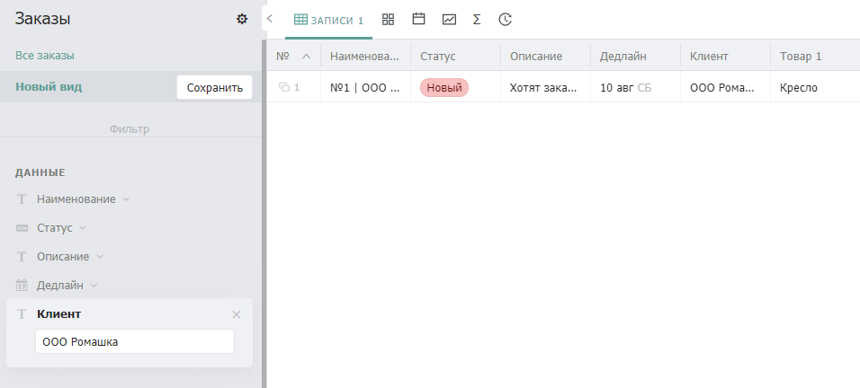
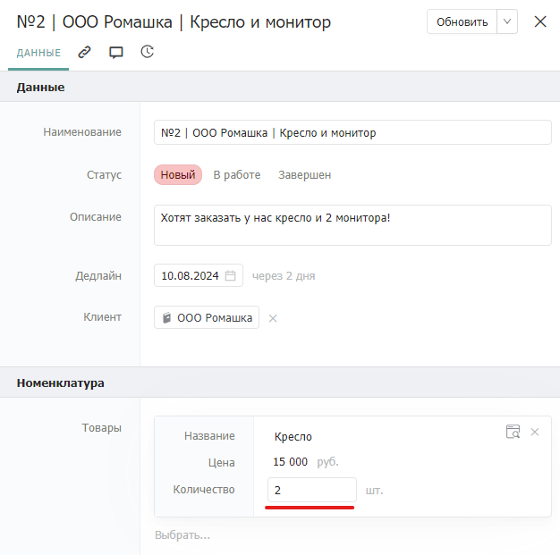
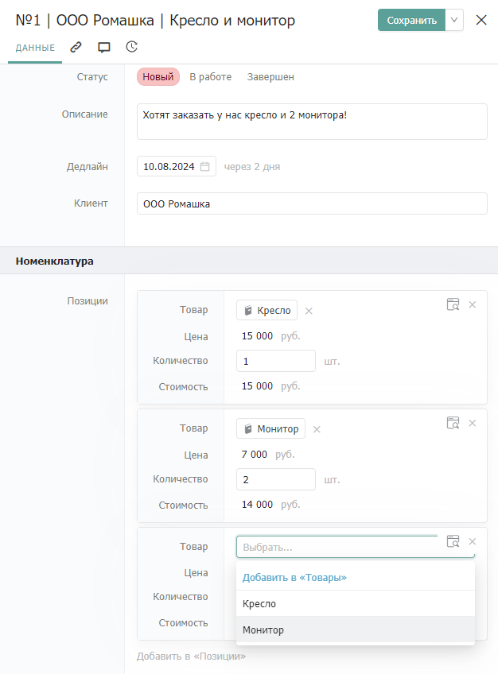

# Выделение позиций

## Описание


Выделяйте  отдельные параметры бизнес-объектов в отдельные сущности (каталоги)


Данный паттерн легко можно спутать с паттерном [_**Разделение**_](razdelenie.md). Смысл у них похожий, но ключевое отличие в том, что в паттерне [_**Разделение**_](razdelenie.md) мы рекомендуем хранить информацию по каждому бизнес-объекту в отдельном каталоге, а в текущем паттерне _**Выделение позиций**_ мы рекомендуем выделять некоторые параметры одного бизнес-объекта в отдельные объекты системы.

## Проблематика

Рассмотрим проблемы несоблюдения _паттерна выделения позиций_ на примере системы учета заказов, спроектированной на Бипиуме.

Заказ состоит из номенклатуры с указанием товаров и их количества. В одном заказе может быть номенклатура из нескольких различных товаров.

Если при проектировании не использовался _паттерн_ [_**Разделение**_](razdelenie.md) _и **Выделение позиций**_, то в системе будет настроен единственный каталог - "Заказы":

<figure><figcaption></figcaption></figure>

На примере настроенного каталога можем выделить следующие проблемы:

* Ручное заполнение полей идентичными значениями
* Усложнение фильтрации и ведения отчетности
* Невозможность формирования динамического количества позиций

### Ручное заполнение полей идентичными значениями

В настроенном каталоге есть поля, которые заполняются текстовым значением вместо использования связей с дополнительными каталогами:

* Клиент
* Товар 1
* Товар 2

Например: по одному клиенту в системе может быть несколько заказов. Во втором заказе по клиенту нужно вновь указывать его наименование вручную.

Такой подход увеличивает время заполнения полей в записи: каждое поле заполняется вручную вместо выбора уже заполненного ранее значения.

Кроме этого при добавлении дополнительных полей связанных с клиентом или товарами карточка заказа будет увеличиваться, затрудняя навигацию.

### Усложнение фильтрации и ведения отчетности

Из-за ручного ввода значений вероятность орфографических ошибок многократно увеличивается. В связи с этим возможна некорректная фильтрация записей в каталоге.

Например, по одному и тому же клиенту заведено 2 заказа. В одном из них допущена орфографическая ошибка в наименовании клиента:

<figure><figcaption>
<mark style="color:green;">Здесь наименование заполнено корректно</mark>
</figcaption></figure> <figure><figcaption>
<mark style="color:red;">А здесь в наименовании допущена ошибка:</mark>
</figcaption></figure>

При попытке отфильтровать все заказы по клиенту система выдаст только один заказ, хотя фактически по клиенту сформировано два заказа:

<figure><figcaption></figcaption></figure>

Также будет затруднена фильтрация всех заказов по определенному товару. Предположим, что во втором заказе клиент хочет заказать те же товары, но названия товаров теперь расположены в других полях:

<figure><figcaption></figcaption></figure> <figure><figcaption></figcaption></figure>

При попытке получить все заказы с монитором получаем только один заказ вместо двух:

<figure><figcaption></figcaption></figure>

Такое происходит из-за того, что во втором заказе монитор указан в поле “Товар 2”, а не “Товар 1”.

То есть для того, чтобы получить общее количество заказов с определенным товаром нужно последовательно вставить наименование товара в каждое поле и сложить общее количество записей во всех выдачах. Такой подход многократно увеличивает время на анализ данных и делает невозможным ведение отчетности в виде графиков в системе.

### Невозможность формирования динамического количества позиций

В примере рассмотренном выше есть возможность заполнения номенклатуры, состоящей из двух товаров. При этом, если клиент закажет три разных товара, то в системе не будет возможности указать все три в рамках одной записи.

Для того, чтобы сформировать такой заказ:

* Сотрудникам необходимо создать дополнительную запись и дозаполнить в ней “лишний” товар.
* Разработчику системы нужно добавлять новые поля для каждого нового случая увеличения товаров в номенклатуре.

### Невозможность добавления одного товара в заказы в разных количествах

Мы часто сталкиваемся с тем, что пользователи применяют паттерн [&#x420;_&#x430;зделение_](razdelenie.md)_:_ для бизнес-объекта "Товар" создается отдельный каталог, но при этом "Количество" определяют как атрибут товара.

Рассмотрим реализацию того же функционала формирования заказов в примере, когда "Количество" является атрибутом "Товара":

<figure><figcaption></figcaption></figure>

Предположим, что клиент делает второй заказ и также заказывает кресло, но в ином количестве.

<figure><figcaption></figcaption></figure>

По причине того, что мы берем тот же товар из того же каталога и укажем другое количество, у нас перезапишется количество товара и в первом заказе.

<figure><figcaption></figcaption></figure>

Действие вполне логичное, но в нашем контексте абсолютно некорректное.

В общем случае подобная ситуация может привести ко многим проблемам, связанным с несоответствием текущего состояния записей к их фактическому состоянию, а следовательно к некорректным данным, влияющие на текущие бизнес-процессы.

## Применение паттерна

Теперь рассмотрим реализацию системы учета заказов с использованием паттерна [_**Разделение**_](razdelenie.md) _и **Выделение позиций**_:

<figure><figcaption></figcaption></figure>

Были добавлены каталоги:

* Клиенты: каталог с базой всех клиентов в системе

<figure><figcaption></figcaption></figure>

* Товары: каталог с базой товаров, доступных к заказу

<figure><figcaption></figcaption></figure> <figure><figcaption></figcaption></figure>

* Позиции заказа: каталог-прослойка с указанием товара и его количества. Это как раз таки та самая отдельная сущность, которая была выведена из бизнес-объекта "Заказ" как отдельная сущность. "Позиция заказа" не является отдельным бизнес-объектом - это параметр заказа, выделенный в отдельный каталог.

<figure><figcaption></figcaption></figure> <figure><figcaption></figcaption></figure>

В данной реализации можно добавлять одни и те же товары в различных количествах к разным заказам. При этом мы избегаем проблемы перезаписи количества товара в одном заказе, когда добавляется этот же товар в другой заказ.

Добавлять новые позиции товаров можно прямо внутри записи заказа

<figure><figcaption></figcaption></figure>

Также появляется возможность добавлять новые товары непосредственно в записи заказа, если они по какой-то причине не были добавлены ранее. Это экономит наше время, избавляя от необходимости переходить в другой каталог для создания нового товара.
