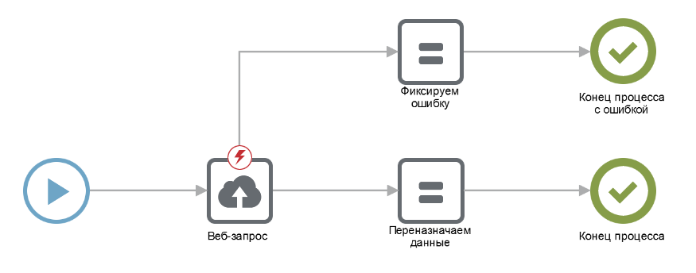
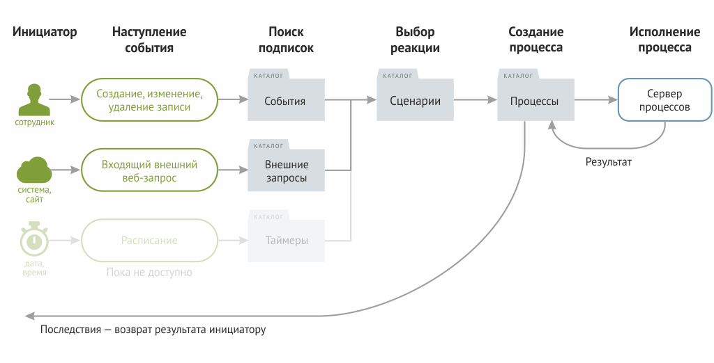

# 🤖 Автоматизации

Процесс – упорядоченная последовательность действий, направленная на решение определенной задачи. Для описания бизнес-процессов используются системы условных обозначений — нотации. Бипиум использует [нотацию BPMN 2.0](https://ru.wikipedia.org/wiki/BPMN). Настройка бизнес-процессов ведется в графическом редакторе с помощью компонентов.

## **Предназначение**

Процессы в Бипиуме — реакции на события. При наступлении определенных событий, Бипиум запускает процессы, которые предназначены для решения 3-х основных задач:

* Обеспечение жизненного цикла бизнес-логики (например, движение заявки по процессу обработки заявок).
* Автоматизация рутинных операций (например, рассылка сообщений через мессенджер).
* Взаимодействие с внешними системами (например, прием документов от бухгалтерских программ)

### Терминология

**Сценарий** — блок-схема бизнес-процесса, описывающая алгоритм его выполнения.

**Процесс** — копия сценария, запущенная на исполнение с определенными входными параметрами.

**Событие** — определенные ситуации, возникающие в системе и вне её.

**Подписка** — назначение определенной реакции (запуск процесса) при наступлении некого события.

## Принцип работы

1. **Событие**. При наступлении в Бипиуме одного из событий:
   * при изменении, создании и удалении записи в каталогах.
   * при получении внешнего веб-запроса.
   * по расписанию (пока не реализовано).
2. **Реакция.** Бипиум ищет сценарии, подписанные на эти события:
   * Подписки на события хранятся в каталоге «События».
   * Связанные с событиями сценарии в каталоге «Сценарии».
3. **Создание процесса.** Для связанного с событием сценария Бипиум запускает его копию — процесс:
   * в каталоге «Процессы» создается запись с параметрами запуска: инициатор, событие, сценарий, входные параметры.
   * копия сценария запускается на исполнение с входными параметрами.
4. **Исполнение**. Процесс исполняется, последовательно выполняя компоненты, и может:
   * изменять данные в Бипиуме.
   * делать внешние веб-запросы.
   * делать внешние запросы к базам данных.
   * манипулировать с данными.
5. **Результат**. После завершения процесса, его результат сохраняется в каталоге «Процессы»:
   * устанавливается статус: завершен или ошибка.
   * сохраняются выходные параметры (переменные).
6. **Последствия**. Для некоторых событий выходные параметры процесса передаются инициатору события:
   * для событий изменения данных в Бипиуме («перед изменением», «перед созданием», «перед удалением») результат используется для отображения сообщения сотруднику (например, сообщения об ошибке).
   * для событий изменения данных в Бипиуме («во время редактирования») результат применяется в качестве новых значений полей редактируемой записи.
   * для событий, связанных с приемом внешних запросов, результат возвращается в качестве HTTP-ответа.

## Как настроить

### Создайте сценарий

* В отделе «Управление» в каталоге «Сценарии» добавьте новую запись.
* В поле «Сценарий» нажмите «создать».
* Нарисуйте сценарий: из панели компонентов выберите требуемые и расположите их в необходимой последовательности, задайте их свойства.

Подробнее о сценариях, графическом редакторе и компонентах читайте в статье «[Сценарии](scripts/)».

### Подпишитесь на событие

1. В отделе «Управление» в каталоге «События» добавьте новую запись.
2. Настройте параметры события.
3. В качестве реакции выберите сценарий.

Подробнее о настройке событий и реакций читайте в статье «[События и процессы](events/)».

## **Ограничения**

#### **В облаке**

Максимальное число одновременно запущенных процессов: 100.\
Максимальная длительность выполнения процесса: 24 часа.\
Максимальный размер пользовательских данных процесса: 256 Кб.

#### **На своем сервере**

В серверной версии параметры ограничения настраиваются индивидуально.\
Подробнее читайте в статье «[Ограничения](limits.md)».
