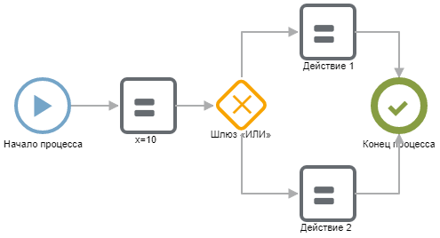

# Примеры настройки

В этом разделе приведены примеры настройки типовых кейсов и фрагментов сценариев.

## Условие

Подробнее в статье «[Условие](if.md)».

## Цикл

Подробнее в статье «[Цикл](for.md)».
