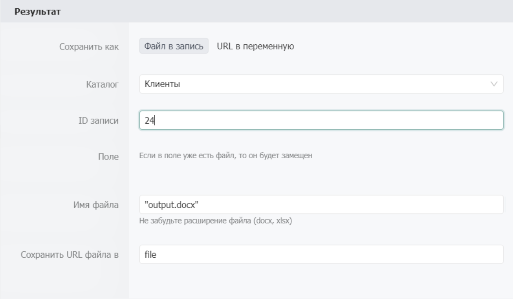

# Сгенерировать документ

Используется для создания документа из заранее загруженного шаблона. Поддерживаются форматы .xslx и .docx. Для его использования необходимо создать файл шаблона размеченного тегами, загрузить файл в Bpium и подготовить JSON с тегами. &#x20;

## Свойства

### Секция «Шаблон»

**Путь к шаблону**\
****Принимает ссылку на файл шаблона. Ссылка может быть представлена как в виде указания местоположения файла в системе (`Файл из каталога`) или ссылка на файл шаблона располагающийся на доступном серверу BPIUM хосте (`URL к файлу`).

.png>)

**Каталог**\
****Список доступных каталогов для поиска записей. Формат: список каталогов.

**ID записи**  \
****Идентификатор записи, которую надо изменить. Формат: **** значение/выражение.

**Поле**\
****Идентификатор поля в котором находится ссылка на файл шаблона.

.png>)

**URL шаблона**\
****URL к файлу шаблону находящемуся в открытом для системы доступе.

### Секция «Данные»

Ожидает данные которые будут переданы в шаблон, для вставки. Данные можно вводить как в формате «Ключ = значение», так и в виде «JSON» строки.

**Формат значений**  \
****Позволяет выбрать формат представления данных для шаблона. `Ключ=значение` — позволит задавать значения ключей используемых в шаблоне. `JSON-объект` — позволит передать все данные как JS-объект.

_Формат значений:_ «_Формат ключ = значение_»

.png>)

В данном формате вы задаете ключи которые можно использовать дальше в шаблоне. В отличии от типа JSON поле ключ не считаемое, это означает, что наименование ключа статично.

```javascript
    key1: value1,      // Ключ = значение
    key2: {            // Ключ с вложенным ключом
        key3: value3    
        }

```

_Формат значений: Формат_ «_JSON - объект_»

.png>)

Позволяет записывать строку в формате JSON и в отличие от предыдущего формата поле ввода считаемое, поэтому в качестве любой части, в том числе и ключа, может быть использован результат вычисления.

```javascript
{
    key1: value1,      // Ключ = значение
    key2: {            // Ключ с вложенным ключом
        key3: value3    
    },
    [key4]: value4     // Переменная в качестве ключа.
}
```

### Секция «Результат»

Формат возврата готового файла.

**Сохранить как**\
****Позволяет сохранить готовый файл в указанную запись `Файл в запись` или вернуть ссылку на полученный файл `URL в переменную`.

_Сохранить как: Файл в запись_



Сохраняет результат в поле типа Файл в указанной записи.

**Каталог**\
****Список доступных каталогов для поиска записей. Формат: список каталогов.

**ID записи**  \
****Идентификатор записи, которую надо изменить. Формат: **** значение/выражение.

**Поле**\
****Идентификатор поля, в которое надо сохранить файл. Формат: **** значение/выражение.

_Сохранить как: URL в переменную_

 (1).png>)

**Имя файла**\
****Название под которым будет сохранен файл. Формат: **** значение/выражение

**Сохранить URL файла в**\
****Выходной параметр. Переменная, в которую будет сохранен URL файла в файловом хранилище. Формат: **** имя **** переменной.

## Использование

**Подготовка шаблона**\
****Первым делом вам необходимо определиться с тем, какие данные будут использованы в документе.&#x20;

.png>)

Для разметки шаблоны применяются теги, которые повторяют структуру передаваемых в компонент данных. Теги обрамляются двойными фигурными скобками - **\{{ \}}.**

#### **Пример**

У нас есть данные которые мы отправляем в компонент:

```
// Для формата "Ключ = значение"
executor= {
    "name": "Роговский и партнеры",
    "inn": 34834529585,
    "kpp": 2384384,
    "address": "г. Северодвинск, ул. Непонятная, д. 12, оф. 404",
    "table":[{"number":"one", "price":"12"}, {"number":"two", "price":"42"}]
customer = {
   	"name": "Продаван",
    "inn": 12334546564,
   	"kpp": 9785545,
   	"address": "г. Альметьевск, ул. Героя, д. 3, оф. 504"
    }

// Для формата "JSON"
{"executor": {
    "name": "Роговский и партнеры",
    "inn": 34834529585,
    "kpp": 2384384,
    "address": "г. Северодвинск, ул. Непонятная, д. 12, оф. 404",
    "table":[{"number":"one", "price":"12"}, {"number":"two", "price":"42"}], 
"customer": {
    "name": "Продаван",
    "inn": 12334546564,
    "kpp": 9785545,
    "address": "г. Альметьевск, ул. Героя, д. 3, оф. 504"
    }
    }
}
 
```

Для того что бы вставить в текст наименование компании-заказчика мы будем использовать тэг \{{executor.name\}}, что соответствует иерархической структуре переданных данных. Для формирования списков и строк таблиц (множимые данные) нужно присвоить массив объектов с одинаковой структурой.&#x20;


Использование множимых данных в шаблоне возможно только в соответствующей структуре. К примеру: вы можете использовать их только создав первый элемент списка или первую строку таблицы




.png>)

```
...
"table":[{"number":"one", "price":"12"}, {"number":"two", "price":"42"}],
...
```

Тегирование происходит по тому же принципу, что и с другими данными:\
\{{table.number\}}, \{{table.price\}} размножат строки по количеству элементов массива и заполнят соответствующими свойствами объектов массива.

## Пограничные события


Компонент поддерживает 2 типа пограничных событий:

* Ошибка — выход из компонента, если произошла какая-либо ошибка
* Таймаут — выход из компонента, спустя заданное ограничение по времени

Если компонент завершился с ошибкой, но на нем не было пограничного события, то процесс завершается. Сообщение ошибки возвращается в результатах процесса.
