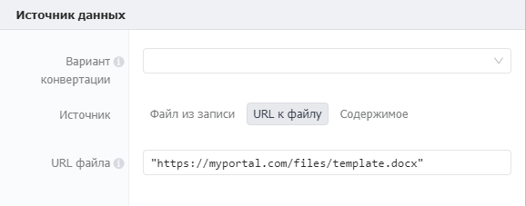
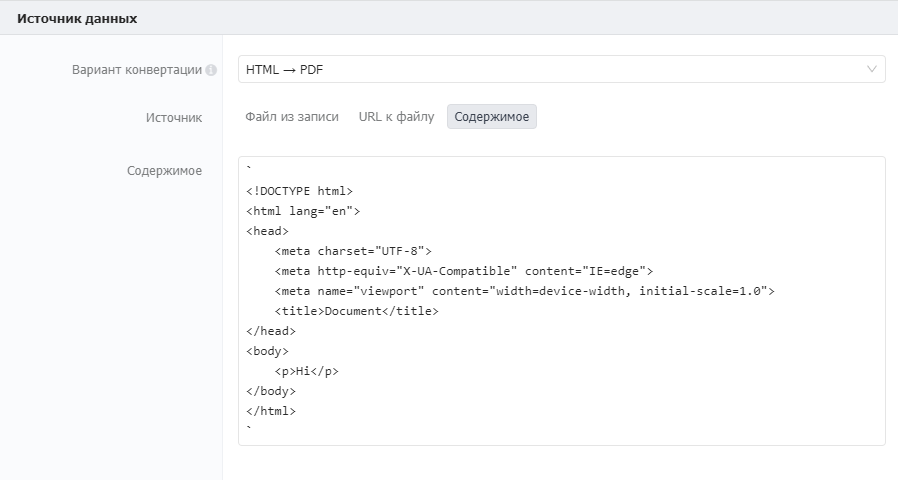
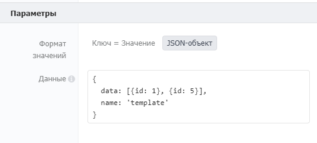
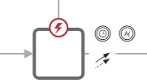

# Конвертер

Используется для конвертации данных и файлов. Подразумевается два варианта использования: генерация документа на основе пользовательского шаблона, и преобразование данных из одного типа в другой, варианты конвертации и примеры использования описаны ниже.

## Свойства

### Секция «Источник данных»

**Вариант конвертации**

<div align="left"><figure><figcaption></figcaption></figure></div>

Список вариантов для конвертации.&#x20;

* `HTML` → `PDF`: Генерация PDF буфера, принимает в качестве входных переменных HTML файл из записи, ссылку на файл или произвольную HTML разметку. Вывод компонента может содержать как сам PDF-файл, так и его буфер.
* `Excel` → `JSON`: Генерация JSON объекта из Excel-таблицы. JSON будет записан в переменную.
*   `XML` → `JSON`:

    Генерация JSON объекта из файла с XML-разметкой. JSON будет записан в переменную.

**Источник**

В качестве источника данных могут быть выбраны следующие:

* Файл из записи&#x20;
* URL к файлу
* Содержимое

**Файл из записи** \
Принимает значение из поля типа «Файл» в записи Бипиума. Указанный файл будет сконвертирован.

<div align="left"><figure><figcaption></figcaption></figure></div>

* **Каталог**\
  Список доступных каталогов для поиска записей. Формат: список каталогов.
*   **ID записи**  \
    Идентификатор записи, в которой находится файл для конвертации.

    Формат: значение/выражение.
* **Поле**\
  Идентификатор поля записи, в которой находится файл для конвертации.

**URL к файлу**\
URL к файлу, который находится в открытом для системы доступе. Если вариант подразумевает использование шаблона, по ссылке должен находится он.

<div align="left"></div>

**Содержимое**\
Поле для ввода содержимого к конвертации. В поле может храниться произвольная HTML-разметка (для варианта конвертации HTML -> PDF) или буферные данные, на основе которых будет производиться конвертация.

Формат данных в поле – строка. Данные могут храниться в произвольных кавычках. Для использования переменных сценария в качестве встраиваемых значений используйте одинарные обратные кавычки «\`». Пример заполнения поля HTML-разметки представлен ниже:



### Секция «Параметры»

Данные можно вводить в формате «Ключ = значение» или в виде JSON-объекта.

Секция появляется только в том случае, если выбранный вариант конвертации поддерживает формат работы с параметрами.

В зависимости от варианта конвертации, поддерживаются следующие параметры:

#### **HTML → PDF**

<table><thead><tr><th width="206">Параметр</th><th width="116">Тип</th><th width="286">Описание</th><th>По умолчанию</th></tr></thead><tbody><tr><td>Width</td><td><p>string | </p><p>number</p></td><td>Устанавливает ширину бумаги. Передается число или строка с единицей измерения.</td><td></td></tr><tr><td>Height</td><td><p>string | </p><p>number</p></td><td>Устанавливает высоту бумаги. Передается число или строка с единицей измерения.</td><td></td></tr><tr><td>Format</td><td>string</td><td><p>Возможные размеры формата:</p><p>- Letter: 8,5 х 11 дюймов</p><p>- Legal: 8,5 х 14 дюймов</p><p>- Tabloid: 11 дюймов х 17 дюймов</p><p>- Ledger: 17 дюймов х 11 дюймов</p><p>- A0: 33,1 дюйма х 46,8 дюйма</p><p>- A1: 23,4 дюйма х 33,1 дюйма</p><p>- A2: 16,54 дюйма х 23,4 дюйма</p><p>- A3: 11,7 дюйма х 16,54 дюйма</p><p>- A4: 8,27 дюйма х 11,7 дюйма</p><p>- A5: 5,83 дюйма х 8,27 дюйма</p><p>- A6: 4,13 дюйма х 5,83 дюйма</p><p>Если передаются параметры Width и(или) Height вместе с параметром Format, то будет применен размер страницы, указанный в параметре Format.</p></td><td>'A4'</td></tr><tr><td>Margin</td><td>string | object</td><td><p>Для указания индивидуальных отступов необходимо передать объект со значениями полей. Например:</p><p>{</p><p>    top: '1cm',</p><p>    left: '2cm',</p><p>    right: '0.5cm',</p><p>    bottom: '1cm'</p><p>}</p></td><td>'1cm'</td></tr><tr><td>Landscape</td><td>boolean</td><td>Ориентация бумаги. Установите true для альбомной ориентации страницы.</td><td>false</td></tr><tr><td>printBackground</td><td>boolean</td><td>Установите false, если не нужно печатать фоновую графику (background).</td><td>true</td></tr><tr><td>Scale</td><td>number</td><td>Масштабирует визуализацию веб-страницы. Значение должно быть больше 0.1 и меньше 2.</td><td>1</td></tr><tr><td>pageRanges</td><td>string</td><td><p>Диапазоны бумаги для конвертации. Например, ‘1-5’, ‘8’, ‘11-13’.</p><p>Пустая строка - означает, что конвертируются все страницы.</p></td><td>‘ ’</td></tr><tr><td>displayHeaderFooter</td><td>boolean</td><td>Показывать ли верхний и нижний колонтитулы. Установите true для показа колонтитулов.</td><td>false</td></tr><tr><td>headerTemplate</td><td>string</td><td><p>Работа с колонтитулами. Передайте HTML шаблон, со следующими классами, используемыми для ввода в них значений:</p><p>- date форматированная дата печати</p><p>- title название документа</p><p>- url местонахождение документа</p><p>- pageNumber текущий номер страницы</p><p>- totalPages общее количество страниц в документе</p><p>Например, если хотите вывести название документа в колонтитул, необходимо передать html шаблон с классом title: '&#x3C;p class="title" style="font-size: 7pt; margin-left: 1cm;">&#x3C;/p>'</p></td><td></td></tr><tr><td>footerTemplate</td><td>string</td><td>Работа с колонтитулами.<a href="https://pptr.dev/api/puppeteer.pdfoptions.headertemplate"> </a><a href="https://pptr.dev/api/puppeteer.pdfoptions.headertemplate">HTML-шаблон</a> для нижнего колонтитула. Использует те же классы, что и headerTemplate.</td><td></td></tr></tbody></table>

#### **XML → JSON**

<table><thead><tr><th width="231">Параметр</th><th width="321.3333333333333">Описание</th><th>По умолчанию</th></tr></thead><tbody><tr><td>attrkey</td><td>Префикс, используемый для доступа к атрибутам.</td><td>$</td></tr><tr><td>charkey</td><td>Префикс, используемый для доступа к содержимому символа.</td><td>_</td></tr><tr><td>trim</td><td>Обрезать пробелы в начале и конце текстовых узлов.</td><td>false</td></tr><tr><td>normalizeTags</td><td>Перевести все имена тегов в нижний регистр.</td><td>false</td></tr><tr><td>normalize</td><td>Обрезать пробелы внутри текстовых узлов.</td><td>false</td></tr><tr><td>explicitRoot</td><td>Установите это, если вы хотите получить корневой узел в результирующем объекте.</td><td>true</td></tr><tr><td>emptyTag</td><td>Каково будет значение пустых узлов.</td><td>“ ”</td></tr><tr><td>explicitArray</td><td>Всегда помещать дочерние узлы в массив, если это правда; в противном случае массив создается только в том случае, если их больше одного.</td><td>true</td></tr><tr><td>ignoreAttrs</td><td>Игнорировать все атрибуты XML и создавать только текстовые узлы.</td><td>false</td></tr><tr><td>mergeAttrs</td><td>Объединить атрибуты и дочерние элементы в качестве свойств родительского объекта вместо того, чтобы отделять атрибуты от объекта дочернего атрибута. Эта опция игнорируется, если ignoreAttrs = true.</td><td>false</td></tr><tr><td>validator</td><td>Вы можете указать вызываемый объект, который каким-то образом проверяет результирующую структуру, как вы хотите.</td><td>null</td></tr><tr><td>xmlns</td><td>Дайте каждому элементу поле, обычно называемое '$ns' (первый символ совпадает с attrkey), которое содержит его локальное имя и URI пространства имен.</td><td>false</td></tr><tr><td>explicitChildren</td><td>Поместить дочерние элементы в отдельное свойство. Не работает с mergeAttrs = true. Если у элемента нет дочерних элементов, то «дочерние элементы» не будут созданы.</td><td>false</td></tr><tr><td>childkey</td><td>Префикс, который используется для доступа к дочерним элементам, если explicitChildren установлено значение true.</td><td>$$</td></tr><tr><td>preserveChildrenOrder</td><td>Изменяет поведение explicitChildren так, что значение дочерних элементов становится упорядоченным массивом. Когда это равно true, каждый узел также получит #nameполе, значение которого будет соответствовать XML nodeName, так что вы можете перебирать массив дочерних элементов и по-прежнему иметь возможность определять имена узлов. Именованные (и потенциально неупорядоченные) свойства также сохраняются в этой конфигурации на том же уровне, что и упорядоченный дочерний массив.</td><td>false</td></tr><tr><td>charsAsChildren</td><td>Определяет, следует ли считать символы дочерними, если explicitChildren включено.</td><td>false</td></tr><tr><td>includeWhiteChars</td><td>Определяет, следует ли включать текстовые узлы, содержащие только пробелы.</td><td>false</td></tr><tr><td>attrNameProcessors</td><td><p>Позволяет добавлять функции обработки имени атрибута. Принимает Array функции со следующей сигнатурой:</p><p>function (name){</p><p>//do something with `name`</p><p>    return name</p><p>}</p></td><td>null</td></tr><tr><td>attrValueProcessors</td><td><p>Позволяет добавлять функции обработки значений атрибутов. Принимает Array функции со следующей сигнатурой:</p><p>function (value, name){</p><p>  //do something with `name`</p><p>  return name</p><p>}</p></td><td>null</td></tr><tr><td>tagNameProcessors</td><td><p>Позволяет добавлять функции обработки имен тегов. Принимает Array функции со следующей сигнатурой:</p><p>function (name){</p><p>  //do something with `name`</p><p>  return name</p><p>}</p></td><td>null</td></tr><tr><td>valueProcessors</td><td><p>Позволяет добавлять функции обработки значений элементов. Принимает Array функции со следующей сигнатурой:</p><p>function (value, name){</p><p>  //do something with `name`</p><p>  return name</p><p>}</p></td><td>null</td></tr></tbody></table>

#### **Формат значений**

Позволяет выбрать способ передачи параметров конвертации. Возможные значения: Ключ = значение, JSON-объект.

* Формат «ключ = значение»\
  Параметры передаются в виде Наименование параметра = Значение параметра

<div align="left"></div>

* Формат «JSON — объект»\
  Параметры передаются в виде JSON-объекта.

<div align="left"></div>

В отличие от формата «Ключ-значение» этот формат может принимать в качестве ключа атрибута значение переменной:

```javascript
{
    key1: value1,      // Ключ = значение
    key2: {            // Ключ с вложенным ключом
        key3: value3    
    },
    [key4]: value4     // Переменная в качестве ключа.
}
```

### Секция «Результат»

Формат возврата готового файла.

**Сохранить как**\
Позволяет получить результат в одном из 3х вариантов:

* Файл в запись

Cохраняет результат в поле типа Файл в указанной записи

**Каталог**\
Список доступных каталогов для поиска записей. Формат: список каталогов.

**ID записи**  \
Идентификатор записи, которую надо изменить. Формат: значение/выражение.

**Поле**\
Идентификатор поля, в которое надо сохранить файл. Формат: значение/выражение.

**Имя файла**\
Имя под которым будет файл будет сохранен в файловом хранилище. Формат: значение/выражение.

**Сохранить URL файла в**\
Имя переменной куда будет записана ссылка на файл. Формат: имя переменной.

.png>)

* URL в переменную

**Имя файла**\
Название под которым будет сохранен файл. Формат: значение/выражение

**Сохранить URL файла в**\
Выходной параметр. Переменная, в которую будет сохранен URL файла в файловом хранилище. Формат: имя переменной.

.png>)

* Содержимое в переменную

**Сохранить содержимое в**

Имя переменной куда будет записан результат работы компонента. Например, конвертер Excel->JSON может как записать результат в файл, так и сохранить его в переменную для дальнейшего использования в сценарии.

.png>)

Для конвертации Excel -> JSON результатом будет объект, ключи которого - наименование листа Excel, значения - массив с полями листа.

```
{
  Лист1: [
    { 
      A: "ячейка А1", 
      B: "ячейка B1", 
      C: "ячейка C1" 
    },
    { 
      A: "ячейка А2", 
      B: "ячейка B2", 
      C: "ячейка C2"
    },
  ],
  Лист2: [
    { 
      A: "ячейка А1", //ячейка B2 не заполнена
      C: "ячейка C1"
    },
    { 
      A: "ячейка А2", 
      B: "ячейка B2", 
      C: "ячейка C2"
    },
  ],
};
```

Результат конвертации XML -> JSON.

```
{
  "CAT": {
    "NAME": "Izzy",
    "BREED": "Siamese",
    "AGE": "6",
    "ALTERED": "yes",
    "DECLAWED": "no",
    "LICENSE": "Izz138bod",
    "OWNER": "Colin Wilcox"
  }
}
```

## Пограничные события



Компонент поддерживает 2 типа пограничных событий:

* Ошибка — выход из компонента, если произошла какая-либо ошибка
* Таймаут — выход из компонента, спустя заданное ограничение по времени

Если компонент завершился с ошибкой, но на нем не было пограничного события, то процесс завершается. Сообщение ошибки возвращается в результатах процесса.
