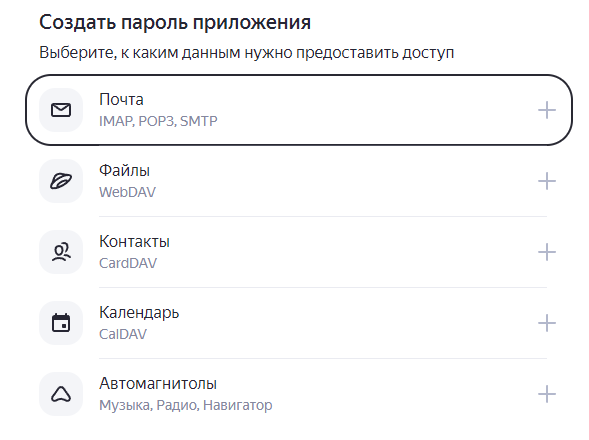
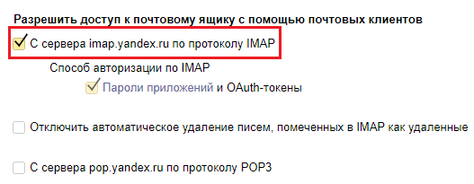

# Получение почты

## **Свойства**

### Секция «Подключение»

#### Способ подключения

Позволяет выбрать способ задания параметров подключения к почтовому серверу. Возможные варианты: параметры и строка подключения. Вариант параметры позволяет указать параметры подключения по отдельности. Вариант строка подключения — единой строкой со всеми параметрами.&#x20;

_Способ подключения: Параметры_

#### **Адрес сервера**

Адрес (домен или IP-адрес) почтового сервера. Например, «imap.yandex.ru». Формат: «значение в кавычках» или выражение.

#### **Порт**

Порт почтового сервера. Например, 993. Формат: «значение в кавычках» или выражение.

#### **Шифрование**

Указывает использовать ли защищенное соединение (SSL) для подключения к почтовому серверу. Вариант «не использовать» сначала пробует соединиться используя технологию STARTTLS, при неуспехе пробует без шифрования.

#### **Логин**

Логин для авторизации на почтовом сервере. Как правило совпадает с адресом электронной почты. Формат: «значение в кавычках» или выражение.

#### **Пароль**

Пароль для авторизации на почтовом сервере. Как правило совпадает с паролем от адреса электронной почты. Формат: «значение в кавычках» или выражение.

#### **Токен для подключения**

Токен для подключения к почтовому серверу по протоколам помимо IMAP. На данный момент не используется.

_Способ подключения: Строка подключения_

#### **Строка подключения**

Строка подключения к почтовому серверу со всеми параметрами.

### **Секция «Критерии поиска писем»**

#### **Тип фильтра**

Позволяет указать фильтры получаемых сообщений. Доступен набор предопределенных фильтров при выборе типа «Стандартный» и набор пользовательских фильтров при выборе типа «Расширенный».

_Тип фильтра: Стандартный_

#### **Категория писем**

Фильтрация получаемых писем по заранее определенным категориям. Доступные значения: «Все», «Отвеченные», «Черновик», «Удаленные», «Новые», «Недавние», «Непрочитанные», «Без флага».

#### **Дата писем «от»**

Фильтрация получаемых писем по дате получения. Задается начальная дата, относительно которой получается список писем. Дата в формате RFC или ISO. Для упрощенного ввода даты в ISO возможно использование метода toISOString() библиотеки moment js. Пример:

```javascript
`2022-08-31T11:38:18.167Z` //Дата в формате ISO
`Fri, 29 Dec 1995 11:24:28` //Дата в формате RFC2822
moment( ‘08.20.2012’ ).toISOString() //Преобразование даты 20.08.2012 к формату ISO
```

Любое из значений выше можно ввести в поле.

**Дата писем «до»**

Фильтрация получаемых писем по дате получения. Задается конечная дата, до которой получается список писем. Формат даты RFC или ISO. Для упрощенного ввода даты в ISO возможно использование метода toISOString() библиотеки moment js. Пример:

```javascript
`2022-08-31T11:38:18.167Z` //Дата в формате ISO
`Fri, 29 Dec 1995 11:24:28` //Дата в формате RFC2822
moment( ‘08.20.2012’ ).toISOString() //Преобразование даты 20.08.2012 к формату ISO
```

Любое из значений выше можно ввести в поле.

#### **Отправитель**

Фильтрация получаемых писем по электронной почте отправителя. Формат «значения в кавычках» или выражение.

#### **Тема**

Фильтрация писем по заданной теме. Поиск осуществляется по вхождению значения, указанного в поле.

_Тип фильтра: Расширенный_

#### Пользовательские фильтры

Массив флагов для поиска сообщений. Формат: [https://www.npmjs.com/package/node-imap](https://www.npmjs.com/package/node-imap)**.**

### **Секция «Правила получения письма»**

#### **Порядковый номер**

Указывается порядковый номер тела получаемого письма из массива всех полученных писем. Письмо с этим порядковым номером сохраняется в переменную из поля «Сохранить письмо в».

#### **Вложения**

Получение вложений выбранного в предыдущем поле письма. Доступные варианты: «Не получать», «Получить ссылки», «Получить содержимое». \
\
&#xNAN;_&#x412;ложения: Не получать_

При выборе этого значения вложения получаемого письма не будут получены.\
\
&#xNAN;_&#x412;ложения: Получить ссылки_

При выборе этого значения вложения получаемого письма будут получены в виде массива с файлами. Формат вложений:

<pre class="language-javascript"><code class="lang-javascript">attachments: [
	{
		«filename»: `Имя_файла.расширение`,
		«contentType»: `тип_файла`,
		«size»: `размер_файла`,
		«fileId»: `идентификатор_файла`,
		«url»: `ссылка на файл`
<strong>	},
</strong>	…
]
</code></pre>

_Вложения: Получить содержимое_

При выборе этого значения вложения получаемого письма будут получены в виде значений файлового буфера. Формат вложений:

```javascript
attachments: [
	{
		«filename»: `Имя_файла.расширение`,
		«contentType»: `тип_файла`,
		«size»: `размер_файла`,
		«content»: {
			«type»: «Buffer»,
			«data»: [ … ]
		}
	},
	…
]
```

#### Отметить письмо прочитанным

Позволяет отметить полученное письмо как прочитанное. Варианты – «Да», «Нет».

### **Секция «Результат»**

#### Сохранить письмо **«**&#x432;»

Переменная для записи тела полученного письма и его вложений.

#### **Сохранить количество найденных писем**

Переменная для записи полного количества найденных по фильтрам писем.

## **Параметры подключения к популярным сервисам**

### **Яндекс.Почта**

* Адрес сервера: «imap.yandex.ru»
* Порт: 993
* Шифрование: Использовать
* Логин: полный адрес эл. почты (в кавычках)
* Пароль: пароль приложения (в кавычках)

### **Gmail**

* Адрес сервера: «imap.gmail.com»
* Порт: 993
* Шифрование: Использовать
* Логин: полный адрес эл. почты (в кавычках)
* Пароль: пароль приложения (в кавычках)

## **Разрешения на получение почты через Бипиум**

Для возможности получать письма через протокол IMAP нужно дать соответствующий доступ в настройках вашего почтового ящика. Настройки доступов для сервисов Яндекс.Почта и Gmail описаны ниже. Оба сервиса требуют использование пароля приложений вместо портального пароля.

### **Яндекс.Почта**

#### **Получения пароля приложения**

* Перейдите по адресу [https://id.yandex.ru/security](https://id.yandex.ru/security) и авторизуйтесь под своей учетной записью.
* На странице найдите секцию «Доступ к вашим данным» и перейдите на страницу «Пароли приложений»:

<figure><figcaption></figcaption></figure>

* На открывшейся странице в секции «Создать пароль приложения» выберите «Почта»:

<figure><figcaption></figcaption></figure>

* Следуйте подсказкам для создания пароля приложения. Сохраните созданный пароль и используйте его в качестве пароля в компоненте «Получение почты».

#### **Разрешение на получение почты через IMAP**

* Войдите на сервис [https://mail.yandex.ru](https://mail.yandex.ru) и авторизуйтесь под своей учетной записью
* Откройте страницу всех настроек вашей учетной записи:

<figure><figcaption></figcaption></figure>

* Перейдите на страницу «Почтовые программы»:

<figure><figcaption></figcaption></figure>

* Отметьте выделенный чек-бокс:

<figure><figcaption></figcaption></figure>

### Gmail

#### **Получения пароля приложения**

* Войдите на сервис [https://gmail.com](https://gmail.com) и авторизуйтесь своей учетной записью.
* Кликните на иконку своего аккаунта и перейдите по ссылке «Управление аккаунтом Google»:

<figure><figcaption></figcaption></figure>

* Перейдите на вкладку «Безопасность»:

<figure><figcaption></figcaption></figure>

* В отделе «Вход в аккаунт Google» нажмите на пункт «Двухэтапная аутентификация». Завершите процесс настройки двухэтапной аутентификации, следуя подсказкам:

<figure><figcaption></figcaption></figure>

* После завершения процесса настройки двухэтапной аутентификации вновь перейдите на вкладку «Безопасность» (п. 3 выше).
* В отделе «Вход в аккаунт Google» нажмите на появившийся пункт «Пароли приложений»:

<figure><figcaption></figcaption></figure>

* В окне создания пароля укажите приложение «Бипиум» и нажмите «Создать»:

<figure><figcaption></figcaption></figure>

* Сохраните созданный пароль приложения и используйте его в качестве пароля в компоненте «Получение почты»:

<figure><figcaption></figcaption></figure>

#### **Разрешение на получение почты через IMAP**

* Войдите на сервис [https://gmail.com](https://gmail.com) и авторизуйтесь своей учетной записью.
* Нажмите на иконку шестеренки возле иконки учетной записи и перейдите по ссылке «Все настройки»:

<figure><figcaption></figcaption></figure>

* Перейдите в отдел «Пересылка и POP/IMAP»:

<figure><figcaption></figcaption></figure>

* Нажмите на «Включить IMAP»:

<figure><figcaption></figcaption></figure>
