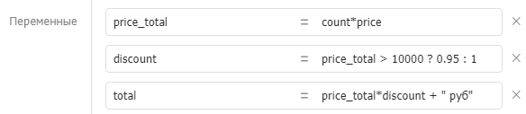

# Выражения

Большинство компонентов принимают на вход параметры в формате выражений. Выражения — вычисляемые конструкции из текста, переменных и различных функций. Переменные также могут принимать значения в формате выражений (компонент «[Назначение переменных](components/setvariables.md)»).



## Синтаксис

Выражения — вычислимый по правилам Javascript-код. Выражения поддерживают использование переменных, операций и функции базовых объектов JavaScript. Примеры:

* `"Текст"` → Текст
* `variable` → переменная variable → значение переменной variable
* `["1"]` → Массив с одним элементов, равным "1"
* `"Текст с " + variable + " внутри"` → Текст с \[значение переменной variable] внутри
* `5*5+5` → 30
* `user.name.substr(0,3)` → первые 3 буквы свойства name объекта user
* `{name: "Петр", age: 21}` → объект с свойствами name и age
* `` `Добрый день, ${name}` `` → текстовый шаблон с переменной внутри

Подробнее: [базовые объекты JavaScript](https://developer.mozilla.org/ru/docs/Web/JavaScript/Reference/Global\_Objects).

Если требуется сделать более сложное вычисление, то используйте компонент «[Код (javascript)](components/code.md)».

### Текстовые константы: "Текст"

Чтобы указать в качестве значения свойства компонента или значения переменной текстовую строку, оберните значение в одинарные (') или двойные кавычки ("). Без кавычек Бипиум будет считать значение вычислимым выражением и пытаться исполнить.

Экранирование кавычек: `"Текст с \"кавычками\" внутри"` → Текст с "кавычками" внутри

### Шаблоны: \`Многострочный текст\`

Чтобы указать в качестве значения многострочную текстовую строку, оберните значение в обратные одинарные кавычки (символ левее кнопки «1» на клавиатуре), не путайте с обычной одинарной кавычкой ('). Такое выражение название шаблоном. Внутри шаблона допустимо использовать переменные и выражения, заключив их в конструкцию вида `${выражение}`.

Пример использования шаблона в качестве значения выражения:

```javascript
`Здравствуйте, ${name}!
Рады сообщить вам, что...`
```

## **Результат**

### Успешное вычисление

В зависимости от выражения и используемых функций результат выражений может быть строкой, числом, датой, объектом или массивом. Переменные внутри процесса могут быть любого из этих форматов.

### Ошибка при вычислении

Если выражение некорректно, то Бипиум завершит процесс с возвратом ошибки. Возможные ошибки в выражениях:

* некорректный синтаксис
* использованы несуществующие переменные
* использованы недоступные функции
