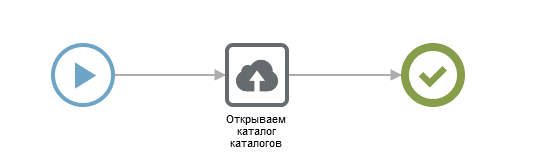

# Входные и выходные параметры компонентов

## **Входные параметры**

Входные параметры в сценариях Bpium можно указывать с двумя способами:

1. Переменными
2. Идентификатор поля

Далее мы разберем каждый из вариантов более подробно.

### **Переменные**

Переменные могут быть заданы либо в самом сценарии, либо могут быть преданы как входные параметры для сценария. Переменные как входные параметры для компонентов могут быть использованы там где в поле указано “значение” / выражения.

#### **Пример**

Создадим в компоненте «Назначение переменных» переменную data с значением 'admin'



Далее передадим в компоненте «Найти записи» в фильтр следующие значения:

 (1).png>)

Результатом выполнения данного сценария выглядит следующим образом:

```javascript
"data": "admin",
"result": [
 {
  "id": "1",
  "title": "admin",
  "values": {
   "1": "admin",
   "2": "admin",
   "3": "",
   "4": [
   "$user"
   ],
   "5": []
   }
  }
 ]
```

Таким образом мы передали в фильтр значение ‘admin’ и получили все записи подходящие по критериям.

### **Идентификатор поля**

Идентификатор поля может быть задан либо числом указанным при создании, либо при помощи вложенных шаблонов. Далее мы разберем как задать идентификатор поля при помощи вложенных шаблонов.

#### **Пример**

Создадим в компоненте «Назначение переменных» переменную identifier с значением 1


Далее передадим в компоненте «Найти записи» в фильтр следующие значения:

.png>)

Результатом выполнения данного сценария выглядит следующим образом:

```javascript
"identifier": 1,
"result": [
 {
  "id": "1",
  "title": "admin",
  "values": {
   "1": "admin",
   "2": "admin",
   "3": "",
   "4": [
   "$user"
   ],
   "5": []
   }
 }
 ]
```

## **Выходные параметры**

Выходные параметры в сценариях Bpium можно указывать с двумя способами

1. Переменными
2. Ключ объекта и данные сохранятся как значения этого ключа

Способ задачи с помощью переменных мы разобрали в пункте с входными параметрами. Далее мы более подробно разберем как сохранить выходные параметры как значение ключа объекта.

**Пример**

В компоненте «Назначение переменных» создается объект «data» с ключом «temp» с подключами «сценарии», «события», «сотрудники» у каждого из которых есть свой подключи «values». В том же компоненте создается переменная «requiredData» с ключами и свойствами: employees = сотрудники, events = события, script = сценарии.

.png>)

Далее создаем 3 компонента «Найти записи» и в секции «Результат» в поле «Сохранить в» указываем следующие значения:

.png>)

.png>)

.png>)

### **Результат**

Результатом выполнения данного сценария выглядит следующим образом:

```javascript
"data": {
        "temp": {
            "сценарии": {
                "values": [
                    {
                        "id": "1",
                        "title": "Импорт",
                        "values": {
                            "1": "Импорт",
                            "2": "",
                            "3": [
                                {
                                    "id": 8,
                                    "title": "version.7.bpmn",
                                    "size": 15375,
                                    "url": "http://192.168.0.40:2020/storage/1/e1a8939a-4270-415d-82dd-985456f96a80/version.7.bpmn",
                                    "mimeType": "application/bpmn+xml",
                                    "metadata": null
                                }
                            ]
                        }
                    }
                ]
            },
            "события": {
                "values": [
                    {
                        "id": "1",
                        "title": "тест",
                        "values": {
                            "1": "тест",
                            "2": "",
                            "4": [
                                {
                                    "catalogId": "1",
                                    "catalogTitle": "Каталоги",
                                    "catalogIcon": "content-8",
                                    "recordId": "20",
                                    "recordTitle": "321",
                                    "isRemoved": false
                                }
                            ],
                            "5": [
                                "$record.after.create"
                            ],
                            "6": "",
                            "8": []
                        }
                    }
                ]
            },
            "сотрудники": {
                "values": [
                    {
                        "id": "1",
                        "title": "admin",
                        "values": {
                            "1": "admin",
                            "2": "admin",
                            "3": "",
                            "4": [
                                "$user"
                            ],
                            "5": []
                        }
                    },
                    {
                        "id": "2",
                        "title": "1",
                        "values": {
                            "1": "1",
                            "2": "shamil.vagapov@bpium.ru",
                            "3": "",
                            "4": [
                                "$extuser"
                            ],
                            "5": []
                        }
                    }
                ]
            }
        }
    },
```

Таким образом результаты исполнения компонентов «Найти записи» записались в свойства указанных объектов.
