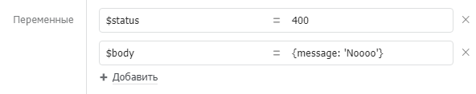

# Переменные

Процесс во время исполнения накапливает данные, доступные всем компонентам. Для передачи данных между компонентами используются переменные. Переменные могут создавать компоненты из своих выходных параметров и компонент «[Назначение переменных](components/setvariables.md)».

## Синтаксис **имен переменных**

Имена переменных задаются в соответствии с принятыми правилами в JavaScript. Ключевые правила:

* Первый символ должен быть латинской буквой (в верхнем или нижнем регистре), символом подчеркивания, знаком доллара ($ — используется для служебных выходных переменных Бипиума).
* Последующие знаки должны быть латинскими буквами, числами или символами подчеркивания.
* Имя переменной не должно совпадать с [зарезервированным словом](https://msdn.microsoft.com/ru-ru/library/0779sbks\(v=vs.94\).aspx).
* Имена переменных чувствительны к регистру. Name и name — разные переменные.

Подробнее: **** [правила именования переменных в JavaScript](https://msdn.microsoft.com/ru-ru/library/67defydd\(v=vs.94\).aspx#Anchor\_1).

### **Примеры имен**

* `recordId`&#x20;
* `RecordId`
* `$status`&#x20;

## З**начение**

### **Тип данных**

Переменные в процессах Бипиума могут быть текстовыми, числовыми, датой, объектами `{}`и массивами `[]`. Большинство компонентов возвращают значения в виде текста. Чтобы присвоить переменной текстовую строку оберните значение в кавычки.

### Примеры значений

* `"текст"`&#x20;
* `123`
* `Date()`&#x20;
* `values[5]`
* `{ id: 3, email: 'bpium@bpium.ru' }`
* `[ {catalogId: '3', recordId: '4'}, {catalogId: '3', recordId: '5'} ]`
* В формате шаблонов (в обратных кавычках, находятся на клавише «ё»):\
  `` `многострочный текст ``\
  `` с переменной ${varname} внутри` ``

О манипуляции с данными читайте в статье «[Выражения](expression.md)».


**Как проверить задана ли переменная?**

Иногда бывает необходимо проверить задана ли переменная, например в входных параметрах. Если проверить наличие переменной `somevar` с помощью выражения `! somevar`, то процесс завершится с ошибкой, когда эта переменная не задана.

Проверить наличие переменной можно с помощью шлюза «или». Для этого на выходящую из шлюза ветку, которая соответствует отсутствию параметра `somevar`, нужно повесить условие `typeof sovevar === 'undefined'`. А на вторую ветку, которая соответствует ситуации, когда переменная `somevar` задана —`typeof somevar !== 'undefined'`

Также можно проверить и переопределить значение не заданной переменной в компоненте [Назначение переменных](components/setvariables.md#svoistva), с помощью выражения:

`typeof somevar !== 'undefined' ? somevar : "новое значение"`


####
