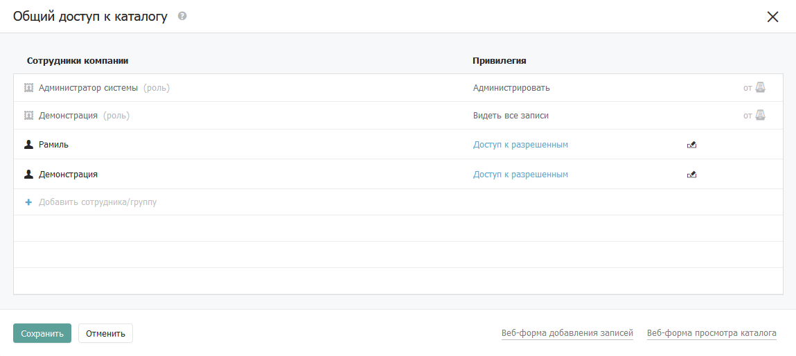

# Привилегии

Доступ к данным бывает разный: одни сотрудники могут видеть записи, а другие их изменять. Действия, которые сотрудники могут совершать, называются привилегиями.

### Привилегии

* **Видеть каталог/отдел** **в меню** —право видеть каталог/отдел в меню интерфейса
* **Видеть все записи** — право видеть все записи каталога (или во всех каталогов отдела)
* **Изменять все записи** — право редактировать все записи каталога (или каталогах отдела)
* **Создавать записи** — право создавать записи в каталоге (или каталогах отдела)
* **Экспортировать записи** — право выгружать в Excel записи каталога (или каталогов отдела)
* **Удалять записи** — право удалять записи в каталоге (или каталогах отдела)
* **Назначать права** — право задавать права на записи и другие объекты
* **Администрировать** — право изменять отдел, создавать или менять структуру каталогов

## Приоритеты привилегий

Каждая из следующих привилегий включает возможности предыдущих. Например, привилегия удалять записи включает возможность их видеть, изменять, создавать новые и экспортировать. Старше всех привилегия — «Администрировать».

Если на сотрудника не назначена ни одна привилегия, то Бипиум посчитает ситуацию неопределённой и запретит доступ.

## Принадлежность привилегий

#### Видеть, изменять, удалять, назначать права

Привилегии назначенные на `отдел`, `каталог` или `вид`, действуют не на них самих, а на все записи в них. Привилегии назначенные на запись, влияет на саму запись.

#### Создавать

Привилегия «Создавать» назначается на `отдел`, `каталог` или `вид`. Даёт право создавать записи в выбранных каталогах. Если привилегия назначена на `вид`, то сотрудник сможет создавать записи в каталоге, даже если созданная запись в итоге не попадёт в этот вид.

#### Экспортировать

Привилегия «Экспортировать» назначается на `отдел`, `каталог` или `вид`. Даёт право экспортировать доступные записи в Excel.

#### Назначать права

Привилегия «Назначать права» назначается на `отдел`, `каталог`, `вид` или `запись`. Дает право изменять права доступа к объекту и всем вложенным. Например, назначенная на `каталог`, даст сотруднику право менять права на `каталог`, все `виды` и все `записи`. Более того, даёт право создавать, удалять и изменять правовые `виды`. Право «Назначать права» однако не позволяет изменять правила с привилегией «Администрировать» для других сотрудников: Bpium не даст создать, удалить или изменить такие правила.

#### Администрировать

Привилегия «Администрировать» назначается на `отдел` и `каталог`. Даёт право переименовывать отдел и каталоги, сортировать их порядок, создавать новые каталоги и менять их структуру.

## Наследование привилегий

Привилегии `отдела` наследуются на `каталог`. Привилегии `каталога` наследуются на `записи`. Также на `записи` наследуются привилегии от всех `видов`, в которые она попадает.

Если на `отдел` назначено право «видеть все записи», то на запись будет пронаследовано право видеть без возможности изменения. Если изменять — будет изменять. Назначать права — будет назначать права. Если на `отдел` или `каталог` назначена привилегия «Администрировать», то она будет пронаследована как наивысшая разрешающая привилегия — «Назначать права».

В форме доступа на объект наследуемые правила показаны серым цветом. Их нельзя удалить.

## Привилегия «доступ к разрешенным»

Среди правил на `каталог` и `отдел` встречаются правила с привилегией «Доступ к разрешенным». Эта привилегия означает, что на часть записей каталога действуют отдельные привилегии, и указанный сотрудник получит некое право на них. Это может быть любая из привилегий в том числе и запрещающая. Таким образом Бипиум подсказывает, что существуют дополнительные права на записи в отделе и каталогах.

Показана форма назначения прав на каталог. Правила «доступ к разрешенным» выглядят следующим образом:

<figure><figcaption></figcaption></figure>

Эти правила можно изменить (повысить), но нельзя удалить. Чтобы заблокировать доступ для сотрудника на разрешенные записи, удалите правила у `записей` и `видов`.

Бипиум отображает эти привилегии, чтобы в едином окне показать полный перечень сотрудников, кто увидит `каталог` или `отдел` в меню.
