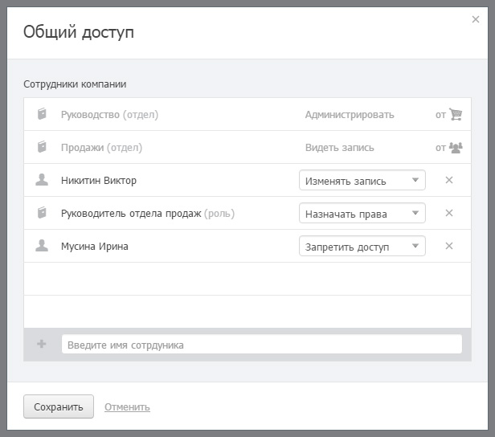

# Правила

## Форма доступа

Форма назначения прав на запись:

Доступ к объекту состоит из правил. Каждое правило состоит из субъекта (сотрудника или [правовой группы](https://docs.bpium.ru/rights/groups)) и уровня доступа субъекта к данным ([привилегия](https://docs.bpium.ru/rights/priviliges)).

**Наследование.** Правила, выделенные сером цветом — наследуемые. Их нельзя удалить. Иконка справа соответствует иконке каталога или отдела, подсказывая от кого наследуется это правило.

## Комбинация правил для сотрудника

Бипиум, определяя право доступа сотрудника к записи, комбинирует подходящие правила для отдела, каталога, всех видов и записей. Если для сотрудника подходит несколько правил, то выбирается правило с наивысшей привилегией. Подходящими считаются правила, если они назначены на этого сотрудника или на правовую группу, в которую он входит. Каждый сотрудник также входит в группу «Все сотрудники».

Подробнее об алгоритме комбинирования правил и прав на объекты в статье «[Комбинация прав](https://docs.bpium.ru/rights/policy)».
