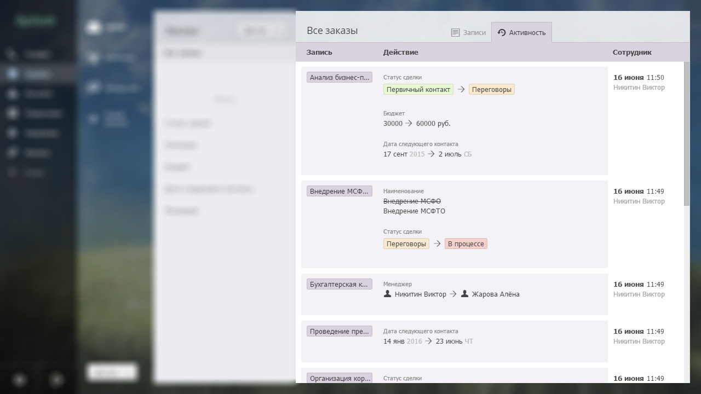

# Активность

## Лента изменений

Бипиум сохраняет изменения данных в записях, которые делают сотрудники. Изменения по всем записям попадают в общую ленту — активности. Лента позволяет оценить работу сотрудников.

События в ленте отсортированы по дате изменений: недавние — сверху, старые — снизу.

События показывают, какие поля были изменены, прежние и новые значения. Прежние значения зачёркнуты или показаны в виде изменения: Было → Стало. В правой колонке показан автор изменений и дата. В общей ленте активности также показаны комментарии, оставленные сотрудникам к записям.

## Фильтр изменений

В ленту активности попадают события по найденным записям. Если выбрать вид или задать фильтр, то будут показаны активности только по записям, удовлетворяющим условиям поиска.

### Права

Лента активности учитывает права доступа к данным. Сотрудник увидит события только по доступным ему записям.
