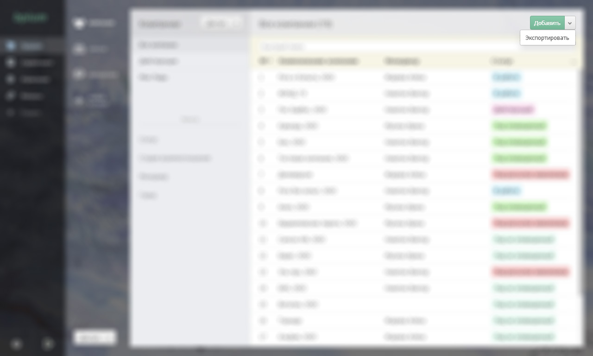
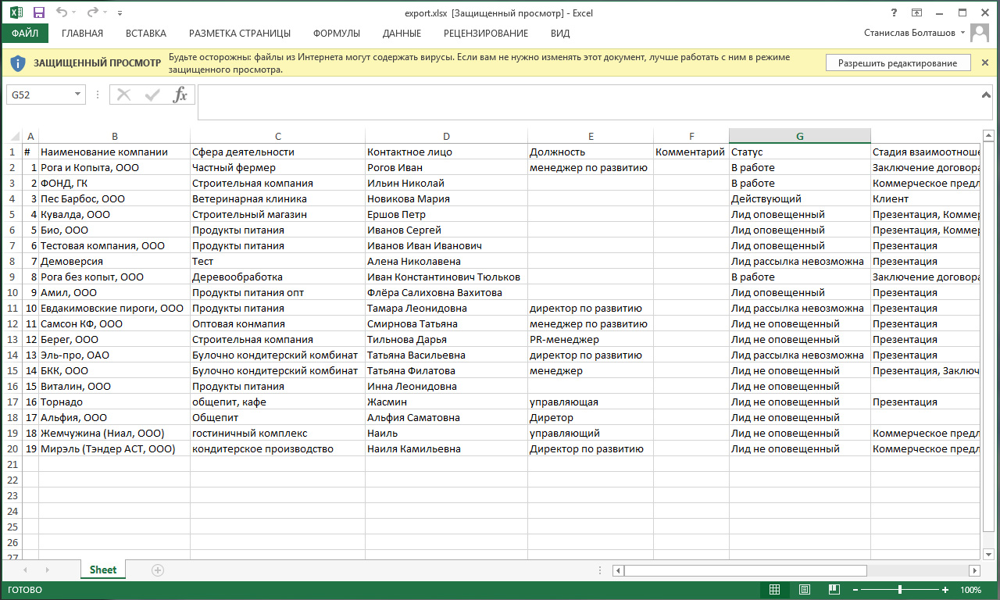

# Экспорт записей

## Экспорт в Excel

Список записей каталога можно экспортировать в файл Microsoft Excel.

Бипиум сохраняет в файл все записи каталога, а не только те, что на экране. Если заданы условия поиска, то будут экспортированы только записи, удовлетворяющие фильтру.

### Формат экспорта полей

Сложные типы полей (категории, контакты, связанные объекты,...) преобразуются в обычный текст:

Поля типа файл не экспортируются.

### Право экспортировать записи

Экспортировать записи могут сотрудники с правом «Экспортировать» или более высокой привилегией на каталог или вид. Подробнее в статье «[Права](https://github.com/bpium/bpium-documentation/tree/3eee69fa93775fc88bf609ca5696e1f9581d33fa/policy.html)».

## Экспорт типизированных данных

Для экспорта данных с учётом типов полей, воспользуйтесь методом API для получения записей.
