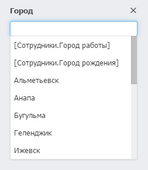

# Поиск и фильтрация

## Быстрый поиск

Быстрый поиск находит записи по совпадению в любом из текстовых полей анкеты или полей с контактами: телефонах, адресах электронной почты и их описаниях.

Для расширенного поиска используются фильтры.

## Фильтры

Фильтры расположены слева от записей каталога. Каждое поле анкеты каталога является фильтром, по которому можно находить записи.

Если задано несколько фильтров, то будут найдены записи, удовлетворяющие всем условиям — для полей применяется правило «**И**».

## Правила применения условий для типов полей

### Число

Фильтр позволяет задать диапазон значений. Также можно задать только одно из значений.

### Дата

Фильтр позволяет найти записи по фиксированному или относительному диапазон дат или найти записи без даты.

**Фиксированный диапазон**: интервал времени между конкретными днями года. Указывается в формате «дд.мм.гггг». Одна из дат может быть не указана. Например, _от_ «25.12.2015» найдет записи с указанной датой или более поздние.

**Относительный диапазон**: интервал времени между двумя датами относительно текущего дня. Задается в днях. Например: _от_ «-7» дней _до_ «7» дней. Одна из дат может быть не указана. Например, _до_ «-30» найдет все записи, просроченные больше чем на месяц.

**Предустановленные относительные диапазоны:**

* Сегодня — начиная от начала текущего дня и до конца дня
* Сегодня и ранее — все дни до текущего, включая его
* Вчера — полные прошедшие сутки
* Эта неделя — от понедельника до воскресенья этой недели (даже если оно ещё не наступило)
* Прошлая неделя — полная прошедшая неделя (7 дней начиная с понедельника)
* Этот месяц — с 1 числа этого месяца и до конца последнего дня этого месяца
* Последние 30 дней — от дня 30 дней назад и до текущего дня
* Прошлый месяц — полный прошедший календарный месяц
* Этот год —  с 1 января этого года и до 31 декабря этого года
* Последние 365 дней — от дня 365 дней назад и до текущего дня
* Прошлый год — полный прошедший календарный год
* Не указана — поиск записей без указанной даты. Параметр позволяет фильтровать записи по пустым значениям в полях.

### Контакт

Фильтр позволяет искать записи по контактным данным. В отличии от быстрого поиска, фильтр ищет только по значениям контактов: телефонам, электронной почте и адресам сайтов. Фильтр не ищет по описанию контактов.

Бипиум находит телефонные номера в любом формате ввода. Скобки, пробелы, дефисы и другие не числовые символы игнорируются.

### Статус

Фильтр позволяет выбрать одного или несколько значений. Если выбрано несколько значений, то будут найдены записи, у которых есть _хотя бы одно_ из этих значений. Условия применяются с логической операцией «**ИЛИ**».

`Например, найти записи, где статус «Зарегистрирована» ИЛИ «Согласование».`

**Не задано**: поиск записей без указанных значений. Параметр позволяет фильтровать записи по пустым значениям в полях.

### Набор галочек

Фильтр позволяет выбрать одного или несколько значений. Если выбрано несколько значений (галочек), то будут найдены записи, у которых есть _все_ из выбранных значений. Условия применяются с логической операцией «**И**».

`Например, найти записи, где пройдены стадия «консультация» И «демонстрация».`

**Не задано**: поиск записей без указанных значений. Параметр позволяет фильтровать записи по пустым значениям в полях.

### Вопрос

Поле вопрос представлен в виде набора галочек. Фильтр позволяет выбрать одного или несколько значений. Если в фильтре выбрано несколько значений, то будут найдены записи, у которых назначено _одно_ из этих значений. Условия применяются с логической операцией «**ИЛИ**».

`Например, найти записи, где поставлена оценка «точно и быстро» ИЛИ «точно, но долго».`

### Прогресс

Фильтр позволяет задать диапазон значений. Также можно задать только одно из значений.

### Оценка звездами

Фильтр позволяет выбрать одну или несколько звёзд.

### Сотрудники

Фильтр позволяет выбрать одного или нескольких сотрудников. Если выбрано несколько сотрудников, то будут найдены записи, у которых есть _хотя бы один_ из этих сотрудников. Условия применяются с логической операцией «**ИЛИ**».

**Не указан**: поиск записей без указанного сотрудника. Параметр «Не указан» позволяет фильтровать записи по пустым значениям в полях.

#### \[Сотрудники.Я]

Относительное значение \[Сотрудники.Я] позволяет находить записи, где в качестве сотрудника назначен текущий пользователь (тот, кто выполняет поиск). Используется для быстрого выбора себя и для видов, зависящих от смотрящего пользователя.

### Связанные объекты

Фильтр позволяет выбрать один или несколько связанных объектов. Если выбрано несколько значений, то будут найдены записи, у которых есть _хотя бы одно_ из них. Условия применяются с логической операцией «**ИЛИ**».

**Не задан**: поиск записей без указанных объектов. Параметр «Не задан» позволяет фильтровать записи по пустым значениям в полях.

#### Относительные значения

В фильтре по связанных данным могут также присутствовать относительные значения в формате: \[Сотрудники._Поле\\_анкеты\_сотрудника\_]. Они появляются, если это поле ссылается на каталог, который также связан с карточкой сотрудника.

_Пример: поле «Город» каталога клиентов ссылается на каталог городов. На этот же каталог ссылается поле «Филиал» каталога сотрудников. В этом случае будут найдены клиенты из того же города, который указан в карточке текущего пользователя._

Название относительного значения — \[Сотрудники._Поле\\_анкеты\_сотрудника\_]. Например, если в карточке сотрудника два поля: город рождения и город работы, то будет доступно и два значения:

Правовой вид с таким фильтром для разных сотрудников будет находить записи, которые пересекаются через смежный каталог и давать к ним доступ.

### Файлы

Фильтры по загруженным файлам в карточке — «Есть» или «Нет».
