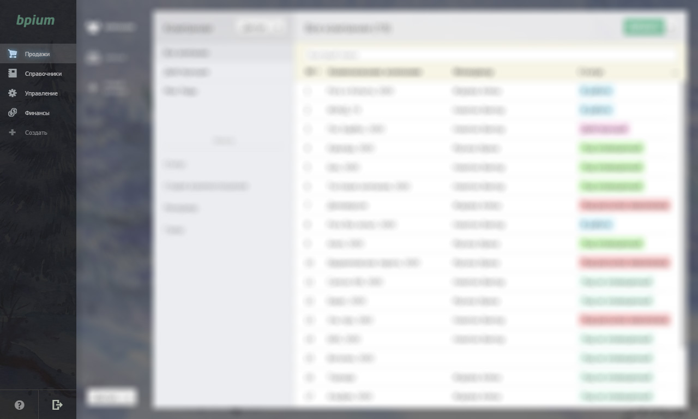
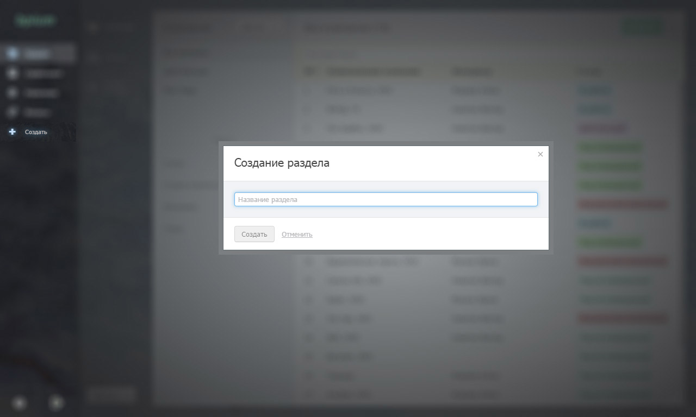

# Отделы

Отделы служат для наведения порядка. С помощью них вы можете группировать каталоги со связанными по смыслу данными. В Бипиуме нет ограничения на число отделов.

## Список отделов

Отделы отображены в верхней части экрана. По умолчанию в Бипиуме создан один отдел — «Управление».

## Создание нового отдела

В конце списка отделов находится кнопка добавления новых отделов. Отделы могут создавать сотрудники имеющие право администрировать отдел «Управление».

Вновь созданные отделы видны всем сотрудникам компании, пока на них не ограничили права.

## Изменение отдела

В нижней-левой части экрана расположена кнопка управления "Свойства отдела":

* Доступ к отделу — назначение прав на отдел
* Переименовать — изменение названия
* Удалить отдел — удаление отдела со всеми каталогами и данными

В зависимости от назначенных прав набор действий может быть ограничен.

## Удаление отдела

При удалении отдела также удаляются и все каталоги этого отдела. При этом, если другие записи ссылаются на записи удаленных каталогов, то эти связи останутся. Но открыть удаленные связанные записи будет нельзя.

### Восстановление удаленных данных

Удаленный отдел и каталоги становятся недоступны через приложение или API. Однако они сохраняются в базе данных, для возможности восстановления в случае ошибочного удаления. Для консультации по восстановлению данных напишите запрос на [support@bpium.ru](mailto:support@bpium.ru).
