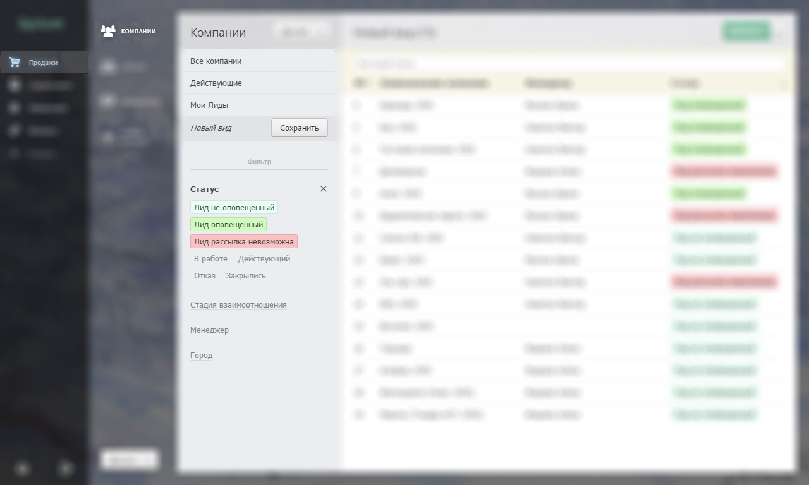

# Виды

Виды — сохраненные шаблоны фильтров для быстрого доступа к нужной информации.

## Список видов

Список видов расположен над фильтрами в левой панели окна каталога:

Виды отсортированы по алфавиту.

## Создание нового вида

Когда вы задаете условия фильтра, Бипиум предлагает сохранить их как новый вид:

## Типы видов

Личные виды — фильтруют записи, правовые — предоставляют доступ к записям.

### Личные виды

Рядовые сотрудники могут сохранить набор фильтров только как личный вид. Личные виды помогают упростить работу. Они фильтруют доступные сотруднику записи каталога. Каждый сотрудник может создать для себя свои виды, другие сотрудники их не увидят.

Форма создания/редактирования личного вида:

### Правовые виды

Правовые виды не только фильтруют записи каталога, но также предоставляют доступ к найденным записям группе сотрудников. Правовые виды могут создавать только сотрудники с правом «Администрировать» каталог.

С помощью правовых видов Бипиум реализуется атрибутную модель доступа к данным (ABAC) — доступ к записям на основе свойств этих записей. Также правовые виды позволяют задать правила редактирования полей анкеты. Подробнее о правовых видах рассказано в статье «[Правовые виды](https://docs.bpium.ru/rights/views)».

## Изменение вида

Для правовых видов можно настроить доступ. Изменять и удалять правовые виды могут только сотрудники с правом «Администрировать» каталог.

## Удаление вида

Если удалить правовой вид, то он будет удалён для всех сотрудников, и они потеряют доступ до записей, до которых предоставлял вид.
