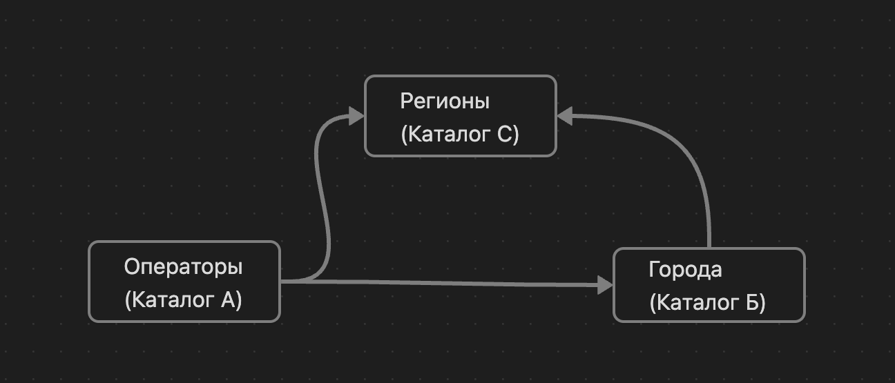

# Фильтры на связанные каталоги

Довольно часто возникают ситуации, когда при выборе записей необходимо отфильтровать их в связанном каталоге по определенному признаку. Например, у нас есть сущность в виде оператора, и, как правило, у оператора есть регион работы и город. Соответственно, можно выделить три общие сущности в виде каталога с соответствующими атрибутами. Когда мы создаем новую запись в каталоге операторов, мы хотели бы отфильтровать город работы оператора по его региону. Как же мы можем это сделать? На самом деле, все просто: для того, чтобы у каталога А появились фильтры по связанной записи каталога Б, оба связанных каталога должны ссылаться на каталог С. Вот наглядный пример для представления такой связи:\

<figure><figcaption></figcaption></figure>

Каталог А - исходный каталог, связанное поле которого мы хотим отфильтровать.

Каталог Б - каталог записи, по которому мы хотим отфильтровать.

Каталог С - общий каталог для того, чтобы платформа понимала, что именно фильтровать.\

## Реализация

#### Каталог С: каталог регионов

Для начала у нас должен быть реализован каталог регионов с подобной структурой:

<figure><figcaption></figcaption></figure>

То есть, просто с атрибутом названия региона для примера.

Далее наполним каталог записями нескольких регионов:

<figure><figcaption></figcaption></figure>

#### Каталог Б: каталог городов

Далее мы создадим каталог городов, который будет включать определенные регионы. Структура будет выглядеть следующим образом:

<figure><figcaption></figcaption></figure>

Из атрибутов будут выделяться только наименование(текст) и связанный каталог на записи каталога “Регионы”, который мы создали ранее.

Также наполним каталог некоторым количеством записей:

<figure><figcaption></figcaption></figure>

#### Каталог А: главный каталог, который является изначальной целью фильтрации

Для того чтобы отработал фильтр необходимо, чтобы изначальный каталог ссылался на две сущности: объект фильтрации(в текущем контексте - города), сущность содержащая фильтры(регионы). На примере данной ситуации с каталогом 'Операторы' и его структурой:

<figure><figcaption></figcaption></figure>

Теперь после того, как мы применили фильтр в настройке структуры каталога, записи каталога городов будут фильтроваться. Это означает, что если у записи оператора есть связь с регионом 'Адыгея' и городом, у которого в качестве региона указана 'Адыгея', то только такие записи мы сможем выбрать:

<figure><figcaption></figcaption></figure>

На данном примере мы сможем увидеть только те города, которые принадлежат региону “Республика Адыгея”.
