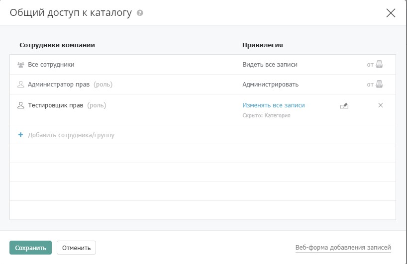
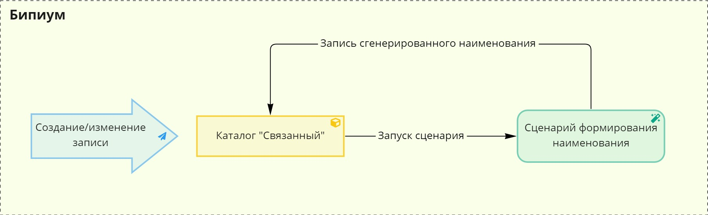
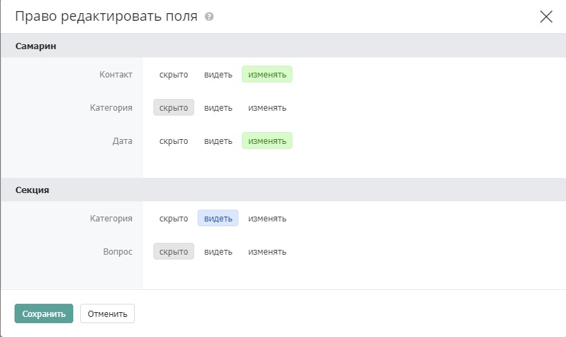

# Права на поля

Бипиум позволяет задавать права на редактирование отдельных полей анкеты. Права на редактирование полей могут быть заданы на весь `каталог`, отдельный `вид` или `запись`.

_Пример: Сотрудник может изменить данные Клиентов, но не может изменить ответственного Менеджера. Или сотрудник не может изменить первичную информацию Клиентов, но может изменять статус работы и дату следующего контакта._

## Назначение прав на поля

Права на поля назначаются в рамках правил в форме доступа. То есть ограничение действует на сотрудника или правовую группу:

Права на поля можно задать на все привилегии кроме «Доступ к разрешенным» и «Запретить доступ». Права на поля также нельзя назначить на наследуемые правила.

### Типы прав на поля

#### Расширяющие

Расширяющее право дает возможность сотрудникам редактировать поле в записях, которые они могут только видеть. Расширяющее право назначается на привилегию «видеть все записи».

#### Ограничивающие

Ограничивающее право запрещает сотрудникам редактировать поле в записях, которые они могут редактировать. Ограничивающее право назначается на привилегии: изменять все записи, создавать записи, удалять записи, экспортировать, назначать права и администрировать. Так же есть возможность ограничить видимость полей для различных сотрудников.


Важно! Если скрытые или запрещенные к редактированию для пользователя поля будут помечены как обязательные к заполнению, то этот пользователь не сможет создать или изменить запись.


### Выбор полей

Справа от поля выбора привилегии расположена кнопка назначения прав на поля&#x20;

Иконка серая, если права не заданы, и черная, если заданы. Клик по кнопке открывает форму выбора полей:

Форма показывает все поля анкеты и позволяет установить какое поле должно быть редактируемым.

### Видимость полей

#### Настройка

Для ограничения видимости определенных полей выбранными сотрудниками необходимо воспользоваться настройками доступа к Каталогу, выбрать пользователя и в настройках полей поставить маркер "Скрыто". Таким образом пользователь не сможет видеть эти поля.&#x20;

## Конкуренция правил

Если для сотрудника действует несколько правил или запись входит в несколько видов с разными правами на поля, то применяется принцип:

`Редактировать > Видеть`

### Право «изменять поле» старше права «видеть поле»

Если на сотрудника действует 2 правила, одно из которых дает право видеть записи и менять поле Х, а другое правило запрещает редактировать поле Х, то сотрудник сможет менять поле Х, так как хотя бы одно правило это разрешает.

### Право «изменять запись» без правил на поля старше права «изменять запись» с правилом «видеть поле»

Если на сотрудника действует 2 правила, одно из которых даёт изменять записи и не имеет отдельных условия на редактирования поля Х, а другое правило запрещает редактировать поле Х, то сотрудник сможет менять поле Х, так как хотя бы одно правило это разрешает.

При этом наследуемые правила имеют такой же вес как и данные на сам объект. Например, если наследуемое от отдела правило разрешает сотруднику изменять записи в каталоге, а на каталоге есть правило запрещающее редактировать поле Х, то сотрудник сможет изменять поле Х, так как хотя бы одно правило это разрешает.
