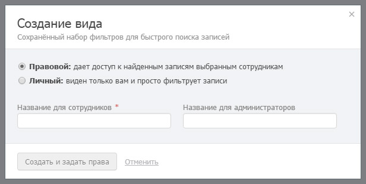

# Правовые виды

Правовые виды в Бипиуме реализуют атрибутную модель прав доступа ([ABAC](https://www.wikiwand.com/en/Attribute-based\_access\_control) — Attribute-based access control). Атрибутная модель — это предоставление доступа к данным на основе свойств этих данных.

## Доступ к записям со свойствами

Например, сотрудники отдела продаж видят только тех клиентов, где они ответственные. Или «младшие консультанты» не видят сделки с суммой выше 100 000 рублей. Или агенты риэлторской компании видят квартиры только из своего района города.

Все эти примеры содержат условия, относящиеся к данным: где я ответственный, где сумма сделки меньше 100 000, где район квартиры совпадает с моим районом. Такие условия в Бипиуме задаются [фильтрами](filters.md) и могут быть сохранены как [виды](views.md). Правовой вид — это вид, который не просто находит данные, но еще и предоставляет доступ к найденным записям сотрудникам.

### Относительные значения

Для фильтрации данных могут использоваться как фиксированные значения (Сумма < 100 000; Статус = Новый), так и относительные (Менеджер = Я; Город клиента = Моему городу).

**Примеры использования относительных значений**

* Сотрудникам отдела продаж дать доступ до клиентов, которых они ведут
* Риэлторам разграничить доступ к объектам недвижимости по районам города
* Менеджерам продаж разграничить доступ к базе клиентов по филиалам
* Сотрудникам службы поддержки дать доступ к заявкам по темам, которые они знают
* Врачам предоставлять доступ к карточкам пациентов на основе болезней пациентов и квалификаций врачей

### Запрещающие виды

Как правило, правовые виды используются для предоставления доступа сотрудникам. Но бывает и наоборот — запрещающие виды. Они скрывают записи, удовлетворяющие условиям.

Например, вид «Вип-клиенты» (где сумма сделки выше 1 000 000 рублей) с привилегией «доступ закрыт» для роли «Младшие консультанты», скроет от них вип-клиентов, даже если они попадают в другие разрешающие виды.

## Создание вида

Правовой вид могут создать сотрудники с привилегией «Назначать права» и «Администрировать» каталог или отдел. Когда сотрудник выбирает фильтры, Бипиум предлагает сохранить шаблон как вид:

Кнопка «Сохранить» открывает форму настройки вида:

### Названия вида

Правовой вид имеет 2 названия: для сотрудников (то, как его увидят сотрудники, которым он доступен) и для администраторов. Название для администраторов помогает администраторам ориентироваться в видах с похожими названиями. Если второе название не задано, то для всех будет использоваться первое.

### Доступ к виду

После сохранения вида, откроется форма доступа — назначения прав, кто увидит записи, попадающие под условия фильтра вида.

Правовой вид даёт сотрудникам доступ к записям с одной из привилегий: видеть записи, изменять записи, создавать записи, экспортировать записи, удалять записи, назначать права. Все привилегии кроме «видеть записи» разрешают редактировать подходящие под вид записи.

Привилегии могут иметь исключения на часть полей анкеты. Подробнее в статье «[Права на поля](policy-fields.md)».

## Скрытие видов

Скрытие правового вида от сотрудника без потери доступа к данным этого вида. Вид остается рабочим, но не виден для сотрудников.

Если не задано «Название для сотрудников», вид не будет отображаться для сотрудников.
