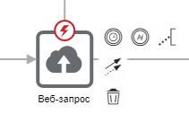

# Компоненты

Bpium для описания сценариев использует нотацию BPMN 2.0. Сценарии состоят из связанных между собой компонентов: событий, шлюзов и действий. Компоненты обмениваются данными между собой через переменные.

<figure><figcaption></figcaption></figure>

## Компоненты

### События (Events)

События – это то, что происходит в течение процесса. События оказывают влияние на ход процесса. Изображаются в виде круга с изображением типа события. Согласно влиянию событий на ход процесса, выделяют три типа: стартовое событие (Start), промежуточное событие (Intermediate) и конечное событие (End). Промежуточные события могут быть прикреплены к другим компонентам. Например, к действию может быть прикреплено событие ошибка.

* [Начало процесса](components/start.md)
* [Конец процесса](components/end.md)
* [Таймер](components/timer.md)

### Действия (Activities)

Действия – общий термин, обозначающий некую работу, выполнение некой задачи. Изображаются в виде прямоугольников с изображением типа операции. В Бипиуме среди действий отдельно выделены компоненты для работы с данными Bpium.

#### Действия с данными Bpium

* [Получить запись](components/get-record.md)
* [Найти записи](components/find-record.md)
* [Изменить запись](components/edit-record.md)
* [Создать запись](components/create-record.md)
* [Удалить запись](components/delete-record.md)
* [Структура каталога](../manual/processes/scripts/components/poluchenie-struktury-kataloga.md)
* [Загрузить файл](../manual/processes/scripts/components/zagruzit-fail.md)
* [Сгенерировать документ](../manual/processes/scripts/components/generaciya-dokumenta.md)

#### Действия

* [Назначение переменных](components/variables.md)
* [Код (JavaScript)](components/code.md)
* [Веб-запрос](components/web.md)
* [SQL-запрос](components/sql.md)
* [Парсер](components/parser.md)
* [Запуск процесса](../manual/processes/scripts/components/zapusk-processa.md)
* [Отправка почты](components/email-send.md)

### Пограничные события (Boundary events)

Пограничные события — альтернативные варианты завершения компонентов-действий. Эти события «вешаются» на сам компонент-действие и активируют альтернативные выходы из компонента при определенных событиях.

Сценарии Бипиум поддерживают 2 типа пограничных событий:

* [Ошибка](components/error.md) — выход из компонента, если произошла какая-либо ошибка
* Таймаут — выход из компонента, спустя заданное ограничение по времи

Если компонент завершился с ошибкой, но на нем не было пограничного события, то процесс завершается. Сообщение ошибки возвращается в результатах процесса.

### Шлюзы (Gateways)

Шлюзы используются для контроля расхождений и схождений потока исполнения в процессе: ветвление, распараллеливание, слияние и соединение маршрутов. Изображаются в виде ромба с изображением типа развития процесса.

* [Шлюз «ИЛИ» (условное ветвление)](components/gateway-or.md)
* [Шлюз «И» (распараллеливание)](components/gateway-and.md)

### **Соединяющие линии**

Компоненты процесса связаны друг с другом соединяющими линиями. Из компонента могут выходить несколько линий — процесс пойдет одновременно по всем из них. На соединяющие линии можно задать условия, в этом случае процесс перейдет к следующему компоненту только при выполнении условия.

* [Соединяющая линия](components/connection.md)

## Свойства компонентов

Компоненты имеют свойства, задающие параметры работы компонента. Все свойства можно разделить на два типа: входные параметры и выходные параметры.

### Входные параметры

Входные параметры поступают на вход компонента. Значения входных параметров можно задавать явными значениями (числа и "строки"), указывать [переменные](variables.md) или [выражения](expressions.md).

Переменные могут быть числами, текстом, датой, массивами и объектами. Подробнее о переменных в соответствующем разделе.

### Выходные параметры

Компоненты передают результаты работы в сценарий через выходные параметры. В качестве значения свойства выходного параметра нужно указывать имя переменной, в которую должен быть сохранен результат. Например, сохранить количество записей в переменную `count`.


Вместо имени переменной можно указать свойство существующей переменной. Например, `data.count`. При этом результат компонента будет записан в переменную `data` в свойство `count`. Если переменная `data` не существует, она будет создана.

