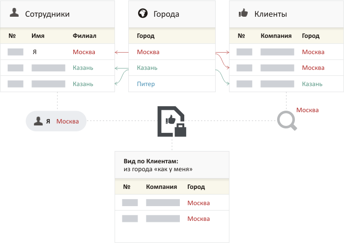

# Фильтры и поиск

## Быстрый поиск

Быстрый поиск находит записи по совпадению в любом из текстовых полей анкеты или полей с контактами: телефонах, адресах электронной почты и их описаниях.

<figure><figcaption></figcaption></figure>

<figure><figcaption></figcaption></figure>

Для расширенного поиска используются фильтры.

## Фильтры

Фильтры расположены слева от записей каталога. Каждое поле анкеты каталога является фильтром, по которому можно находить записи.

<figure><figcaption></figcaption></figure>

Если задано несколько фильтров, то будут найдены записи, удовлетворяющие всем условиям — для поиска записей применяется логическая операция «**И**» по всем фильтруемым полям.

## Правила применения условий для типов полей

### Число

<figure><figcaption></figcaption></figure>

Фильтр позволяет задать диапазон значений. Также можно задать только одно из значений.

### Дата

<figure><figcaption></figcaption></figure>

Фильтр позволяет найти записи по фиксированному или относительному диапазон дат или найти записи без даты.

**Фиксированный диапазон**: интервал времени между конкретными днями года. Указывается в формате «дд.мм.гггг». Одна из дат может быть не указана. Например, _от_ «25.12.2015» найдет записи с указанной датой или более поздние.

**Относительный диапазон**: интервал времени между двумя датами относительно текущего дня. Задается в днях. Например: _от_ «-7» дней _до_ «7» дней. Одна из дат может быть не указана. Например, _до_ «-30» найдет все записи, просроченные больше чем на месяц.

**Предустановленные относительные диапазоны:**

* Сегодня — начиная от начала текущего дня и до конца дня
* Сегодня и ранее — все дни до текущего, включая его
* Вчера — полные прошедшие сутки
* Эта неделя — от понедельника до воскресенья этой недели (даже если оно ещё не наступило)
* Прошлая неделя — полная прошедшая неделя (7 дней начиная с понедельника)
* Этот месяц — с 1 числа этого месяца и до конца последнего дня этого месяца
* Последние 30 дней — от дня 30 дней назад и до текущего дня
* Прошлый месяц — полный прошедший календарный месяц
* Этот год —  с 1 января этого года и до 31 декабря этого года
* Последние 365 дней — от дня 365 дней назад и до текущего дня
* Прошлый год — полный прошедший календарный год
* Не указана — поиск записей без указанной даты. Параметр позволяет фильтровать записи по пустым значениям в полях.

### Контакт

<figure><figcaption></figcaption></figure>

Фильтр позволяет искать записи по контактным данным. В отличии от быстрого поиска, фильтр ищет только по значениям контактов: телефонам, электронной почте и адресам сайтов. Фильтр не ищет по описанию контактов.

Бипиум находит телефонные номера в любом формате ввода. Скобки, пробелы, дефисы и другие не числовые символы игнорируются.

### Статус

<figure><figcaption></figcaption></figure>

Фильтр позволяет выбрать одно или несколько значений. Если выбрано несколько значений, то будут найдены записи, у которых есть _хотя бы одно_ из этих значений. Условия поиска аналогичны логической операции «**ИЛИ**».

`Например, найти записи, где статус «Зарегистрирована» ИЛИ «Согласование».`

**Не задано**: поиск записей без указанных значений. Параметр позволяет фильтровать записи по пустым значениям в полях.

### Набор галочек

<figure><figcaption></figcaption></figure>

Фильтр позволяет выбрать одно или несколько значений. Если выбрано несколько значений (галочек), то будут найдены записи, которые содержат все выбранные значения. Условия поиска аналогичны логической операции «**И**».

`Например, можно найти все записи, где пройдены стадия «консультация» И «демонстрация».`

**Не задано**: поиск записей без указанных значений. Параметр позволяет фильтровать записи по пустым значениям в полях.

### Прогресс

<figure><figcaption></figcaption></figure>

Фильтр позволяет задать диапазон значений. Также можно задать только одно из значений.

### Оценка звездами

<figure><figcaption></figcaption></figure>

Поиск записи по выставленному количеству звезд. Позволяет получить все записи с ТОЧНЫМ совпадением количества звезд.

### Сотрудники

<figure><figcaption></figcaption></figure>

Фильтр позволяет выбрать одного или нескольких сотрудников, указанных в искомом поле. Если выбрано несколько сотрудников, то будут найдены все записи, в которых указан _хотя бы один_ из выбранных сотрудников. Условия поиска аналогичны логической операции «**ИЛИ**».

**Не указан**: поиск записей без указанного сотрудника. Параметр «Не указан» позволяет фильтровать записи по пустым значениям в полях.

#### \[Сотрудники.Я]

<figure><figcaption></figcaption></figure>

Относительное значение \[Сотрудники.Я] позволяет находить записи, где в качестве сотрудника назначен текущий пользователь (тот, кто выполняет поиск). Используется для быстрого выбора текущего сотрудника в панели фильтров, а также для правовых видов, настроенных для работы с динамическим сотрудником.

### Связанные объекты

<figure><figcaption></figcaption></figure>

Фильтр позволяет выбрать один или несколько связанных объектов. Если выбрано несколько значений, то будут найдены записи, у которых указан _хотя бы один_ из них. Условия поиска аналогичны логической операции «**ИЛИ**».

**Не задано**: поиск записей без указанных связанных объектов. Параметр «Не задано» позволяет фильтровать записи по пустым значениям в искомом поле.

#### Фильтр по расширенным полям связанной записи

В Бипиум есть возможность фильтрации записей по атрибутам (полям) связанных записей. Например, у нас есть каталоги: Компании и Контакты. Нам нужно в каталоге Компании найти Контактные лица, у которых есть email, чтобы направить всем шаблонное письмо.

Отфильтруем записи в каталоге Компании по Виду связи Контактного лица для того, чтобы найти Компании с Контактными лицами, у которых есть email.&#x20;

Выберем в фильтрах Контактное лицо и добавим фильтр по связям.

<figure><figcaption></figcaption></figure>

<figure><figcaption></figcaption></figure>

Выберем поле связанного каталога, которое содержит необходимую нам информацию. В нашем случае это поле Вид связи, которое содержит в себе информацию о том, какими способами можно связаться с Контактным лицом.

<figure><figcaption></figcaption></figure>

Выбираем нужный нам параметр. В нашем случае email

<figure><figcaption></figcaption></figure>

Таким образом мы нашли в каталоге Компании Контактных лиц, с которыми можно связаться по email.

<figure><figcaption></figcaption></figure>


Фильтрация по полям связанной записи возможна только по тем полям, которые выведены в карточку в качестве расширенных.&#x20;


<figure><figcaption></figcaption></figure>

<figure><figcaption></figcaption></figure>

#### Относительные значения

В фильтре по связанным данным могут также присутствовать относительные значения в формате: \[Сотрудники._Поле\\_&#x430;нкеты\_сотрудника\_]. Они появляются, если это поле ссылается на каталог, который также связан с карточкой сотрудника.

_Пример: поле «Город» каталога клиентов ссылается на каталог городов. На этот же каталог ссылается поле «Филиал» каталога сотрудников. В этом случае будут найдены клиенты из того же города, который указан в карточке текущего пользователя._

Название относительного значения — \[Сотрудники._Поле\\_&#x430;нкеты\_сотрудника\_]. Например, если в карточке сотрудника два поля: город рождения и город работы, то для поиска будут доступны оба этих поля:

Правовой вид с таким фильтром для разных сотрудников будет находить записи, которые пересекаются через смежный каталог и давать к ним доступ.

### Файлы

Фильтры по загруженным файлам в карточке — «Есть» или «Нет».

<figure><figcaption></figcaption></figure>
