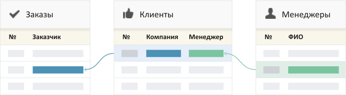

# Каталоги

## Открытие каталога

Для просмотра интересующего каталога необходимо открыть необходимый раздел, после чего в отобразившемся меню каталогов выбрать каталог. Система отобразить рабочее окно каталога.

<figure><figcaption></figcaption></figure>

<figure><figcaption></figcaption></figure>

## Структура каталога

Экран каталога состоит из:

* Левая панель для фильтрации записей
* Основная часть с отображением записей
* Панель с видами отображения
* Кнопка создания новой записи
* Меню настроек вида
* Меню внутренних настроек каталога

## Структура данных каталога

Каждый каталог имеет свою структуру, которую вы определяете самостоятельно. Структура каталога собирается из полей. Поля бывают простые — текстовые данные, или сложные — набор нескольких значений. Например, у «клиента» может быть несколько видов деятельности.

<figure><figcaption></figcaption></figure>

Для визуального удобства, предусмотрены разные типы полей: текстовые поля, категории, вопросы, наборы галочек, прогрессы.

## Связи между данными

Записи в каталогах могут быть связаны между собой. Например, заказы могут быть привязаны к клиентам, а клиенты закреплены за менеджерами.

При создании нового каталога вы переходите в режим редактирования каталога.

## Сортировка каталогов

Каталоги можно разместить в нужном порядке, перетащив их мышкой за иконку каталога. Сортировать каталоги может сотрудник с правом администрировать раздел

### Название каталога и иконка 

Каталог имеет иконку и название. Чтобы изменить иконку, нажмите на кнопку около названия каталога. Бипиум предлагает на выбор более 1000 иконок. Иконки разделены по категориям для удобства навигации.

<figure><figcaption>
Выбор иконки каталога
</figcaption></figure>

<figure><figcaption>
Выбор иконки каталога
</figcaption></figure>
