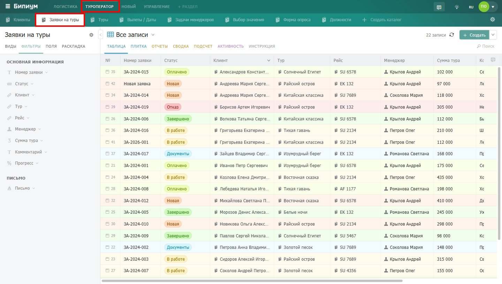
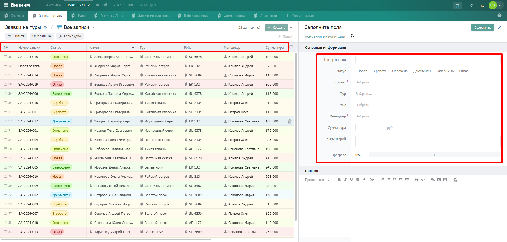

Каталог -- это список однотипных записей. Клиенты, заказы, задачи, договоры, товары -- каждый такой список хранится в отдельном каталоге. Все каталоги компании сгруппированы по разделам и отображаются в строке вкладок под верхней панелью.

## **Как открыть каталог**

1. Выберите нужный раздел в верхней панели -- например, «Туроператор».

2. В строке под разделами появятся вкладки каталогов этого раздела.

3. Нажмите на нужную вкладку -- каталог откроется в рабочей области.

{width=1440px height=816px}

:::info 

Вы видите только те каталоги, к которым у вас есть доступ. Если нужного каталога нет -- обратитесь к администратору.

:::

## **Структура каталога**

Каждый каталог имеет свою структуру -- набор полей, которые описывают каждую запись. Поля могут быть разных типов: текст, число, дата, статус, связь с другим каталогом и многие другие. Структуру каталога настраивает администратор.

{width=1920px height=919px}

## **Что можно делать в каталоге**



---

*  

   **Задача**

*  

   **Где искать**

---

*  

   Найти нужные записи

*  

   [Фильтры и поиск](./filtry-i-poisk)

---

*  

   Просмотреть записи в виде таблицы, доски, графика

*  

   [Режимы отображения](./list/_index)

---

*  

   Открыть и заполнить запись

*  

   [Запись](./../records/_index)

---

*  

   Массово изменить или удалить записи

*  

   [Операции](./operacii/_index)

---

*  

   Импортировать или экспортировать данные

*  

   [Операции](./operacii/_index)

