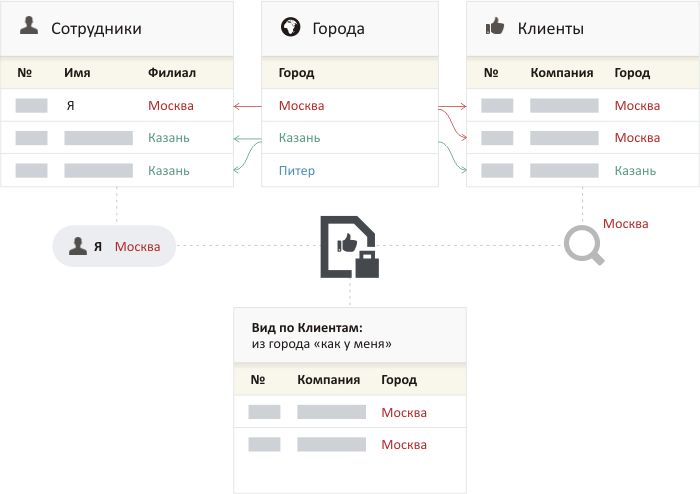

# Фильтры и поиск

## Быстрый поиск

Строка поиска находится в правом верхнем углу каталога. Начните вводить текст — Бипиум сразу же отфильтрует записи, оставив только те, в которых введённый текст встречается в любом текстовом поле или в контактных данных (телефон, email, адрес сайта).

\[Скрин: строка быстрого поиска в каталоге — пустая]

\[Скрин: строка быстрого поиска с введённым текстом — список записей сократился]

Быстрый поиск не требует дополнительных настроек — просто введите слово или фразу. Если нужна более точная фильтрация по конкретным полям — используйте фильтры.

## Фильтры

Фильтры расположены слева от списка записей. Каждое поле анкеты каталога может быть фильтром — нажмите на нужное поле в панели и задайте условие.

\[Скрин: панель фильтров слева от каталога — список полей]

### Несколько фильтров одновременно

Если задать несколько фильтров — Бипиум найдёт записи, которые соответствуют всем условиям сразу. Это работает по принципу «И»: менеджер = Иванов **И** статус = В работе **И** дата до 31.12.2025.


Фильтры сохраняются при переключении между режимами отображения — Таблица, Плитка, Отчёты и другие. Переключитесь в Отчёты с применённым фильтром — графики пересчитаются по отфильтрованным данным.


## Как работают фильтры для разных типов полей

### Текст

Поиск по вхождению — Бипиум найдёт все записи, в которых поле содержит введённый текст. Регистр не учитывается.

<figure><figcaption></figcaption></figure>

### Число

<figure><figcaption></figcaption></figure>

Фильтр позволяет задать диапазон значений. Можно указать только одну границу: например, только «от 100» найдёт все записи со значением 100 и выше.

### Дата

Фильтр по дате поддерживает три способа задать период:

**Период дат** — интервал между конкретными датами. Формат: дд.мм.гггг. Можно указать только одну границу. Например, «от 01.01.2025» найдёт все записи с датой 1 января 2025 и позже.

<figure><figcaption></figcaption></figure>

**Период относительно сегодня** — интервал в днях относительно сегодняшнего дня. Например, «от -7 до 0» — записи за последние 7 дней. «До -30» — все просроченные более чем на месяц.

<figure><figcaption></figcaption></figure>

**Предустановленные периоды** — готовые варианты для быстрого выбора. 

<figure><figcaption></figcaption></figure>

### Контакт

<figure><figcaption></figcaption></figure>

Поиск по значению контактного поля — телефону, email или адресу сайта. В отличие от быстрого поиска, фильтр не ищет по описанию контакта — только по самому значению.

Телефонные номера распознаются в любом формате — скобки, пробелы, дефисы игнорируются. «89001234567», «+7 (900) 123-45-67» и «7900 123 4567» — одно и то же.

### Статус и Набор галочек

Оба фильтра позволяют выбрать одно или несколько значений — но логика отличается:

#### Статус&#x20;

<figure><figcaption></figcaption></figure>

Если выбрать несколько значений, Бипиум найдёт записи у которых есть _хотя бы одно_ из них. Это логика «ИЛИ».

**Не задано**: поиск записей без указанных значений. Параметр позволяет фильтровать записи по пустым значениям в полях.

**Пример**: статус «Зарегистрирована» ИЛИ «Согласование» — найдутся все записи с любым из этих статусов.

#### Набор галочек

<figure><figcaption></figcaption></figure>

Если выбрать несколько значений, Бипиум найдёт записи у которых отмечены _все_ выбранные галочки одновременно. Это логика «И».

**Не задано**: поиск записей без указанных значений. Параметр позволяет фильтровать записи по пустым значениям в полях.

**Пример**: пройдены «Консультация» И «Демонстрация» — найдутся только те записи, где отмечены обе галочки.

### Прогресс

<figure><figcaption></figcaption></figure>

Фильтр позволяет задать диапазон значений. Также можно задать только одно из значений.

### Оценка звездами

<figure><figcaption></figcaption></figure>

Поиск по точному количеству звёзд. Выберите значение — Бипиум покажет только записи с ровно таким количеством.

### Сотрудники

<figure><figcaption></figcaption></figure>

Выберите одного или нескольких сотрудников — Бипиум найдёт записи, в которых в этом поле указан хотя бы один из них. Логика «ИЛИ».

Опция **«Не указан»** — найдёт записи, где поле сотрудника пустое.

#### \[Сотрудники.Я]

<figure><figcaption></figcaption></figure>

Относительное значение \[Сотрудники.Я] позволяет находить записи, где в качестве сотрудника назначен текущий пользователь (тот, кто выполняет поиск). Используется для быстрого выбора текущего сотрудника в панели фильтров, а также для правовых видов, настроенных для работы с динамическим сотрудником.

### Связанные объекты

<figure><figcaption></figcaption></figure>

Фильтр позволяет выбрать один или несколько связанных объектов. Если выбрано несколько значений, то будут найдены записи, у которых указан _хотя бы один_ из них. Условия поиска аналогичны логической операции «**ИЛИ**».

**Не задано**: поиск записей без указанных связанных объектов. Параметр «Не задано» позволяет фильтровать записи по пустым значениям в искомом поле.

#### Фильтр по полям связанной записи

Бипиум позволяет фильтровать не только по самой связанной записи, но и по значениям её полей. Это удобно для более точного поиска.

**Пример.** В каталоге «Заявки на туры» есть поле «Клиент», которое ссылается на каталог «Клиенты». Нужно найти только тех Клиентов, у которых тип связи указал как email. Вместо того чтобы просматривать каждого клиента вручную — можно отфильтровать прямо в каталоге «Заявки на туры»:

1. Откройте фильтр по полю «Клиент».
2. Нажмите «Добавить фильтр по связям».
3. Выберите поле связанного каталога — в нашем примере «Вид связи».
4. Укажите нужное значение — «email».

Таким образом мы нашли в каталоге Компании Контактных лиц, с которыми можно связаться по email.

\[Скрин: фильтр по связанному полю — шаг добавления фильтра по связям]

\[Скриншот: выбор поля связанного каталога для фильтрации]

\[Скриншот: выбор значения — «email»]

\[Скрин: результат — клиенты с которыми можно связаться по email]


Фильтрация по полям связанной записи возможна только по тем полям, которые выведены в карточку в качестве расширенных.&#x20;


#### Относительные значения

В фильтре по связанным данным могут также присутствовать относительные значения в формате: \[Сотрудники._Поле\\_&#x430;нкеты\_сотрудника\_]. Они появляются, если это поле ссылается на каталог, который также связан с карточкой сотрудника.

_Пример: поле «Город» каталога клиентов ссылается на каталог городов. На этот же каталог ссылается поле «Филиал» каталога сотрудников. В этом случае будут найдены клиенты из того же города, который указан в карточке текущего пользователя._

Название относительного значения — \[Сотрудники._Поле\\_&#x430;нкеты\_сотрудника\_]. Например, если в карточке сотрудника два поля: город рождения и город работы, то для поиска будут доступны оба этих поля:

Правовой вид с таким фильтром для разных сотрудников будет находить записи, которые пересекаются через смежный каталог и давать к ним доступ.

### Файлы

Простой фильтр с двумя вариантами: **«Есть»** — найдёт записи с прикреплёнными файлами, **«Нет»** — найдёт записи без файлов.

<figure><figcaption></figcaption></figure>
