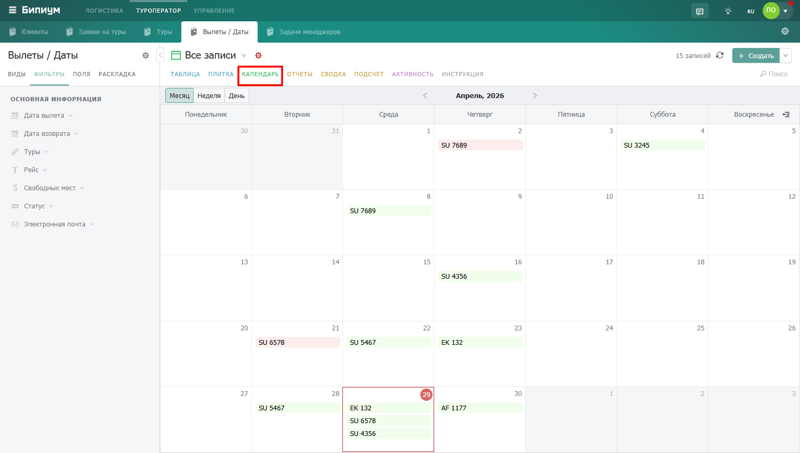
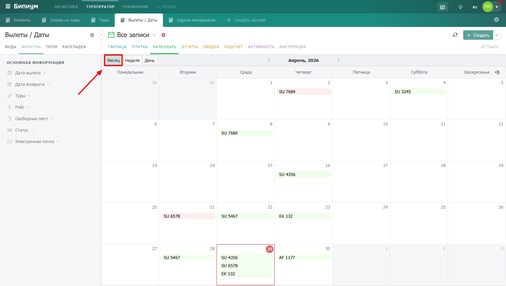
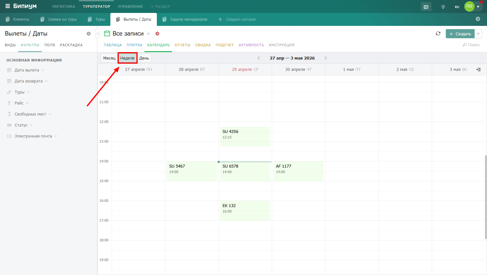
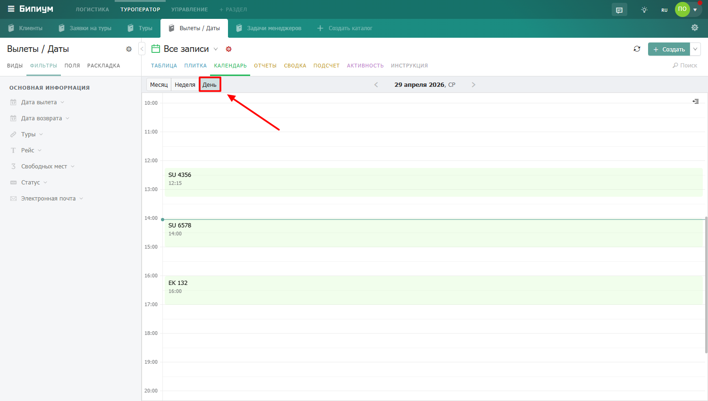
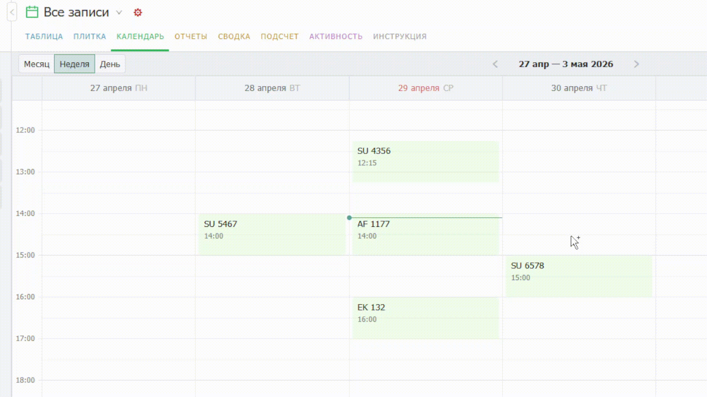

# Календарь

<figure><figcaption>
Режим отображения «Календарь»
</figcaption></figure>

## Как пользоваться календарем

### Виды отображения

Записи в календарном виде отображаются согласно выбранному периоду. Календарный вид отображения показывает данные в трех временных отрезках:&#x20;

* **Месяц** — обзорный вид. Все дни месяца на одном экране, на каждом дне — краткие названия записей. Подходит для общего планирования и оценки загрузки на месяц вперёд.

<figure><figcaption>
Вид отображения «Месяц»
</figcaption></figure>

* **Неделя** — детальный вид с почасовой разбивкой текущей недели. Подходит для ежедневной работы — видно когда именно запланированы встречи и задачи.

<figure><figcaption>
Вид отображения «Неделя»
</figcaption></figure>

* **День** — максимально детальный вид одного дня. Удобен для плотно расписанных дней с множеством коротких событий.

<figure><figcaption>
Вид отображения «День»
</figcaption></figure>

### Быстрый просмотр записи

Нажмите на событие в календаре — справа откроется панель с основными полями записи. Это позволяет быстро посмотреть детали, не открывая полную карточку. Чтобы открыть карточку целиком — дважды нажмите на название записи в панели.

<figure><figcaption>
Быстрый просмотр записи.
</figcaption></figure>

### Создание записи из календаря

Дважды нажмите на пустое место в нужном дне — откроется форма создания новой записи с уже проставленной датой. Это быстрее чем нажимать кнопку «Создать» и заполнять дату вручную.

### Перетаскивание событий

Захватите событие мышью и перетащите на другой день или время — дата в записи обновится автоматически.

<figure><figcaption></figcaption></figure>


Если событие занимает несколько дней — в настройках укажите поле с датой начала и поле с датой окончания. Тогда событие будет растянуто на весь период в виде блока.

