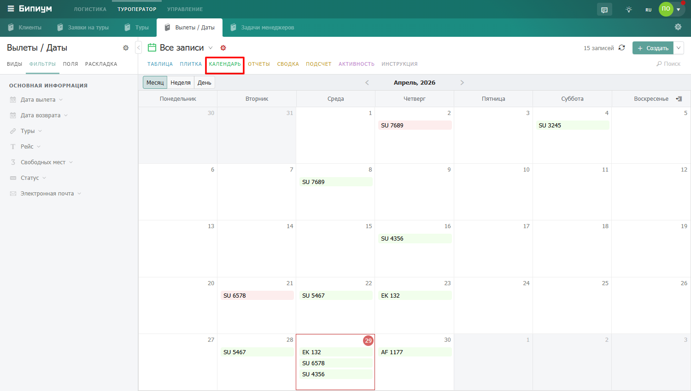
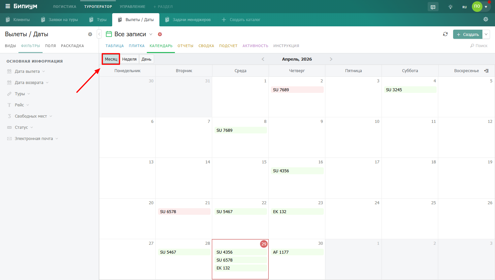
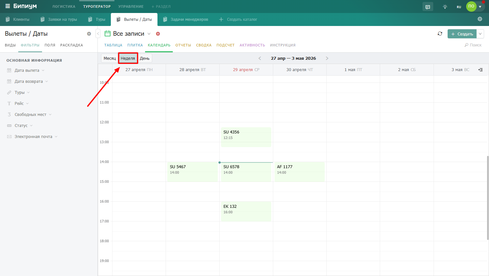
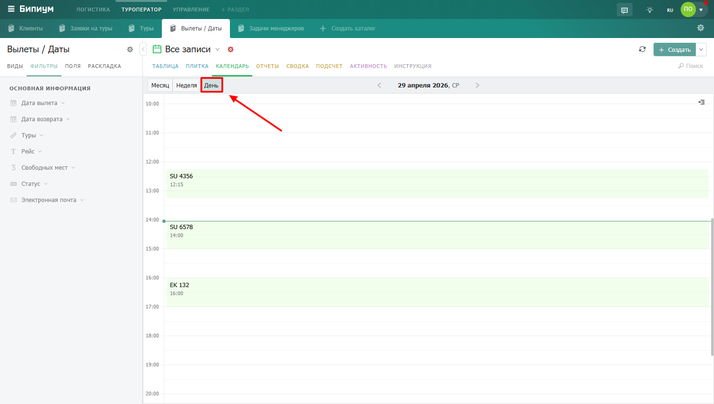
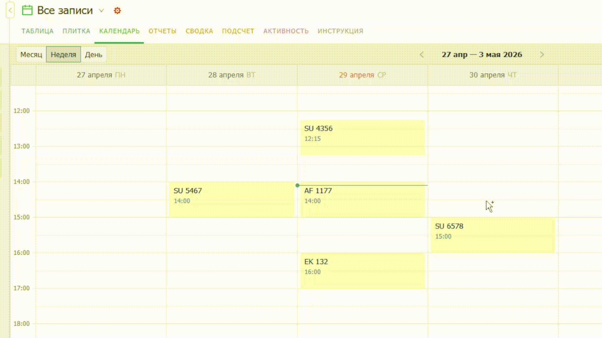

Режим отображения записей по датам. Удобен для работы с задачами, встречами, дедлайнами и любыми событиями, привязанными ко времени.

## Как пользоваться календарем

### Виды отображения

Записи в календарном виде отображаются согласно выбранному периоду. Календарный вид отображения показывает данные в трех временных отрезках:

-  **Месяц** -- обзорный вид. Все дни месяца на одном экране, на каждом дне -- краткие названия записей. Подходит для общего планирования и оценки загрузки на месяц вперёд.

-  **Неделя** -- детальный вид с почасовой разбивкой текущей недели. Подходит для ежедневной работы -- видно когда именно запланированы встречи и задачи.

-  **День** -- максимально детальный вид одного дня. Удобен для плотно расписанных дней с множеством коротких событий.

### Быстрый просмотр записи

Нажмите на событие в календаре -- справа откроется панель с основными полями записи. Это позволяет быстро посмотреть детали, не открывая полную карточку. Чтобы открыть карточку целиком -- дважды нажмите на название записи в панели.

### Создание записи из календаря

Дважды нажмите на пустое место в нужном дне -- откроется форма создания новой записи с уже проставленной датой. Это быстрее чем нажимать кнопку «Создать» и заполнять дату вручную.

### Перетаскивание событий

Захватите событие мышью и перетащите на другой день или время -- дата в записи обновится автоматически.

:::note 

Если событие занимает несколько дней -- в настройках укажите поле с датой начала и поле с датой окончания. Тогда событие будет растянуто на весь период в виде блока.

:::