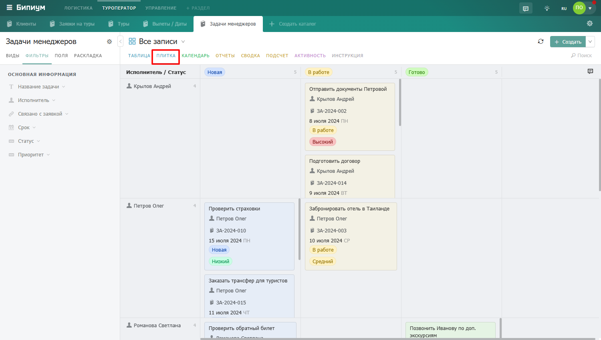

# Плитка

<figure><figcaption></figcaption></figure>

## Как пользоваться плиткой 

### Перетаскивание записей

Записи можно перетаскивать между столбцами — это ключевая возможность режима Плитка. При перетаскивании карточки из одного столбца в другой Бипиум автоматически изменяет значение поля раскладки в записи. Например, если перетащить задачу из столбца «В работе» в «Готово» — статус задачи изменится на «Готово» без необходимости открывать карточку.

<figure><figcaption>
Перетаскивание записей.
</figcaption></figure>

### Настройка раскладки

Нажмите на надпись **«Раскладка»** в панели слева от рабочей области. Откроется блок настройки отображения записей.\
Здесь вы можете увидеть:

1. Разложить по горизонтали — выберите поле, по значениям которого карточки будут разложены в столбцы (например, «Статус»).
2.
   Разложить по вертикали — выберите поле для дополнительной группировки карточек внутри столбцов.
3.
   Подкрасить цветом — выберите поле, по которому карточки будут подсвечиваться (например, «Приоритет»). Подсветка доступна, если в записи есть хотя бы одно поле типа «Статус».
4. Сортировать по — выберите поле для сортировки карточек внутри групп (например, «№ записи») и задайте направление: «по возрастанию» или «по убыванию».

<figure><figcaption>
Настройка раскладки.
</figcaption></figure>

### Настройка полей

Нажмите на надпись **«Поля»** в панели слева от рабочей области — откроется панель управления столбцами. Включайте и выключайте поля, меняйте их порядок перетаскиванием. В карточке будут отображаться только выбранные поля в установленном вами порядке. 

<figure><figcaption>
На
</figcaption></figure>

### Изменение размеров столбцов 

Для изменения ширины столбца наведите курсор на его правую границу в строке заголовков. Когда курсор примет вид двусторонней стрелки, зажмите левую кнопку мыши и потяните в нужную сторону. При изменении ширины одного столбца автоматически подстраивается ширина остальных.

Аналогичным образом можно изменить высоту строк при вертикальной раскладке — потяните за нижнюю границу строки в панели разложения по вертикали.

<figure><figcaption>
Изменение размеров столбцов.
</figcaption></figure>
