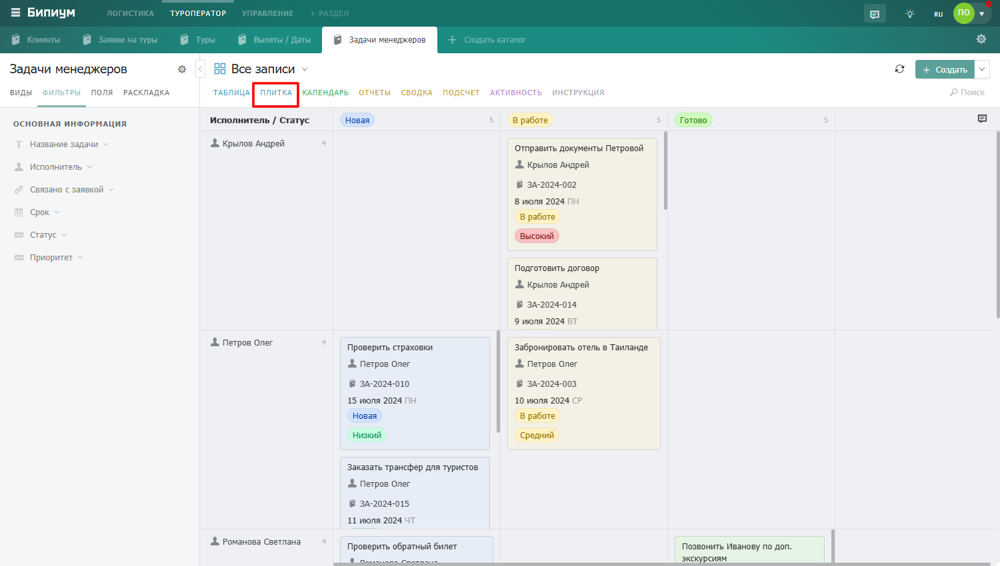
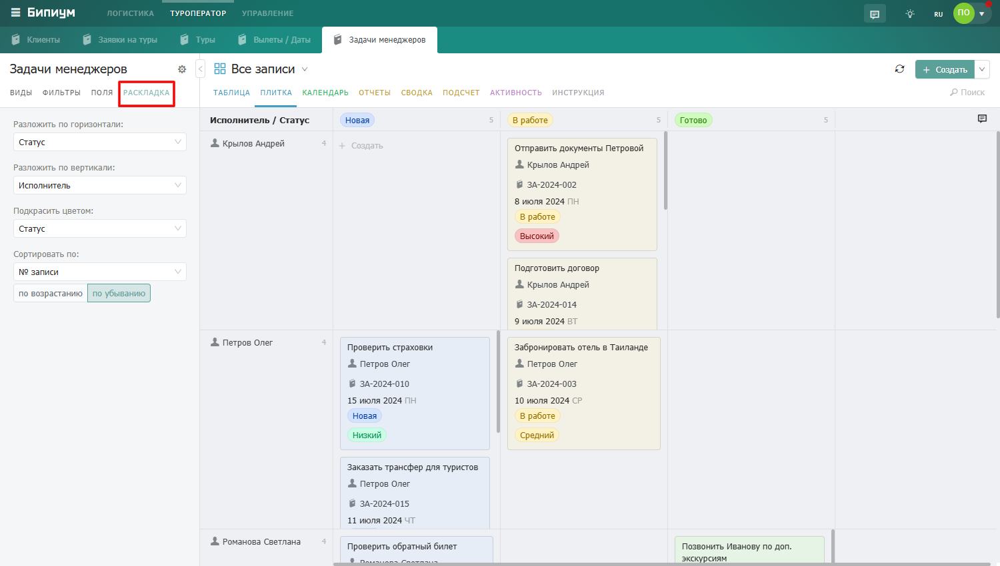

Режим отображения в виде Kanban-доски. Записи раскладываются по столбцам в зависимости от значения выбранного поля. Идеален для управления задачами, заявками и любыми процессами с этапами.

### Как пользоваться плиткой

### Перетаскивание записей

Записи можно перетаскивать между столбцами -- это ключевая возможность режима Плитка. При перетаскивании карточки из одного столбца в другой Бипиум автоматически изменяет значение поля раскладки в записи. Например, если перетащить задачу из столбца «В работе» в «Готово» -- статус задачи изменится на «Готово» без необходимости открывать карточку.

### Настройка раскладки

Нажмите на надпись **«Раскладка»** в панели слева от рабочей области. Откроется блок настройки отображения записей.\
Здесь вы можете увидеть:

1. Разложить по горизонтали -- выберите поле, по значениям которого карточки будут разложены в столбцы (например, «Статус»).

2. Разложить по вертикали -- выберите поле для дополнительной группировки карточек внутри столбцов.

3. Подкрасить цветом -- выберите поле, по которому карточки будут подсвечиваться (например, «Приоритет»). Подсветка доступна, если в записи есть хотя бы одно поле типа «Статус».

4. Сортировать по -- выберите поле для сортировки карточек внутри групп (например, «№ записи») и задайте направление: «по возрастанию» или «по убыванию».

{width=1500px height=850px}

### Настройка полей

Нажмите на надпись **«Поля»** в панели слева от рабочей области -- откроется панель управления столбцами. Включайте и выключайте поля, меняйте их порядок перетаскиванием. В карточке будут отображаться только выбранные поля в установленном вами порядке.

### Изменение размеров столбцов

Для изменения ширины столбца наведите курсор на его правую границу в строке заголовков. Когда курсор примет вид двусторонней стрелки, зажмите левую кнопку мыши и потяните в нужную сторону. При изменении ширины одного столбца автоматически подстраивается ширина остальных.

Аналогичным образом можно изменить высоту строк при вертикальной раскладке -- потяните за нижнюю границу строки в панели разложения по вертикали.

.gif> "Изменение размеров столбцов."){width=1920px height=1080px}