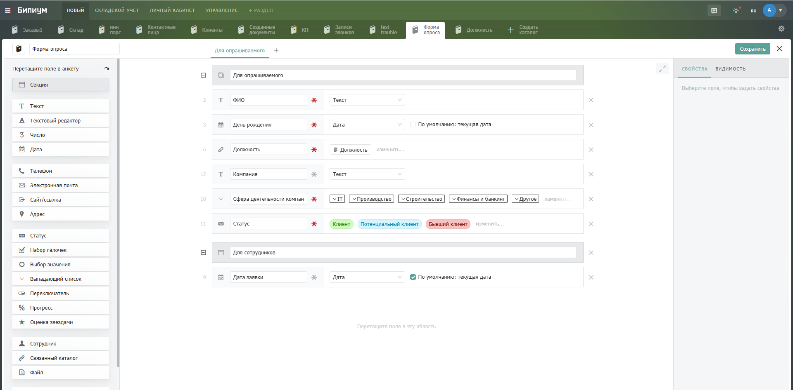

# Плитка

Плиточный режим можно найти в каждом каталоге, нажав на вкладку Плитка.

<figure><figcaption>
Открытие режима отображеня Плитка
</figcaption></figure>

## Структура интерфейса

Кнопка создания новой записи (1). Позволяет создать новую запись.

Кнопка обновления записей (2). Позволяет актуализировать записей, если в каталог были внесены изменения.

Поиск (3). Поиск позволяет найти нужную запись по введенному значению в строке поиска.

Панель раскладываемых полей по горизонтали (4). В панели можно менять столбцы полей местами, перетягивая столбец в нужное место.

Панель раскладываемых полей по вертикали (5). В панели можно менять столбцы полей местами, перетягивая столбец в нужное место.

Чат (6). При нажатии на иконку чата система отфильтрует записи и отобразит только те записи, в чате которых есть новые сообщения

Инструменты подкрашивания, сортировки и отображения (7).

Область записей (8). Область разложенных в плитке записей.

<figure><figcaption>
Структура интерфейса Плитки.
</figcaption></figure>

## Плиточный режим

Плиточный режим работает аналогично Канбан-доске, в которой можно разместить задачи и перетаскивать между столбцами. В плиточном режиме отображения можно просмотреть до 500 записей.

<figure><figcaption></figcaption></figure>

### Построение 

В плиточном режиме вы можете настроить параметры вывода по горизонтали и вертикали. Для этого необходимо нажать на иконку списка в верхней правой части экрана.

Так же можно подкрасить плитки значениями цветов одного из полей типа Категория для более информативного отображения. В результате существует возможность сортировать полученные данные по признаку числа ваших полей.

<figure><figcaption></figcaption></figure>

### Видимость столбцов

Нажмите на иконку списка и настройте поля, которые вы хотите видеть, и очередность их отображения.

<figure><figcaption></figcaption></figure>

<figure><figcaption></figcaption></figure>

### Изменение размеров столбцов 

Для изменения размера столбцов необходимо навести курсор на международный столбец в строку разложения по горизонтали и потянуть в нужную сторону. При изменении размеров одного столбца автоматически меняется размер других. Отдельно можно настроить поворот столбца разложения по вертикали.

### Поиск записей 

Поле быстрого поиска так же работает и в режиме «Плит». Оно позволяет просматривать записи по данным в текстовых полях: названия, имена контактов, телефоны и адреса электронной почты. Для расширенного поиска используйте фильтры.
