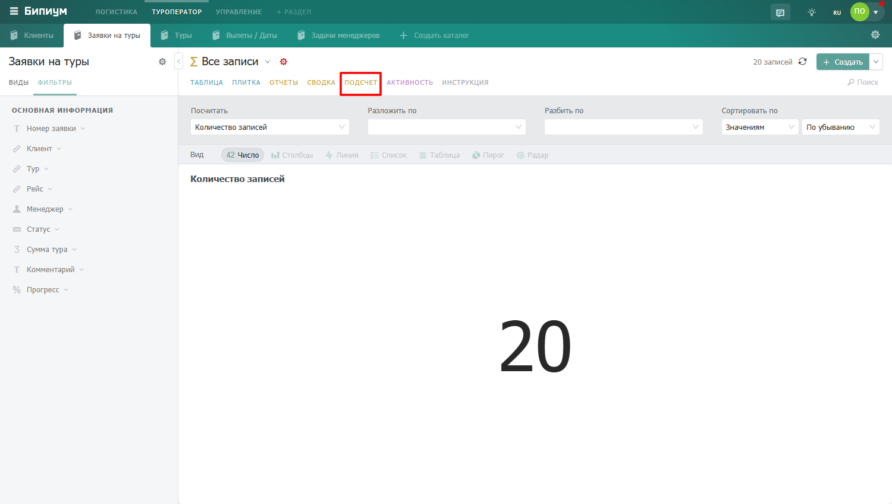

# Подсчет

<figure><figcaption>
Режим отображения «Подсчет»
</figcaption></figure>

## Чем отличается от Отчётов

Режим Отчёты — это постоянные дашборды, которые администратор настраивает для всей команды. Все сотрудники видят одни и те же графики. Режим Подсчёт — это ваш личный инструмент: вы настраиваете его как нужно прямо сейчас, результаты видите только вы, настройки не влияют на других сотрудников.

## Параметры построения

В верхней части экрана расположены четыре параметра:

<table><thead><tr><th width="168">Параметр</th><th>Что делает</th></tr></thead><tbody><tr><td><strong>Посчитать</strong></td><td>Выберите поле и способ агрегации — что именно считать. Например: «Тур (количество уникальных)» посчитает сколько уникальных туров в каждой группе. Доступные функции: количество, количество уникальных, сумма, среднее, минимум, максимум.</td></tr><tr><td><strong>Разложить по</strong></td><td>Выберите поле для группировки данных по горизонтальной оси — каждое значение этого поля станет отдельным столбцом или точкой на графике. Например, «Менеджер» — каждый менеджер получит свой столбец.</td></tr><tr><td><strong>Разбить по</strong></td><td>Необязательный параметр. Разбивает каждый столбец на сегменты по значениям выбранного поля — получается сгруппированная диаграмма. Например, если разложить по «Менеджеру» и разбить по «Туру» — каждый столбец менеджера окрасится в цвета разных туров. Галочка «Сложить значения» объединяет сегменты в единый стек вместо отдельных столбцов.</td></tr><tr><td><strong>Сортировать по</strong></td><td>Порядок столбцов на графике: по значениям или по названию, а также по убыванию или по возрастанию.</td></tr></tbody></table>

## Выбор вида отображения

Под параметрами находится строка переключения вида. Бипиум также сразу показывает итоговые числа — общее количество записей и среднее значение.

<table><thead><tr><th width="188">Вид</th><th>Когда использовать</th></tr></thead><tbody><tr><td><strong>Число</strong></td><td>Показать одно ключевое значение крупно — например, общее количество заявок</td></tr><tr><td><strong>Столбцы</strong></td><td>Сравнить значения по категориям — стандартная гистограмма</td></tr><tr><td><strong>Линия</strong></td><td>Показать динамику во времени</td></tr><tr><td><strong>Список</strong></td><td>Горизонтальные полосы — удобнее для длинных названий категорий</td></tr><tr><td><strong>Таблица</strong></td><td>Данные в табличном формате — значения по каждой группе</td></tr><tr><td><strong>Пирог</strong></td><td>Доли от целого — круговая диаграмма</td></tr><tr><td><strong>Радар</strong></td><td>Сравнение по нескольким критериям одновременно</td></tr></tbody></table>

<figure><figcaption>
Пример подсчета сумм тура с разложением по статусам и разбиением по менеджерам
</figcaption></figure>

Результат обновляется мгновенно при изменении любого параметра — можно быстро перебирать варианты и смотреть данные под разными углами.


Подсчёт реагирует на фильтры каталога. Примените фильтр — и результат пересчитается только по отфильтрованным записям. Удобно для быстрого сравнения показателей за разные периоды.


