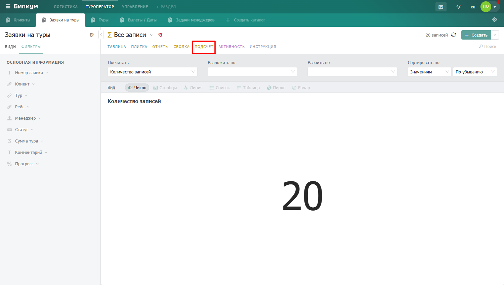

Инструмент для быстрого личного анализа данных прямо в каталоге. Позволяет построить простой график или посчитать показатель в реальном времени -- без настройки постоянного дашборда.

## Чем отличается от Отчётов

Режим Отчёты -- это постоянные дашборды, которые администратор настраивает для всей команды. Все сотрудники видят одни и те же графики. Режим Подсчёт -- это ваш личный инструмент: вы настраиваете его как нужно прямо сейчас, результаты видите только вы, настройки не влияют на других сотрудников.

## Параметры построения

В верхней части экрана расположены четыре параметра:



---

*  

   Параметр

*  

   Что делает

---

*  

   Посчитать

*  

   Выберите поле и способ агрегации -- что именно считать. Например: «Тур (количество уникальных)» посчитает сколько уникальных туров в каждой группе. Доступные функции: количество, количество уникальных, сумма, среднее, минимум, максимум.

---

*  

   Разложить по

*  

   Выберите поле для группировки данных по горизонтальной оси -- каждое значение этого поля станет отдельным столбцом или точкой на графике. Например, «Менеджер» -- каждый менеджер получит свой столбец.

---

*  

   Разбить по

*  

   Необязательный параметр. Разбивает каждый столбец на сегменты по значениям выбранного поля -- получается сгруппированная диаграмма. Например, если разложить по «Менеджеру» и разбить по «Туру» -- каждый столбец менеджера окрасится в цвета разных туров. Галочка «Сложить значения» объединяет сегменты в единый стек вместо отдельных столбцов.

---

*  

   Сортировать по

*  

   Порядок столбцов на графике: по значениям или по названию, а также по убыванию или по возрастанию.



## Выбор вида отображения

Под параметрами находится строка переключения вида. Бипиум также сразу показывает итоговые числа -- общее количество записей и среднее значение.



---

*  

   Вид

*  

   Когда использовать

---

*  

   Число

*  

   Показать одно ключевое значение крупно -- например, общее количество заявок

---

*  

   Столбцы

*  

   Сравнить значения по категориям -- стандартная гистограмма

---

*  

   Линия

*  

   Показать динамику во времени

---

*  

   Список

*  

   Горизонтальные полосы -- удобнее для длинных названий категорий

---

*  

   Таблица

*  

   Данные в табличном формате -- значения по каждой группе

---

*  

   Пирог

*  

   Доли от целого -- круговая диаграмма

---

*  

   Радар

*  

   Сравнение по нескольким критериям одновременно



Результат обновляется мгновенно при изменении любого параметра -- можно быстро перебирать варианты и смотреть данные под разными углами.

:::note 

Подсчёт реагирует на фильтры каталога. Примените фильтр -- и результат пересчитается только по отфильтрованным записям. Удобно для быстрого сравнения показателей за разные периоды.

:::