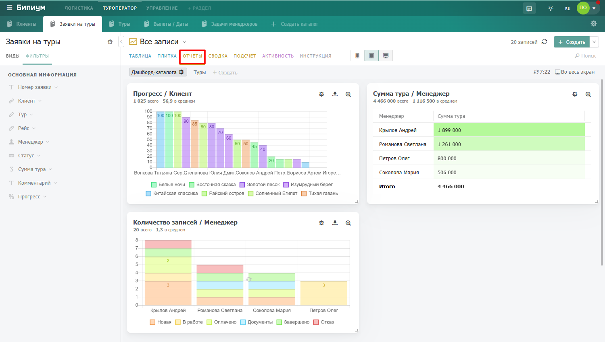
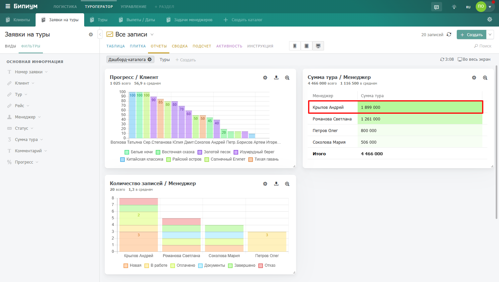
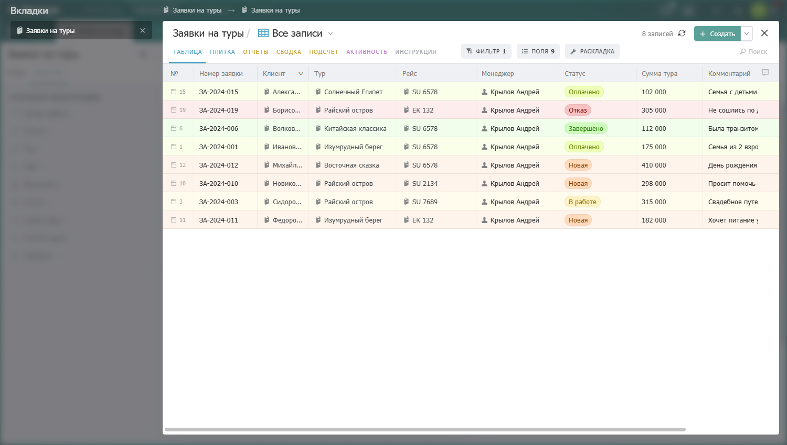

Режим графиков и дашбордов. Позволяет увидеть данные каталога в виде диаграмм -- сколько записей по каждому менеджеру, как менялась сумма сделок по месяцам, какое распределение по статусам.

<figure>

<figcaption>

</figcaption>

</figure>

## Что такое дашборд

Дашборд -- экран с набором графиков, которые администратор заранее настроил для этого каталога. Каждый график показывает данные в определённом разрезе. Графики расположены на сетке и могут занимать разную ширину -- от узкого виджета до графика на весь экран.

Над каждым графиком отображается итоговое значение -- суммарное или среднее по всем данным -- чтобы сразу видеть ключевой показатель.

## Как читать графики

Графики реагируют на фильтры каталога и виды. Если вы применили фильтр или выбрали правовой вид -- все графики автоматически пересчитаются и покажут данные только по отфильтрованным записям. Это позволяет быстро сравнивать показатели разных периодов или групп данных.

Можно нажать на конкретный столбец или сегмент графика -- откроется список записей, из которых он состоит. Так можно перейти от общей картины к конкретным данным.

{width=1500px height=850px}

{width=1500px height=850px}

## Скачать график

Наведите мышь на график -- в правом верхнем углу появятся иконки управления. Нажмите на иконку скачивания -- график сохранится как изображение. Доступно скачивание с прозрачным фоном -- удобно для вставки в презентации.

## Типы графиков



---

*  

   **Тип**

*  

   **Как выглядит**

*  

   **Когда использовать**

---

*  

   **Столбцы**

*  

   Вертикальные столбцы рядом

*  

   Сравнить значения по категориям -- например, сумма продаж по менеджерам

---

*  

   Линия

*  

   Линейный график

*  

   Показать динамику во времени -- например, количество заявок по месяцам

---

*  

   Список

*  

   Горизонтальные полосы

*  

   Удобнее столбцов для длинных названий категорий

---

*  

   Пирог

*  

   Круговая диаграмма

*  

   Показать доли от целого -- например, распределение по статусам

---

*  

   Радар

*  

   Паутина по критериям

*  

   Сравнить объект по нескольким критериям одновременно

---

*  

   Число

*  

   Крупное число

*  

   Показать одно ключевое значение -- например, общую сумму продаж за месяц



:::info 

Создавать и изменять графики могут только сотрудники с правом администрировать каталог. Просматривать дашборд может любой сотрудник, у которого есть доступ к записям каталога.

:::