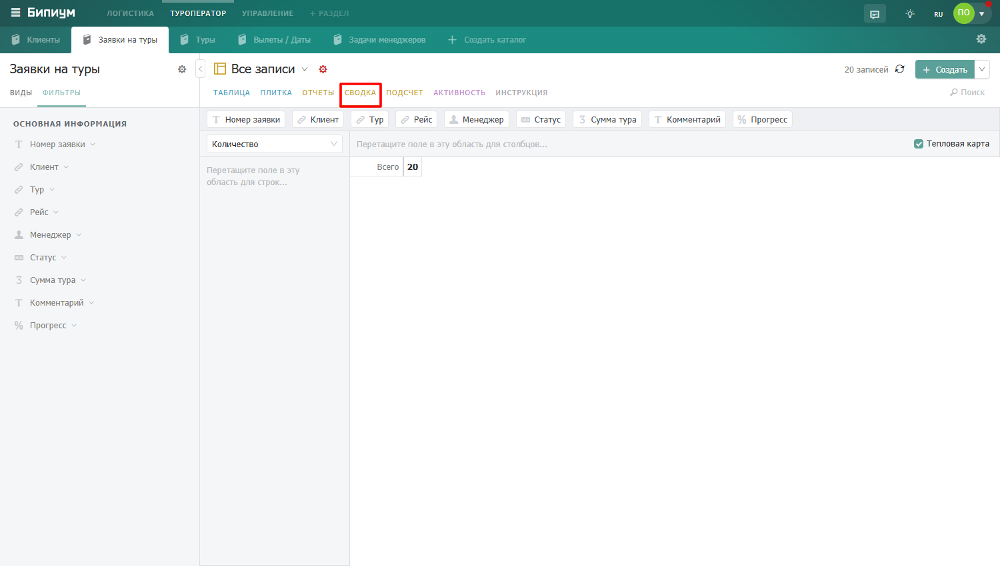

Режим сводных таблиц -- аналог сводных таблиц в Excel. Позволяет сгруппировать записи по нескольким полям и получить итоговые числа на их пересечении: суммы, средние значения, количество, доли.

## Как работает сводка

Вы выбираете поля для строк и столбцов -- сводка группирует по ним все записи и считает итоговые значения на каждом пересечении. Например: строки -- менеджеры, столбцы -- месяцы, значение -- сумма сделок. Получите таблицу: сколько каждый менеджер продал в каждом месяце.

## Как построить сводку

1. Над рабочей областью находятся все доступные поля каталога.

2. Перетащите нужное поле в область «Строки» -- это будет левая колонка таблицы.

3. Перетащите другое поле в область «Столбцы» -- это будут заголовки колонок.

4. Выберите способ подсчёта -- Бипиум мгновенно пересчитает таблицу.

<figure>

В каждой области можно разместить несколько полей одновременно -- тогда получится многоуровневая группировка.

### Способы подсчёта



---

*  

   Способ

*  

   Что считает

---

*  

   Количество

*  

   Число записей в каждой ячейке

---

*  

   Количество уникальных

*  

   Только уникальные значения поля

---

*  

   Список уникальных

*  

   Перечисление всех неповторяющихся значений

---

*  

   Сумма

*  

   Суммарное значение числового поля

---

*  

   Сумма целых

*  

   Сумма значений, округлённых до целого числа

---

*  

   Среднее

*  

   Среднее значение (пустые поля не учитываются)

---

*  

   Медиана

*  

   Серединное значение в наборе

---

*  

   Выборочная дисперсия

*  

   Мера разброса значений относительно среднего

---

*  

   **Стандартное отклонение выборки**

*  

   Корень из выборочной дисперсии

---

*  

   Минимум / Максимум

*  

   Наименьшее или наибольшее значение

---

*  

   Первый

*  

   Первое значение поля в порядке исходных данных

---

*  

   Последний

*  

   Последнее значение поля в порядке исходных данных

---

*  

   Сумма по сумме

*  

   Сумма произведений или вложенная агрегация (например, сумма(цена × количество) по строкам, а затем повторная сумма по группам).

---

*  

   Доля по строке

*  

   Процент от суммы строки

---

*  

   Доля по столбцу

*  

   Процент от суммы столбца

---

*  

   Доля по всему

*  

   Процент от общего итога таблицы

---

*  

   Количество по всему

*  

   Процент от общего количества записей во всей таблице

---

*  

   Количество по строке

*  

   Процент от итогового количества записей в данной строке

---

*  

   Количество по столбцу

*  

   Процент от итогового количества записей в данном столбце



### Тепловая карта

Включите опцию «Тепловая карта» -- ячейки сводки подсветятся цветом в зависимости от значения. Чем больше число, тем интенсивнее цвет. Это помогает мгновенно увидеть «горячие» места в данных -- например, какой менеджер в каком месяце показал наилучший результат.

:::note 

Сводка учитывает активные фильтры каталога. Примените фильтр -- и сводка пересчитается только по отфильтрованным записям. Удобно для сравнения данных за разные периоды.

:::

</figure>