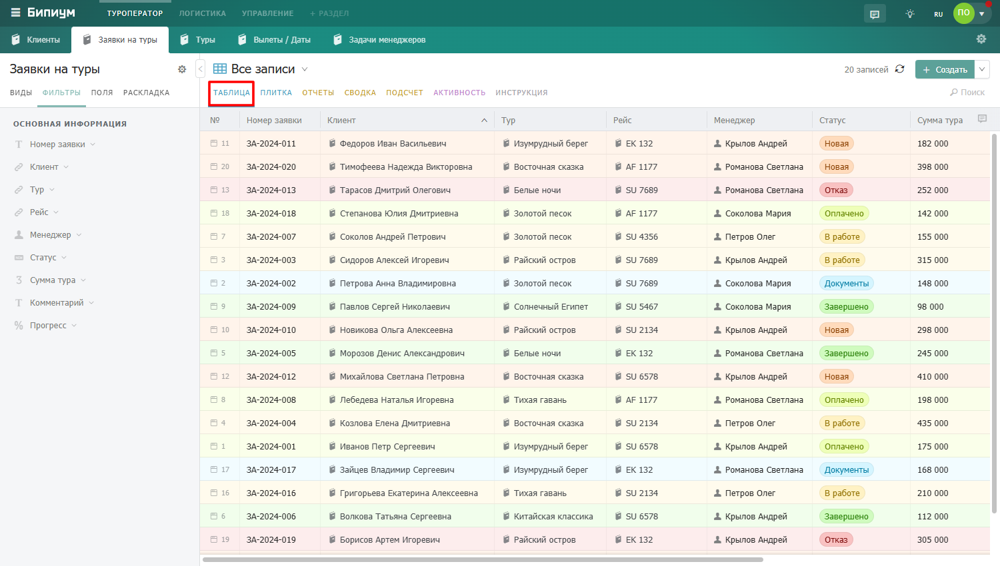

# Таблица

<figure><figcaption>
Вид отображения «Таблица»
</figcaption></figure>

## Как работать с таблицей

### Открыть запись

Кликните на строку — откроется карточка записи. Чтобы отредактировать значение прямо в таблице, не открывая карточку, дважды кликните на нужную ячейку.

### Изменение размера столбцов

Чтобы изменить ширину столбца, наведите курсор на правую границу заголовка столбца. Когда курсор примет вид двусторонней стрелки, зажмите левую кнопку мыши и потяните в нужную сторону.

При изменении ширины одного столбца автоматически перераспределяется ширина остальных столбцов таблицы.

<figure><figcaption>
Изменение размера столбца
</figcaption></figure>

### Сортировка по столбцу

Кликните на стрелочку рядом с заголовком столбца — записи отсортируются по этому полю. Повторный клик изменит порядок на обратный.

<figure><figcaption>
Сортировка по столбцу
</figcaption></figure>

### Выбор отображаемых столбцов

Нажмите надпись «Поля» в панели слева от рабочей области — откроется блок управления столбцами. Включайте и выключайте поля, меняйте их порядок перетаскиванием.

<figure><figcaption>
Выбор отображаемых столбцов
</figcaption></figure>

### Настройка раскладки

Нажмите на надпись **«Раскладка»** в панели слева от рабочей области — откроется блок настройки отображения записей. \
Здесь вы можете увидеть:

* **Подкрасить цветом:** если в записи есть хотя бы одно поле типа «Статус», система автоматически включает возможность цветовой подсветки. Строки будут выделяться цветом в зависимости от значения такого поля.
* **Сортировать по:** выберите поле, по которому нужно отсортировать записи (например, «№ записи», «Заголовок», «Статус»), и задайте направление: «По возрастанию» или «По убыванию».

<figure><figcaption>
Настройка раскладки
</figcaption></figure>

### Новые сообщения в чатах

Нажмите иконку чата — таблица отфильтруется и покажет только записи, в чате которых есть непрочитанные сообщения.

<figure><figcaption>
Новые сообщения в записях
</figcaption></figure>


Записи подгружаются по мере прокрутки вниз — весь список не загружается сразу. Если нужно найти конкретную запись, используйте поиск или фильтры.

