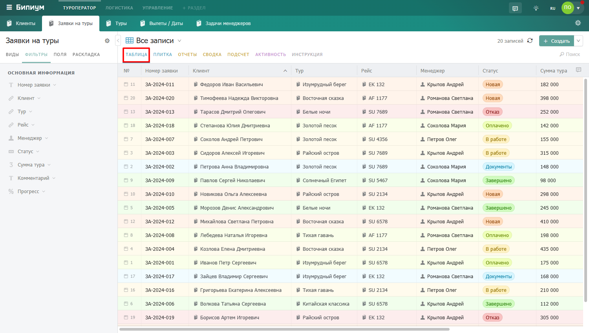
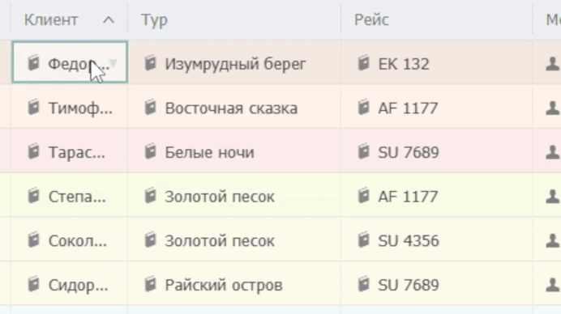
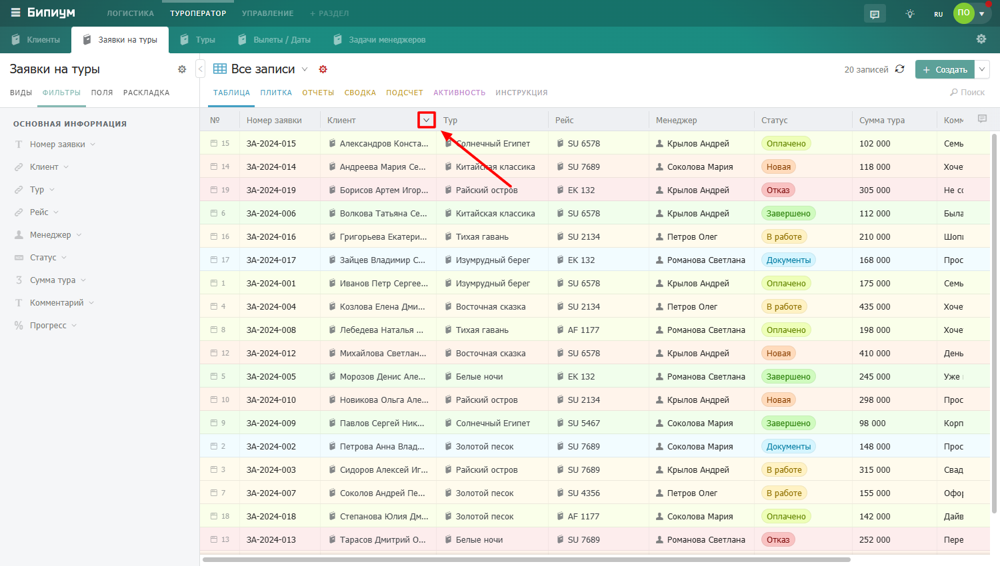
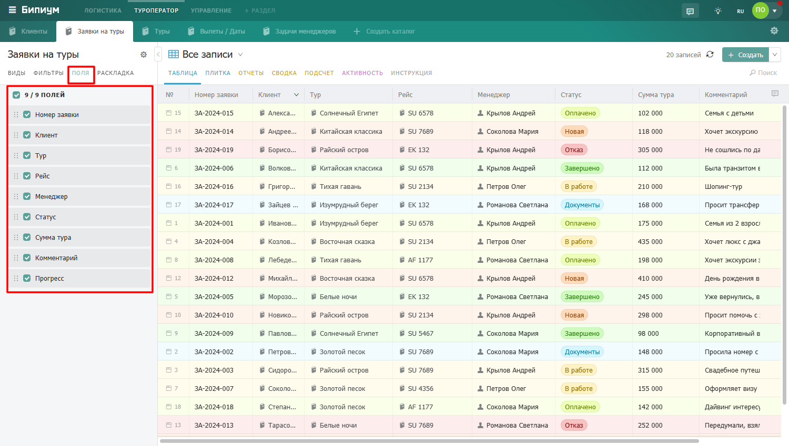
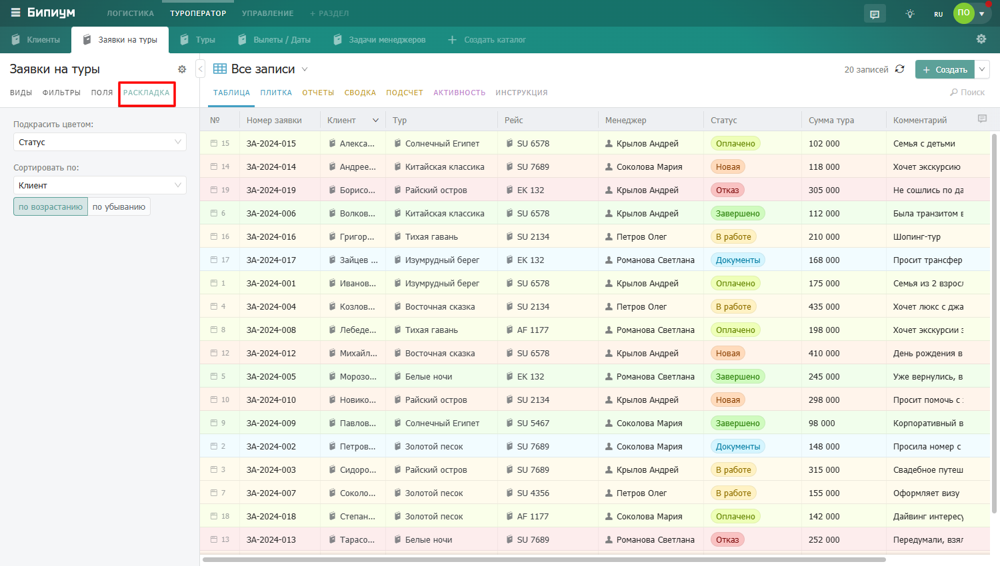
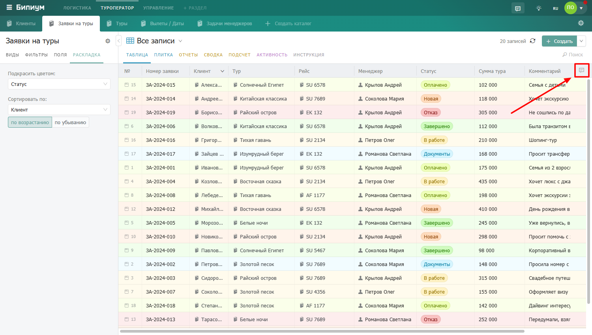

Основной режим просмотра каталога. Записи отображаются строками, поля -- столбцами. Удобен для работы с большим списком записей -- просмотра, редактирования, сортировки.

{width=1500px height=850px}

## Как работать с таблицей

### Открыть запись

Кликните на строку -- откроется карточка записи. Чтобы отредактировать значение прямо в таблице, не открывая карточку, дважды кликните на нужную ячейку.

### Изменение размера столбцов

Чтобы изменить ширину столбца, наведите курсор на правую границу заголовка столбца. Когда курсор примет вид двусторонней стрелки, зажмите левую кнопку мыши и потяните в нужную сторону.

При изменении ширины одного столбца автоматически перераспределяется ширина остальных столбцов таблицы.

{width=692px height=388px}

### Сортировка по столбцу

Кликните на стрелочку рядом с заголовком столбца -- записи отсортируются по этому полю. Повторный клик изменит порядок на обратный.

{width=1500px height=850px}

### Выбор отображаемых столбцов

Нажмите надпись «Поля» в панели слева от рабочей области -- откроется блок управления столбцами. Включайте и выключайте поля, меняйте их порядок перетаскиванием.

{width=1500px height=850px}

### Настройка раскладки

Нажмите на надпись **«Раскладка»** в панели слева от рабочей области -- откроется блок настройки отображения записей. \
Здесь вы можете увидеть:

-  **Подкрасить цветом:** если в записи есть хотя бы одно поле типа «Статус», система автоматически включает возможность цветовой подсветки. Строки будут выделяться цветом в зависимости от значения такого поля.

-  **Сортировать по:** выберите поле, по которому нужно отсортировать записи (например, «№ записи», «Заголовок», «Статус»), и задайте направление: «По возрастанию» или «По убыванию».

{width=1500px height=850px}

### Новые сообщения в чатах

Нажмите иконку чата -- таблица отфильтруется и покажет только записи, в чате которых есть непрочитанные сообщения.

{width=1500px height=850px}

:::info 

Записи подгружаются по мере прокрутки вниз -- весь список не загружается сразу. Если нужно найти конкретную запись, используйте поиск или фильтры.

:::