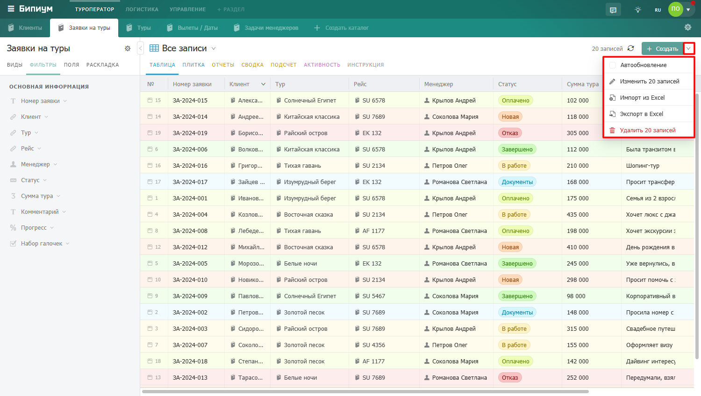

В каталоге также можно выполнять различные операции с большим количеством записей единовременно:



---

*  

   Операция

*  

   Описание

---

*  

   [**Автообновление**](./avtoobnovlenie)

*  

   Операция, при активации которой записи будут обновляться автоматически по мере поступления изменений.

---

*  

   [**Массовое редактирование**](./massovoe-redaktirovanie)

*  

   Операция для одновременного редактирования значений нескольких записей.

---

*  

   [**Импорт записей**](./import-zapisei)

*  

   Операция для импорта записей из excel.

---

*  

   [**Экспорт записей**](./export)

*  

   Операция для экспорта записей в excel.

---

*  

   [**Массовое удаление**](./massovoe-udalenie)

*  

   Операция для одновременного удаления нескольких записей.


