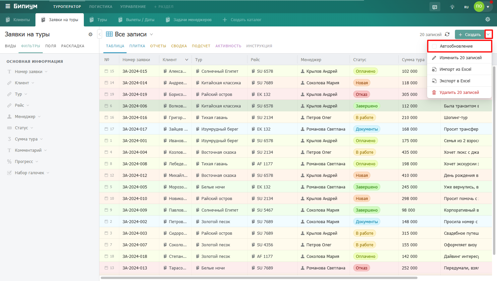

Автообновление позволяет каталогу автоматически подгружать новые и изменённые записи без ручного нажатия кнопки «Обновить». Удобно если вы работаете в каталоге одновременно с другими сотрудниками и хотите видеть актуальные данные.

### Как включить

Нажмите на стрелку рядом с кнопкой «Создать» и выберите «Автообновление» -- рядом с пунктом появится галочка. Список записей будет автоматически обновляться каждые 10 минут. Настройка сохраняется для этого каталога -- при следующем открытии автообновление останется включённым.

<figure>

<figcaption>

</figcaption>

</figure>

Чтобы выключить -- нажмите «Автообновление» ещё раз, галочка пропадёт.