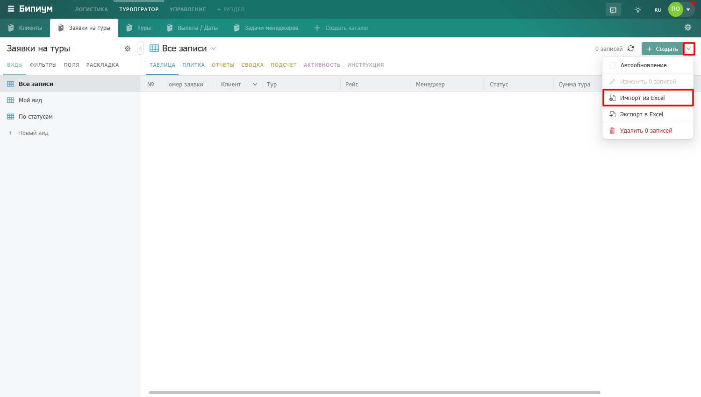

# Импорт записей

<figure><figcaption>
Пункт «Импорт из Excel» в выпадающем меню рядом с кнопкой «Создать»
</figcaption></figure>

### Как подготовить файл

Бипиум принимает файлы формата `.xlsx`. Требования к структуре файла:

* Первая заполненная ячейка в каждом столбце — заголовок. Он должен совпадать с названием поля каталога — тогда Бипиум сопоставит их автоматически.
* Каждая следующая строка — одна запись.
* Столбцы, которые не нужно импортировать, можно исключить на этапе настройки.

<figure><figcaption>
Пример Excel-файла — заголовки в первой строке, данные в строках ниже
</figcaption></figure>

## Импортируем из Excel

### Шаг 1 — Выбор файла

Откройте нужный каталог, нажмите на стрелку рядом с кнопкой «Создать» и выберите «Импорт из Excel». В открывшемся окне выберите файл с компьютера.

<figure><figcaption>
Окно выбора файла для импорта
</figcaption></figure>

### Шаг 2 — Настройка сопоставления

После загрузки файла Бипиум покажет таблицу с данными из Excel. Над каждым столбцом — заголовок с выпадающим списком, где можно выбрать поле каталога, в которое будут загружены данные этого столбца.

<figure><figcaption>
Таблица с данными — над каждым столбцом выпадающий список с полями каталога
</figcaption></figure>

Если название столбца в Excel совпадает с названием поля в каталоге — Бипиум сопоставит их автоматически. Если нет — выберите поле вручную из списка. Столбцы которые не нужно импортировать — выберите значение **«Не импортировать»**.

<figure><figcaption>
Выбор поля каталога вручную из выпадающего списка
</figcaption></figure>

### Шаг 3 — Проверка и исправление ошибок

аждая строка таблицы имеет статус, который показывает можно ли её импортировать:

<table><thead><tr><th width="235">Статус строки</th><th>Что означает</th></tr></thead><tbody><tr><td><strong>Определено</strong></td><td>Все ячейки строки корректны — запись готова к импорту</td></tr><tr><td><strong>Ошибка определения</strong></td><td>Хотя бы одна ячейка содержит ошибку — текст в ней отображается красным</td></tr><tr><td><strong>Не импортировать</strong></td><td>Строка вручную исключена из импорта</td></tr><tr><td><strong>Обработка</strong></td><td>Строка обрабатывается прямо сейчас</td></tr><tr><td><strong>Импортировано</strong></td><td>Запись успешно создана</td></tr><tr><td><strong>Ошибка импорта</strong></td><td>Строку не удалось импортировать</td></tr></tbody></table>

Ячейки с ошибками выделены красным текстом. Большинство строк можно исправить прямо в таблице — кликните на ячейку и введите правильное значение или выберите из списка.

<figure><figcaption>
Строка с ошибкой — красный текст в ячейке с некорректным значением
</figcaption></figure>

<figure><figcaption>
Исправление ошибки — выбор правильного значения из выпадающего списка
</figcaption></figure>


Когда исправляете ошибку в ячейке с некорректным значением — изменение применяется сразу ко всем ячейкам этого столбца с таким же значением (кроме пустых). Если исправляете корректную ячейку — изменение применяется только к ней одной.


В нижней части каждого столбца отображается процент успешно определённых ячеек — удобно чтобы оценить качество данных перед импортом.

Таблицу можно отфильтровать по статусу строк или по данным в ячейках — например, показать только строки с ошибками и исправить их все подряд.

<figure><figcaption>
Фильтр по статусу строк
</figcaption></figure>

### Шаг 4 — Запуск импорта

Когда данные проверены, нажмите кнопку «Импортировать» в левом нижнем углу. Бипиум начнёт создавать записи — прогресс отображается цветной полосой: зелёный цвет показывает успешно импортированные строки, красный — строки с ошибками.

<figure><figcaption>
Прогресс импорта — цветная полоса и примерное время выполнения
</figcaption></figure>

Импорт можно поставить на паузу кнопкой «Пауза» — уже созданные записи останутся, оставшиеся будут ожидать возобновления.


В правом нижнем углу отображается примерное время до завершения импорта.


### Совпадение значений при импорте

Для полей типа «Статус», «Сотрудник», «Связанный каталог» Бипиум ищет значение по точному совпадению названия. Если в файле «Директор», а в Бипиуме «Директор» — сопоставится автоматически. Если в файле опечатка, например «Диреткор» — Бипиум не найдёт совпадение и покажет ошибку. В этом случае можно вручную выбрать правильное значение прямо в таблице.

### Права на импорт

Импортировать записи могут сотрудники с привилегией «Создавать записи» и выше. Если у сотрудника нет доступа к просмотру записей каталога, но есть право создавать — импорт всё равно будет доступен.

### Когда стандартного импорта недостаточно

Стандартный импорт только создаёт новые записи — он не обновляет существующие и не позволяет фильтровать строки по условию. Если нужно обновить существующие данные или выполнить более сложную загрузку — используйте сценарий автоматизации с компонентом работы с Excel. Подробную инструкцию как это сделать вы можете увидеть на нашем [форуме](https://forum.bpium.ru/d/22-import-dannyh-iz-excel).
