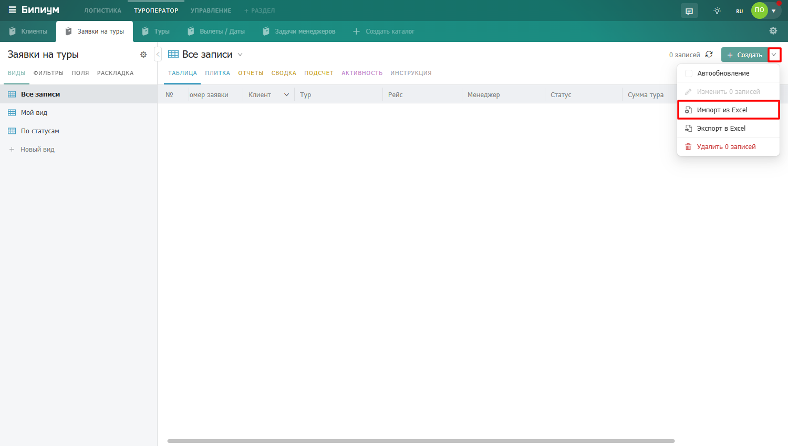
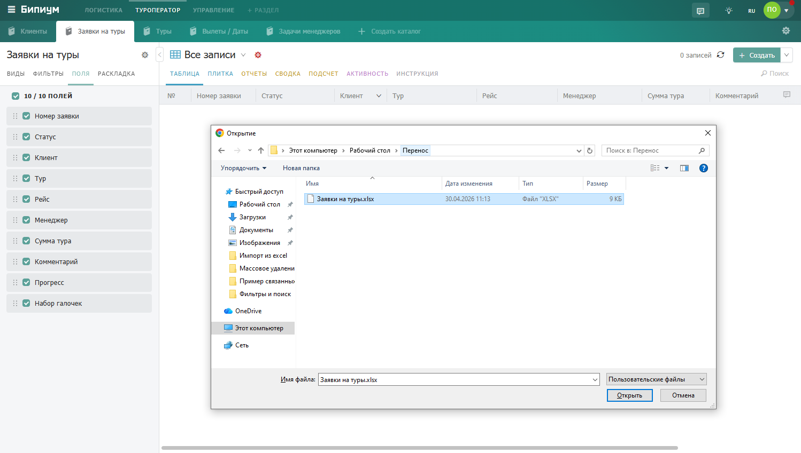
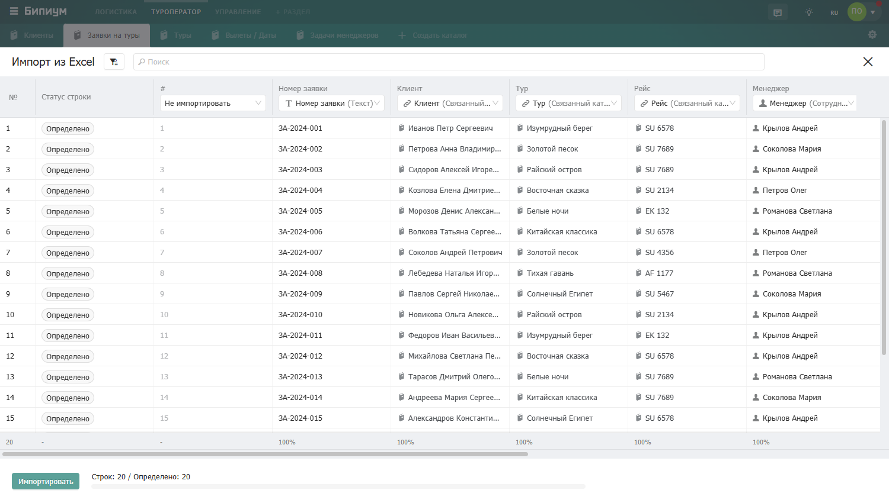

Импорт позволяет загрузить записи в каталог из файла Excel. Удобен для первоначального заполнения каталога данными или переноса информации из другой системы.

## Как подготовить файл

Бипиум принимает файлы формата `.xlsx`. Требования к структуре файла:

-  Первая заполненная ячейка в каждом столбце -- заголовок. Он должен совпадать с названием поля каталога -- тогда Бипиум сопоставит их автоматически.

-  Каждая следующая строка -- одна запись.

-  Столбцы, которые не нужно импортировать, можно исключить на этапе настройки.

.png> "Пример Excel-файла -- заголовки в первой строке, данные в строках ниже"){width=1500px height=850px}

## Импортируем из Excel

### Шаг 1 -- Выбор файла

Откройте нужный каталог, нажмите на стрелку рядом с кнопкой «Создать» и выберите «Импорт из Excel». В открывшемся окне выберите файл с компьютера.

{width=1498px height=849px}

 

### Шаг 2 -- Настройка сопоставления

После загрузки файла Бипиум покажет таблицу с данными из Excel. Над каждым столбцом -- заголовок с выпадающим списком, где можно выбрать поле каталога, в которое будут загружены данные этого столбца.

{width=1500px height=850px}

Если название столбца в Excel совпадает с названием поля в каталоге -- Бипиум сопоставит их автоматически. Если нет -- выберите поле вручную из списка. Столбцы которые не нужно импортировать -- выберите значение **«Не импортировать»**.

### Шаг 3 -- Проверка и исправление ошибок

Каждая строка таблицы имеет статус, который показывает можно ли её импортировать:



---

*  

   Статус строки

*  

   Что означает

---

*  

   Определено

*  

   Все ячейки строки корректны -- запись готова к импорту

---

*  

   Ошибка определения

*  

   Хотя бы одна ячейка содержит ошибку -- текст в ней отображается красным

---

*  

   Не импортировать

*  

   Строка вручную исключена из импорта

---

*  

   Обработка

*  

   Строка обрабатывается прямо сейчас

---

*  

   Импортировано

*  

   Запись успешно создана

---

*  

   Ошибка импорта

*  

   Строку не удалось импортировать



Ячейки с ошибками выделены красным текстом. Большинство строк можно исправить прямо в таблице -- кликните на ячейку и введите правильное значение или выберите из списка.

.png> "Строка с ошибкой -- красный текст в ячейке с некорректным значением"){width=1500px height=850px}

.png> "Исправление ошибки -- выбор правильного значения из выпадающего списка"){width=1500px height=850px}

:::note 

Когда исправляете ошибку в ячейке с некорректным значением -- изменение применяется сразу ко всем ячейкам этого столбца с таким же значением (кроме пустых). Если исправляете корректную ячейку -- изменение применяется только к ней одной.

:::

В нижней части каждого столбца отображается процент успешно определённых ячеек -- удобно чтобы оценить качество данных перед импортом.

Таблицу можно отфильтровать по статусу строк или по данным в ячейках -- например, показать только строки с ошибками и исправить их все подряд.

### Шаг 4 -- Запуск импорта

Когда данные проверены, нажмите кнопку «Импортировать» в левом нижнем углу. Бипиум начнёт создавать записи -- прогресс отображается цветной полосой: зелёный цвет показывает успешно импортированные строки, красный -- строки с ошибками.

Импорт можно поставить на паузу кнопкой «Пауза» -- уже созданные записи останутся, оставшиеся будут ожидать возобновления.

:::note 

В правом нижнем углу отображается примерное время до завершения импорта.

:::

## Совпадение значений при импорте

Для полей типа «Статус», «Сотрудник», «Связанный каталог» Бипиум ищет значение по точному совпадению названия. Если в файле «Директор», а в Бипиуме «Директор» -- сопоставится автоматически. Если в файле опечатка, например «Диреткор» -- Бипиум не найдёт совпадение и покажет ошибку. В этом случае можно вручную выбрать правильное значение прямо в таблице.

## Права на импорт

Импортировать записи могут сотрудники с привилегией «Создавать записи» и выше. Если у сотрудника нет доступа к просмотру записей каталога, но есть право создавать -- импорт всё равно будет доступен.

## Когда стандартного импорта недостаточно

Стандартный импорт только создаёт новые записи -- он не обновляет существующие и не позволяет фильтровать строки по условию. Если нужно обновить существующие данные или выполнить более сложную загрузку -- используйте сценарий автоматизации с компонентом работы с Excel. Подробную инструкцию как это сделать вы можете увидеть на нашем [форуме](https://forum.bpium.ru/d/22-import-dannyh-iz-excel).