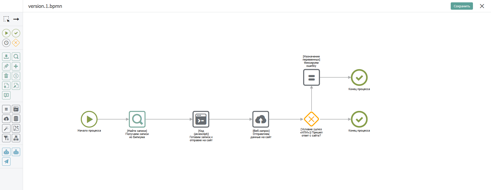

# Виды

Список видов расположен в левой панели в разделе Виды. Виды отсортированы по алфавиту. Заданные фильтры также можно сохранить для того, чтобы при открытии каталога не настраивать каждый раз заново.  Это можно сделать через настройку Личных видов.

Виды бывают:&#x20;

* Личные (фильтруют записи)&#x20;
* [Правовые](../../bpium-setup/prava/views.md) (предоставляют доступ к записям)

## Личные виды

Если вы часто пользуетесь одним и тем же набором фильтров — сохраните его как личный вид. Личный вид видите только вы, он не влияет на других сотрудников.

### Как создать личный вид

1. Настройте нужные фильтры в панели слева.
2. Нажмите «Сохранить» рядом с полем нового вида.\
   \
   \[Скриншот: кнопка «Сохранить» рядом с полем нового вида] 
3.  Укажите наименование вида и режим отображения, который будет использоваться по умолчанию при переходе к данному виду.

    <figure><figcaption></figcaption></figure>
4. Нажмите «Сохранить» — вид появится в списке и сразу применится.\
   \[Скрин: сохранённый вид появился в списке под названием каталога]

### Просмотр доступных видов

Все доступные пользователю виды отображаются на панели слева во вкладке «Виды». В списке присутствуют только те виды, которые были созданы данным пользователем, либо те, к которым ему был предоставлен доступ.

\[Скрин: Вкладка виды со всеми доступными видами]

### Редактирование личного вида

Для того, чтобы внести изменения в созданный вами личный вид, нажмите на иконку карандаша рядом с названием вида. Созданный вид можно переименовать, удалить или задать новый ID вида. Для редактирования созданного вами правового вида ознакомьтесь со статьей «[Правовые виды](https://docs.bpium.ru/rights/views)».

<figure><figcaption></figcaption></figure>

<figure><figcaption></figcaption></figure>

Для правовых видов можно настроить доступ. Изменять и удалять правовые виды могут только сотрудники с правом «Администрировать» каталог.

### Удаление личного вида

Если удалить личный вид, то он перестанет отображаться в вашем списке видов.

## Правовые виды

Правовые виды не только фильтруют записи каталога, но также предоставляют доступ к найденным записям группе сотрудников. Правовые виды могут создавать только сотрудники с правом «Администрировать» каталог.

С помощью правовых видов Бипиум реализует атрибутную модель доступа к данным (ABAC) — доступ к записям на основе свойств этих записей. Также правовые виды позволяют задать правила редактирования полей анкеты. Подробнее о правовых видах рассказано в статье «[Правовые виды](https://docs.bpium.ru/rights/views)».
