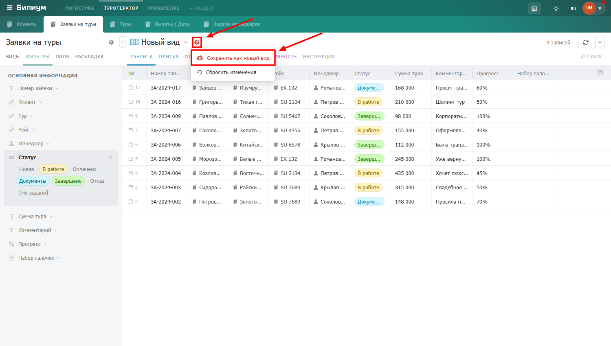
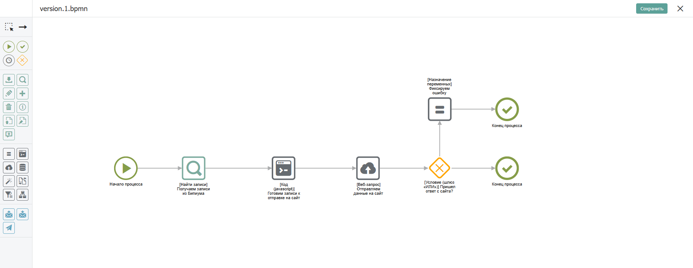
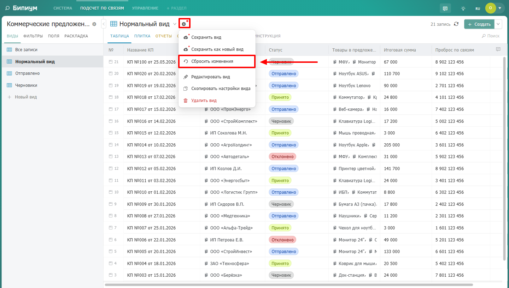

Виды представляют собой сохраненные шаблоны фильтров *и настроек отображения* для быстрого доступа к нужной информации.

Список видов расположен в левой панели в разделе Виды. Виды отсортированы по алфавиту. Заданные фильтры также можно сохранить для того, чтобы при открытии каталога не настраивать каждый раз заново, при повторном открытии каталога будет отображаться последний выбранный вид.  

В Бипиуме используются:

-  Системный вид «Все записи»

-  Личные виды

-  Общие виды

-  [Правовые виды](./../../bpium-setup/prava/views)

## Вид «Все записи»

В каждом каталоге по умолчанию есть системный вид «Все записи».

Он показывает все записи, доступные сотруднику в каталоге. Отдельные права на этот вид не назначаются -- доступ ***определяется доступами из правовых видов***.

Администратор может настроить отображение вида «Все записи»:

-  выбрать отображаемые поля;

-  задать порядок колонок;

-  настроить ширину полей;

-  выбрать режим отображения.

-  задать раскладку (цвет строк, сортировка и другие в зависимости от режима отображения)

Эти настройки будут использоваться как базовая разметка для всех пользователей каталога.

## Общие виды

Общие виды создаются администратором и отображаются у всех сотрудников, имеющих доступ к каталогу.

Общий вид нужен для того, чтобы администратор мог заранее подготовить удобное представление данных для сотрудников:

-  настроить фильтры;

-  выбрать отображаемые поля;

-  задать порядок колонок;

-  выбрать режим отображения.

Например:

-  «Новые заявки» (таблица)

-  «Просроченные задачи» (календарь)

-  «Мои клиенты» (карточки)

-  «Документы на согласовании» (сводка)

Общие виды помогают сотрудникам быстрее начать работу без самостоятельной настройки каталога.

## Личные виды

Набор фильтров, который часто используется, можно сохранить как личный вид. Такой вид доступен только его владельцу и не влияет на работу других сотрудников.

### Как создать личный вид

1. Настройте нужные фильтры в панели слева.

2. Нажмите на иконку шестерёнки рядом с названием нового вида, далее нажмите на «Сохранить как новый вид».

   {width=1500px height=850px}

3. Укажите наименование вида и режим отображения, который будет использоваться по умолчанию при переходе к данному виду.

   

4. Нажмите «Сохранить» -- вид появится в списке и сразу применится.

### Просмотр доступных видов

Все доступные пользователю виды отображаются на панели слева во вкладке «Виды». В списке присутствуют только те виды, которые были созданы данным пользователем, либо те, к которым ему был предоставлен доступ администратором.

### Редактирование личного вида

Чтобы изменить созданный вами личный вид, на левой панели перейдите во вкладку «Виды» и выберите нужный вид. Справа от его названия нажмите на значок шестерёнки -- в выпадающем меню выберите «Настроить вид». Откроется окно, где можно изменить название вида и режим отображения. Чтобы настроить фильтры, перейдите на соответствующую вкладку и задайте новые условия. После внесения изменений снова нажмите на шестерёнку рядом с названием вида и выберите «Сохранить». В этом же меню доступны переименование, удаление вида и изменение его ID.

Для правовых видов можно настроить доступ. Изменять и удалять правовые виды могут только сотрудники с правом «Администрировать» каталог.

### Удаление личного вида

Чтобы удалить созданный личный вид, на левой панели откройте вкладку «Виды» и найдите нужный вид. Справа от его названия нажмите на значок шестерёнки -- в выпадающем меню выберите «Удалить вид». Система запросит подтверждение: нажмите «Удалить». После этого вид удалится и перестанет отображаться в списке видов. Восстановить удалённый личный вид невозможно -- его потребуется создавать заново.

## Правовые виды

Правовые виды не только фильтруют записи каталога, но также предоставляют доступ к найденным записям группе сотрудников. Правовые виды могут создавать только сотрудники с правом «Администрировать» каталог.

С помощью правовых видов Бипиум реализует атрибутную модель доступа к данным (ABAC) -- доступ к записям на основе свойств этих записей. Также правовые виды позволяют задать правила редактирования полей анкеты. Подробнее о правовых видах рассказано в статье «[Правовые виды](./../../bpium-setup/prava/views)».

## Пользовательские настройки отображения

Пользователь может изменить отображение общего вида или вида «Все записи» под себя:

-  изменить ширину колонок;

-  переставить поля;

-  скрыть отдельные поля;

-  изменить настройки отображения таблицы.

Эти изменения сохраняются индивидуально и не влияют на других сотрудников.

При этом исходная разметка, настроенная администратором, остаётся без изменений.

Если пользователь изменил отображение вида, он может вернуть исходную разметку с помощью кнопки «Сбросить изменения».

{width=1440px height=816px}