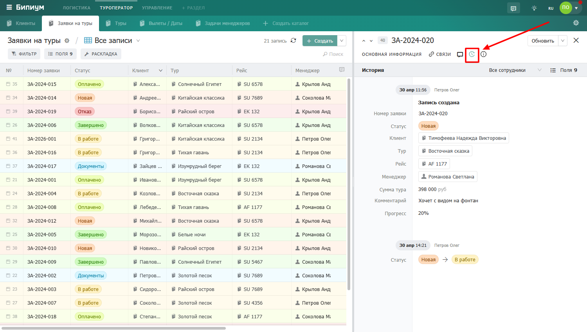

# История

<figure><figcaption>
Вкладка истории в анкете записи
</figcaption></figure>

### Как читать ленту

Изменения отображаются в хронологическом порядке — самые свежие сверху. Каждое событие содержит имя сотрудника, дату и время, а также перечень изменённых полей.

Для большинства изменений видно что было и что стало:

* **Было → Стало** — если значение изменилось
* **Только новое значение** — для некоторых типов полей

Каждая новая дата отделяется горизонтальной линией — удобно ориентироваться в длинной ленте. Комментарии из чата также отображаются в ленте истории и выделены фоном.

### Фильтрация ленты

Ленту можно фильтровать чтобы найти нужные изменения:

* **По сотруднику** — видеть только действия конкретного человека

<figure><figcaption>
Фильтр по сотруднику — выпадающий список
</figcaption></figure>

* **По полям** — видеть изменения только выбранных полей

<figure><figcaption>
Фильтр по отображаемым полям
</figcaption></figure>


История учитывает права доступа. Вы увидите только те изменения, к которым у вас есть доступ. Если администратор ограничил видимость определённых полей — изменения по ним в истории не отобразятся.

